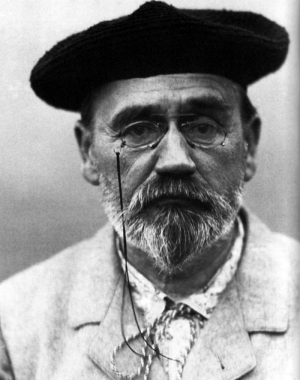

+++
title = "图像处理"
weight = 120
+++

Zola 通过内置函数 `resize_image` 提供对自动图像调整大小的支持，该函数在模板代码和 shortcodes 中都可用。

函数用法如下：

```jinja
resize_image(path, width, height, op, format, quality, speed)
```

### 参数

- `path`: 源图像的路径。将按以下顺序搜索以下目录：
    - `/` (项目的根目录；即包含 `config.toml` 的目录)
    - `/static`
    - `/content`
    - `/public`
    - `/themes/current-theme/static`
- `width` 和 `height`: 调整大小后的图像的像素尺寸。用法取决于 `op` 参数。
- `op` (_可选_): 调整大小操作。可以是以下之一：
    - `"scale"`
    - `"fit_width"`
    - `"fit_height"`
    - `"fit"`
    - `"fill"`

  下面解释了每一个的作用。默认为 `"fill"`。
- `format` (_可选_): 调整大小后的图像的编码格式。可以是以下之一：
    - `"auto"`
    - `"jpg"`
    - `"png"`
    - `"webp"`
    - `"avif"`

  默认为 `"auto"`，这意味着格式是根据输入图像格式选择的。
  JPEG 用于 JPEG 和其他有损格式，PNG 用于 PNG 和其他无损格式。
- `quality` (_可选_): 调整大小后的图像的质量。质量仅在编码 JPEG、WebP 或 AVIF 时使用。JPEG 的质量范围为 1 到 100，默认为 75。WebP 的质量范围为 0 到 100，默认为无损编码。AVIF 的质量范围为 1 到 100，默认为 80。
- `speed` (_可选_): 编码调整大小后的图像的速度。速度仅在编码 AVIF 时使用。AVIF 的速度范围为 1 到 10，默认为 5。速度 10 应该处理图像最快，但可能不会产生最佳压缩；速度 1 慢得多，但产生最佳压缩。

### 图像处理和返回值

Zola 在构建过程中执行图像处理，并将调整大小后的图像放置在静态文件目录的子目录中：

```
static/processed_images/
```

每个调整大小后的图像的文件名是函数参数的哈希值，这意味着一旦图像以某种方式调整大小，它将被存储在上述目录中，并且在随后的构建期间不需要再次调整大小（除非图像本身、尺寸或其他参数已更改）。

该函数返回具有以下模式的对象：

```
/// 该资产的最终 URL
url: String,
/// 生成的静态资产的路径
static_path: String,
/// 新图像宽度
width: u32,
/// 新图像高度
height: u32,
/// 原始图像宽度
orig_width: u32,
/// 原始图像高度
orig_height: u32,
```

### 颜色和元数据

在处理过程中，所有 EXIF、XMP 和 IPTC 元数据都将被丢弃。

Zola 尽可能保留图像色彩空间信息。
适用以下限制：
- 仅保留基于 ICC 的颜色数据。
- 对于 WebP，只有无损编码支持 ICC 配置文件。
- AVIF 编码目前不支持 ICC 配置文件。

如果丢失了色彩空间，将打印警告。
无论如何，图像都会被转换，没有适当的颜色转换。
因此，如果源色彩空间与目标格式的默认色彩空间（通常是 sRGB 或 Rec.709）不匹配，颜色将显示不正确。

Zola 对原始像素数据执行图像处理，而不考虑色彩空间。
这通常不是问题，但非线性色彩空间（包括 sRGB、Rec.709、AdobeRGB、Display P3 和非线性 Rec2020）可能会表现出不精确的颜色混合，特别是在放大低分辨率图像时。

## 调整大小操作

所有示例的源都是这张 300 像素 × 380 像素的图像：



### **`"scale"`**
  简单地将图像缩放到指定的尺寸（`width` & `height`），而不考虑纵横比。

  `resize_image(..., width=150, height=150, op="scale")`

  {{ resize_image(path="documentation/content/image-processing/01-zola.png", width=150, height=150, op="scale") }}

### **`"fit_width"`**
  调整图像大小，使得结果宽度为 `width`，高度为任何保持纵横比的值。
  不需要 `height` 参数。

  `resize_image(..., width=100, op="fit_width")`

  {{ resize_image(path="documentation/content/image-processing/01-zola.png", width=100, height=0, op="fit_width") }}

### **`"fit_height"`**
  调整图像大小，使得结果高度为 `height`，宽度为任何保持纵横比的值。
  不需要 `width` 参数。

  `resize_image(..., height=150, op="fit_height")`

  {{ resize_image(path="documentation/content/image-processing/01-zola.png", width=0, height=150, op="fit_height") }}

### **`"fit"`**
  类似于 `"fit_width"` 和 `"fit_height"` 的组合，但仅当图像大于任何指定尺寸时才调整大小。
  此模式很方便，例如，如果图像在 shortcode 中自动缩小到特定尺寸以进行移动优化。
  调整图像大小，使得结果适合 `width` 和 `height` 内，同时保持纵横比。这意味着宽度或高度将分别为最大 `width` 和 `height`，但其中一个可能更小，以便保持纵横比。


  `resize_image(..., width=5000, height=5000, op="fit")`

  {{ resize_image(path="documentation/content/image-processing/01-zola.png", width=5000, height=5000, op="fit") }}

  `resize_image(..., width=150, height=150, op="fit")`

  {{ resize_image(path="documentation/content/image-processing/01-zola.png", width=150, height=150, op="fit") }}

### **`"fill"`**
  这是默认操作。它采用图像的中心部分，具有与给定的 `width` 和 `height` 相同的纵横比，并将其调整为 `width` 和 `height`。这意味着调整大小后的纵横比之外的图像部分将被裁剪掉。

  `resize_image(..., width=150, height=150, op="fill")`

  {{ resize_image(path="documentation/content/image-processing/01-zola.png", width=150, height=150, op="fill") }}


## 通过 shortcodes 在 markdown 中使用 `resize_image`

`resize_image` 是 Zola 内置的 Tera 函数（参见 [模板](@/documentation/templates/_index.md) 章节），但它可以使用 [shortcodes](@/documentation/content/shortcodes.md) 在 Markdown 中使用。

上面的示例是使用名为 `resize_image.html` 的 shortcode 文件生成的，内容如下：

```jinja


```

## 创建图片库

`resize_image()` 可以多次使用和/或在循环中使用。它旨在有效地处理这种情况。

这可以与 `assets` [页面元数据](@/documentation/templates/pages-sections.md) 一起使用来创建图片库。
`assets` 变量保存带有资源的页面目录中所有资产的路径（参见 [资产共置](@/documentation/content/overview.md#asset-colocation)）；如果你有除图像以外的文件，你需要像下面的示例一样首先在循环中过滤掉它们。

这可以在 shortcodes 中使用。例如，我们可以使用以下名为 `gallery.html` 的 shortcode 创建一个非常简单的仅 HTML 的可点击图片库：

```jinja
<div>

  
    
    <a href="{{ get_url(path=asset) }}" target="_blank">
      
    </a>
  

</div>
```

如你所见，我们没有指定 `op` 参数，这意味着它将默认为 `"fill"`。同样，格式将默认为 `"auto"`（根据情况选择 PNG 或 JPEG），JPEG 质量将默认为 `75`。

要从 Markdown 文件调用它，只需执行：

```jinja
{{/* gallery() */}}
```

结果如下：

{{ gallery() }}

<small>
  Image attribution: Public domain, except: _06-example.jpg_: Willi Heidelbach, _07-example.jpg_: Daniel Ullrich.
</small>


## 获取图像尺寸和相对调整大小

有时在构建图库时，知道每个资产的尺寸很有用。你可以通过 [get_image_metadata](@/documentation/templates/overview.md#get-image-metadata) 获取此信息。

这也可以与 `resize_image()` 结合使用以进行相对调整大小。因此，我们可以使用以下名为 `resize_image_relative.html` 的 shortcode 创建一个相对图像调整大小函数：

```jinja



```

它可以像这样从 Markdown 调用：

`resize_image_relative(..., scale=0.5)`

{{ resize_image_relative(path="documentation/content/image-processing/01-zola.png", scale=0.5) }}

## 创建高分辨率图像的缩小版本

通过上述内容，我们还可以创建一个 shortcode，用于创建高分辨率图像的 50% 缩小版本（例如在 Retina Mac 上截取的屏幕截图），以及用于在显示高分辨率 / retina 显示器上显示原始图像的正确 HTML5 `srcset`。

考虑以下名为 `high_res_image.html` 的 shortcode：

```jinja





```

{{ high_res_image(path="documentation/content/image-processing/08-example.jpg") }}
