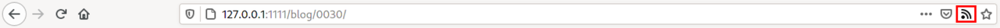

+++
title = "Feeds (订阅源)"
weight = 50
aliases = ["/documentation/templates/rss/"]
+++

如果站点 `config.toml` 文件设置 `generate_feeds = true`，那么 Zola 将为站点生成 feed 文件，根据 `config.toml` 中的 `feed_filenames` 设置命名，默认为 `atom.xml`。给定 feed 文件名 `atom.xml`，生成的文件将位于 `base_url/atom.xml`，基于 `templates` 目录中的 `atom.xml` 文件，或内置的 Atom 模板。

`feed_filenames` 可以设置为任何值，但提供了内置模板 `atom.xml`（首选 Atom 1.0 格式）和 `rss.xml`（RSS 2.0 格式）。如果你选择不同的文件名（例如 `feed.xml`），你需要自己提供模板。

如果你想扩展或修改内置模板，你可以从 [源代码](https://github.com/getzola/zola/tree/master/components/templates/src/builtins) 获取副本，并将其以适当的名称放置在 `templates/` 目录中。你可以在 [W3C Feed Validation Service](https://validator.w3.org/feed/docs/) 中查看 Atom 1.0 和 RSS 2.0 的规范文档。

**只有带有日期的页面才可用。**

Feed 中的作者设置为：
- [front matter](@/documentation/content/page.md#front-matter) 中 `authors` 设置的第一位作者
- 如果不存在，则回退到 [配置](@/documentation/getting-started/configuration.md) 中的 `author`
- 如果也未预设，则设置为 `Unknown`。

请注意，`atom.xml` 和 `rss.xml` 需要不同的格式来指定作者。根据 [RFC 4287][atom_rfc]，`atom.xml` 需要作者的名字，例如 `"John Doe"`。而根据 [RSS 2.0 规范][rss_spec]，电子邮件地址是必需的，名字是可选的，例如 `"lawyer@boyer.net"` 或 `"lawyer@boyer.net (Lawyer Boyer)"`。

Feed 模板获得五个变量：

- `config`: 站点配置
- `feed_url`: 该特定 feed 的完整 url
- `last_updated`: 任何文章的最新 `updated` 或 `date` 字段
- `pages`: 请参阅 [page 变量](@/documentation/templates/pages-sections.md#page-variables) 了解其内容的详细说明
- `lang`: 适用于 feed 中所有页面的语言代码（如果站点是多语言的），如果不是则为 `config.default_language`

分类法术语的 Feeds 还有两个变量，使用来自 [分类法模板](@/documentation/templates/taxonomies.md) 的类型：

- `taxonomy`: `TaxonomyConfig` 类型
- `term`: `TaxonomyTerm` 类型，但没有 `term.pages`（改用 `pages`）

你还可以通过在相应 section 的 front matter 中将 `generate_feeds` 变量设置为 true 来为每个 section 启用单独的 feeds。
Section feeds 将使用与 `config.toml` 文件中指示的相同的模板。
Section feeds 除了五个 feed 模板变量外，还可以从 [section 模板](@/documentation/templates/pages-sections.md) 获得 `section` 变量。

启用 feed 自动发现允许 feed 阅读器和浏览器通知用户你的网站上有可用的 RSS 或 Atom feed。这样用户更容易订阅。
例如，这是使用 [Firefox](https://en.wikipedia.org/wiki/Mozilla_Firefox) [Livemarks](https://addons.mozilla.org/en-US/firefox/addon/livemarks/?src=search) 插件时的样子。



你可以通过修改博客 `base.html` 模板并在 `<head>` 标签之间添加以下代码来启用文章自动发现。
```html

  <link rel="alternate" type="application/rss+xml" title="RSS" href="{{/* get_url(path="rss.xml", trailing_slash=false) */}}">

```
你也可以使用 Atom feed，使用 `type="application/atom+xml"` 和 `path="atom.xml"`。

你站点上的所有页面都将引用你的文章 feed。

为了同时启用标签 feeds，你可以在 `tags/single.html` 模板中使用以下代码重载 `block rss`。
```html

  
  <link rel="alternate" type="application/rss+xml" title="RSS" href="{{/* get_url(path=rss_path, trailing_slash=false) */}}">

```
每个标签页面都将引用其专用 feed。

[atom_rfc]: https://www.rfc-editor.org/rfc/rfc4287
[rss_spec]: https://www.rssboard.org/rss-specification#ltauthorgtSubelementOfLtitemgt
