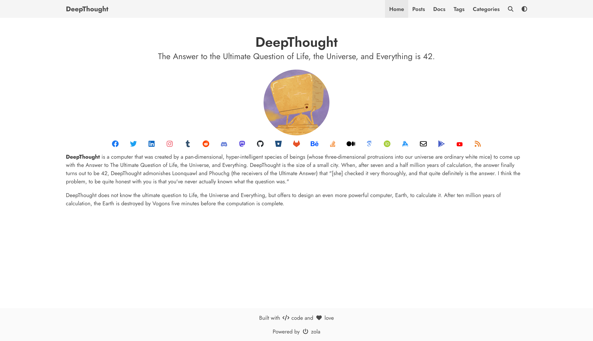

+++
title = "DeepThought"
description = "一个由 Bulma 和 Zola 提供支持的专注于写作的简单博客主题。"
template = "theme.html"
date = 2023-04-09T15:52:10+05:30

[taxonomies]
theme-tags = []

[extra]
created = 2023-04-09T15:52:10+05:30
updated = 2023-04-09T15:52:10+05:30
repository = "https://github.com/RatanShreshtha/DeepThought.git"
homepage = "https://github.com/RatanShreshtha/DeepThought"
minimum_version = "0.14.1"
license = "MIT"
demo = "https://deepthought-theme.netlify.app/"

[extra.author]
name = "Ratan Kulshreshtha"
homepage = "https://ratanshreshtha.dev"
+++        

<div align="center">

  
  <h1>DeepThought</h1>
  
  <p>
    一个由 Bulma 和 Zola 提供支持的专注于写作的简单博客主题。
  </p>
  
  
<!-- Badges -->
<p>
  <a href="https://github.com/RatanShreshtha/DeepThought/graphs/contributors">
    
  </a>
  <a href="">
    
  </a>
  <a href="https://github.com/RatanShreshtha/DeepThought/network/members">
    
  </a>
  <a href="https://github.com/RatanShreshtha/DeepThought/stargazers">
    
  </a>
  <a href="https://github.com/RatanShreshtha/DeepThought/issues/">
    
  </a>
  <a href="https://github.com/RatanShreshtha/DeepThought/blob/main/LICENSE">
    
  </a>
</p>
   
<h4>
    <a href="https://github.com/RatanShreshtha/DeepThought/">查看演示</a>
  <span> · </span>
    <a href="https://github.com/RatanShreshtha/DeepThought">文档</a>
  <span> · </span>
    <a href="https://github.com/RatanShreshtha/DeepThought/issues/">报告 Bug</a>
  <span> · </span>
    <a href="https://github.com/RatanShreshtha/DeepThought/issues/">请求功能</a>
  </h4>
</div>

<br />

<!-- Table of Contents -->
# :notebook_with_decorative_cover: 目录

- :notebook_with_decorative_cover: 目录
  - :star2: 关于项目
    - :camera: 截图
    - :space_invader: 技术栈
    - :dart: 特性
  - :toolbox: 入门
    - :bangbang: 先决条件
    - :gear: 安装
    - :running: 本地运行
    - :triangular_flag_on_post: 部署
  - :eyes: 使用
      - 多语言导航栏
    - KaTeX 数学公式支持
      - 无短代码的自动渲染
    - 其他语言的 Elasticlunr 搜索
  - :wave: 贡献
  - :warning: 许可证
  - :handshake: 联系
  - :gem: 致谢

  

<!-- About the Project -->
## :star2: 关于项目


<!-- Screenshots -->
### :camera: 截图

<div align="center"> 
  
</div>


<!-- TechStack -->
### :space_invader: 技术栈


- [Zola](https://www.getzola.org/) - 您的一站式静态站点引擎
- [Bulma](https://bulma.io/) - 一个有效的现代 CSS 框架。

<!-- Features -->
### :dart: 特性

- [x] 暗色模式
- [x] 分页
- [x] 搜索
- [x] 图表
- [x] 地图
- [x] 示意图
- [x] 画廊
- [x] 分析
- [x] 评论
- [x] 分类
- [x] 社交链接
- [x] 多语言导航栏
- [x] Katex

<!-- Getting Started -->
## 	:toolbox: 入门

<!-- Prerequisites -->
### :bangbang: 先决条件

你需要静态站点生成器 (SSG) [Zola](https://www.getzola.org/documentation/getting-started/installation/) 安装在你的机器上才能使用此主题，请按照他们的 [入门](https://www.getzola.org/documentation/getting-started/overview/) 指南进行操作。

<!-- Installation -->
### :gear: 安装

按照 zola 的 [安装主题](https://www.getzola.org/documentation/themes/installing-and-using-themes/) 指南进行操作。
确保将 `theme = "DeepThought"` 添加到你的 `config.toml`

**检查 zola 版本（仅 0.9.0+）**
只是为了再次检查以确保你有正确的版本。不支持在 0.14.1 以下的版本中使用此主题。

<!-- Run Locally -->
### :running: 本地运行

进入你的站点目录并输入 `zola serve`。你应该会在 `localhost:1111` 看到你的新站点。

**注意**：你必须在 `config.toml` 中提供主题选项变量才能提供功能正常的站点

<!-- Deployment -->
### :triangular_flag_on_post: 部署

[Zola](https://www.getzola.org) 已经有很好的文档用于部署到 [Netlify](https://www.getzola.org/documentation/deployment/netlify/) 或 [Github Pages](https://www.getzola.org/documentation/deployment/github-pages/)。我就不用重复的解释让你感到厌烦了。

<!-- Usage -->
## :eyes: 使用

`DeepThought` 主题提供以下选项

```toml
# 启用外部库
[extra]
katex.enabled = true
katex.auto_render = true

chart.enabled = true
mermaid.enabled = true
galleria.enabled = true

navbar_items = [
 { code = "en", nav_items = [
  { url = "$BASE_URL/", name = "Home" },
  { url = "$BASE_URL/posts", name = "Posts" },
  { url = "$BASE_URL/docs", name = "Docs" },
  { url = "$BASE_URL/tags", name = "Tags" },
  { url = "$BASE_URL/categories", name = "Categories" },
 ]},
]

# 添加 favicon 链接，你可以使用 https://realfavicongenerator.net/ 为你的站点生成 favicon
[extra.favicon]
favicon_16x16 = "/icons/favicon-16x16.png"
favicon_32x32 = "/icons/favicon-32x32.png"
apple_touch_icon = "/icons/apple-touch-icon.png"
safari_pinned_tab = "/icons/safari-pinned-tab.svg"
webmanifest = "/icons/site.webmanifest"

# 作者详情
[extra.author]
name = "DeepThought"
avatar = "/images/avatar.png"

# 社交链接
[extra.social]
email = "<email_id>"
facebook = "<facebook_username>"
github = "<github_username>"
gitlab = "<gitlab_username>"
keybase = "<keybase_username>"
linkedin = "<linkedin_username>"
stackoverflow = "<stackoverflow_userid>"
twitter = "<twitter_username>"
instagram = "<instagram_username>"
behance = "<behance_username>"
google_scholar = "<googlescholar_userid>"
orcid = "<orcid_userid>"
mastodon_username = "<mastadon_username>"
mastodon_server = "<mastodon_server>" (if not set, defaults to mastodon.social)


# 添加 google analytics
[extra.analytics]
google = "<your_gtag>"

# 添加 disqus 评论
[extra.commenting]
disqus = "<your_disqus_shortname>"

# 启用 mapbox 地图
[extra.mapbox]
enabled = true
access_token = "<your_access_token>"
```

#### 多语言导航栏

如果你想在你的博客上拥有多语言导航栏，你必须在 `config.toml` 文件中的 [languages](https://www.getzola.org/documentation/content/multilingual/#configuration) 数组中添加你的新代码语言。

**注意**：不要将你的默认语言添加到此数组中

```toml
languages = [
    {code = "fr"},
    {code = "es"},
]
```

然后为每种语言创建导航项数组：

**注意**：将你的默认语言包含在此数组中

```toml
navbar_items = [
 { code = "en", nav_items = [
  { url = "$BASE_URL/", name = "Home" },
  { url = "$BASE_URL/posts", name = "Posts" },
  { url = "$BASE_URL/docs", name = "Docs" },
  { url = "$BASE_URL/tags", name = "Tags" },
  { url = "$BASE_URL/categories", name = "Categories" },
 ]},
 { code = "fr", nav_items = [
  { url = "$BASE_URL/", name = "Connexion" },
 ]},
 { code = "es", nav_items = [
  { url = "$BASE_URL/", name = "Publicationes" },
  { url = "$BASE_URL/", name = "Registrar" },
 ]}
]
```

en:


fr:


es:


### KaTeX 数学公式支持

此主题包含使用 [KaTeX](https://katex.org/) 的数学公式支持，
可以通过在 `config.toml` 的 `extra` 部分设置 `katex.enabled = true` 来启用。

启用此扩展后，可以在文档中使用 `katex` 短代码：

- `{{/* katex(body="\KaTeX") */}}` 用于排版嵌入文本中的数学公式，
  类似于 LaTeX 中的 `$...$`
- `\KaTeX` 用于排版数学公式块，
  类似于 LaTeX 中的 `$$...$$`

#### 无短代码的自动渲染

可选地，如果通过设置 `katex.auto_render = true` 在配置中启用，
也支持 `\\( \KaTeX \\)` / `$ \KaTeX $` 内联和 `\\[ \KaTeX \\]` / `$$ \KaTeX $$`
块级自动渲染。

### 其他语言的 Elasticlunr 搜索

Zola 使用 [Elasticlunr.js](https://github.com/weixsong/elasticlunr.js) 添加全文搜索功能。
要使用除 en（英语）以外的语言，你需要添加一些 javascript 文件。参见 Zola 的 issue [#1349](https://github.com/getzola/zola/issues/1349)。
通过将 `templates/base.html` 放置在你的项目上并使用 `other_lang_search_js` 块，你可以在正确的时机加载所需的额外 javascript 文件。

例如 `templates/base.html`

```html
 
<script src="{{/* get_url(path='js/lunr.stemmer.support.js') */}}"></script>
<script src="{{/* get_url(path='js/tinyseg.js') */}}"></script>
<script src="{{/* get_url(path='js/lunr.' ~ lang ~ '.js') */}}"></script>
<script src="{{/* get_url(path='js/search.js') */}}"></script>

```

更多详细解释可以在 [elasticlunr 的文档](https://github.com/weixsong/elasticlunr.js#other-languages-example-in-browser) 中找到。

<!-- Contributing -->
## :wave: 贡献

<a href="https://github.com/RatanShreshtha/DeepThought/graphs/contributors">
  
</a>


贡献使开源社区成为一个如此美妙的学习、激励和创造的地方。非常感谢你所做的任何贡献。

- Fork 项目
- 创建你的特性分支 (git checkout -b feature/AmazingFeature)
- 提交你的更改 (git commit -m 'Add some AmazingFeature')
- 推送到分支 (git push origin feature/AmazingFeature)
- 打开一个 Pull Request

<!-- License -->
## :warning: 许可证

根据 MIT 许可证分发。查看 `LICENSE` 获取更多信息。


<!-- Contact -->
## :handshake: 联系

Ratan Kulshreshtha - [@RatanShreshtha](https://twitter.com/RatanShreshtha) - ratan.shreshtha[at]gmail.com

项目链接: [https://github.com/RatanShreshtha/DeepThought](https://github.com/RatanShreshtha/DeepThought)


<!-- Acknowledgments -->
## :gem: 致谢

使用此部分提及你在项目中使用的有用资源和库。

- [Shields.io](https://shields.io/)
- [Choose an Open Source License](https://choosealicense.com)
- [Awesome README](https://github.com/matiassingers/awesome-readme)
- [Emoji Cheat Sheet](https://github.com/ikatyang/emoji-cheat-sheet/blob/main/README.md#travel--places)
- [Slick Carousel](https://kenwheeler.github.io/slick)
- [Font Awesome](https://fontawesome.com)
- [Unsplash](https://unsplash.com/)
