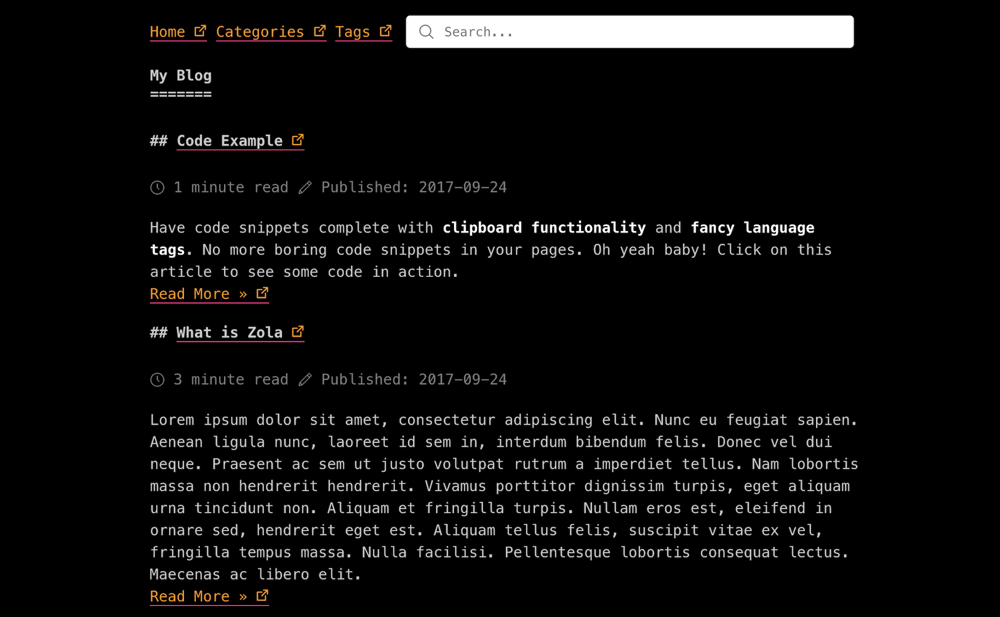

+++
title = "after-dark"
description = "一个稳健、优雅的暗色主题"
template = "theme.html"
date = 2025-01-09T01:48:56-08:00

[taxonomies]
theme-tags = []

[extra]
created = 2025-01-09T01:48:56-08:00
updated = 2025-01-09T01:48:56-08:00
repository = "https://github.com/getzola/after-dark.git"
homepage = "https://github.com/getzola/after-dark"
minimum_version = "0.19.1"
license = "MIT"
demo = "https://getzola.github.io/after-dark/"

[extra.author]
name = "Vincent Prouillet"
homepage = "https://www.vincentprouillet.com"
+++        

# after-dark



## 特性

- [x] 代码片段剪贴板
- [x] Latex 支持
- [ ] 亮色/暗色模式支持
- [x] 搜索功能

## 目录

- 安装
- 选项
  - 顶部菜单
  - 标题
  - 作者
  - 代码片段
  - LaTex 支持
  - 搜索栏

## 安装

首先将此主题下载到你的 `themes` 目录：

```bash
cd themes
git clone https://github.com/getzola/after-dark.git
```

然后在你的 `config.toml` 中启用它：

```toml
theme = "after-dark"
```

此主题需要你的索引部分（`content/_index.md`）分页才能工作：

```toml
paginate_by = 5
```

因此，文章应直接位于 `content` 文件夹下。

主题需要在 `config.toml` 中启用 tags 和 categories 分类法：

```toml
taxonomies = [
    # 你可以启用/禁用 RSS
    {name = "categories", feed = true},
    {name = "tags", feed = true},
]
```

如果你想对分类法页面进行分页，你需要覆盖模板，因为默认情况下它只适用于非分页的分类法。

## 选项

### 顶部菜单

在 `extra` 中设置一个键为 `after_dark_menu` 的字段：

```toml
[extra]
after_dark_menu = [
    {url = "$BASE_URL", name = "Home"},
    {url = "$BASE_URL/categories", name = "Categories"},
    {url = "$BASE_URL/tags", name = "Tags"},
    {url = "https://google.com", name = "Google"},
]
```

如果你在 url 中放入 `$BASE_URL`，它会自动被替换为实际的站点 URL。

### 标题

站点标题显示在首页上。因为它可能与配置中 `title` 字段代表的 `<title>` 元素不同，你可以设置 `after_dark_title` 来代替。

### 作者

你可以在每页基础上或在配置文件中设置此项。

`config.toml`:

```toml
[extra]
author = "John Smith"
```

在页面中（包裹在 +++ 中）：

```toml
title = "..."
date = 1970-01-01

[extra]
author = "John Smith"
```

### 代码片段

语法高亮:

```toml
[markdown]
# 是否进行语法高亮
# 可以通过将 `highlight_theme` 变量设置为 Zola 支持的主题来自定义主题
highlight_code = true

highlight_theme = "one-dark"
```

增强代码块（剪贴板支持和语言标签）

要启用增强代码块，请在你的 `config.toml` 中设置以下内容：

```toml
[extra]
codeblock = true
```

### LaTex 支持

要使用 MathJax 启用 LaTeX 支持，请在你的 `config.toml` 中设置以下内容：

```toml
[extra]
latex = true
```

### 搜索栏

要在页面导航顶部启用搜索栏，请在你的 `config.toml` 中设置以下内容：

```toml
build_search_index = true

[search]
index_format = "elasticlunr_json"

[extra]
enable_search = true
```
