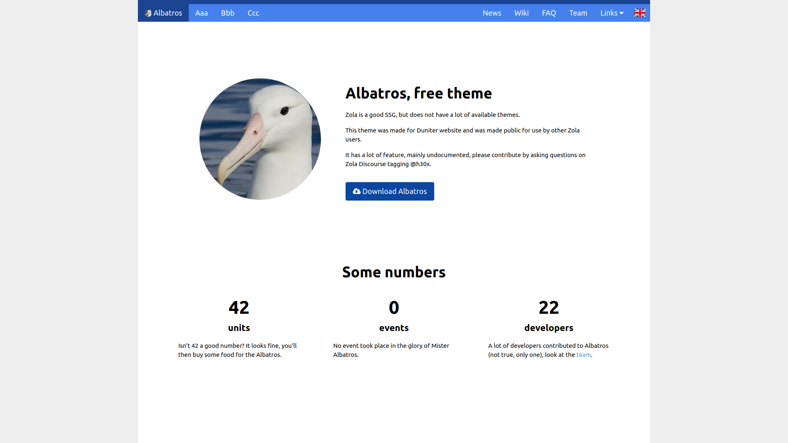

+++
title = "Albatros"
description = "一个功能丰富、最初为 Duniter 网站打造的主题"
template = "theme.html"
date = 2026-03-07T23:59:13+01:00

[taxonomies]
theme-tags = []

[extra]
created = 2026-03-07T23:59:13+01:00
updated = 2026-03-07T23:59:13+01:00
repository = "https://git.42l.fr/HugoTrentesaux/Albatros.git"
homepage = "https://git.42l.fr/HugoTrentesaux/Albatros"
minimum_version = "0.20.0"
license = "AGPL"
demo = "https://albatros.coinduf.eu/"

[extra.author]
name = "Hugo Trentesaux"
homepage = "https://trentesaux.fr/"
+++        

# Zola 的 Albatros 主题

这个主题最初是为 [Duniter](https://duniter.fr/) 网站开发，随后被抽象整理为通用主题 **Albatros**。



## 安装

将主题作为 git 子模块添加：

```bash
git submodule add --name albatros https://git.42l.fr/HugoTrentesaux/albatros.git themes/albatros
```

然后在你的 `config.toml` 中启用主题：

theme = "albatros"

## 功能

它有很多功能，我还没来得及完整文档化。大部分可自定义项位于 `theme.toml` 的 `extra` 区域以及 `sass/_albatros.sass` 文件（例如颜色）。

See:

- https://duniter.fr/
- https://duniter.org/

可作为参考。

### 落地页

建议你提供自定义落地页，可写在 `template/custom` 中。
其余部分由主题处理（页面会以带面包屑的 wiki 结构组织）。

### 作者信息

每位作者都需要在 `content/team` 目录中拥有一张资料卡。

## 支持

如有需要，我会在 [Zola forum](https://zola.discourse.group/) 提供支持，并逐步补充该主题文档。
        
