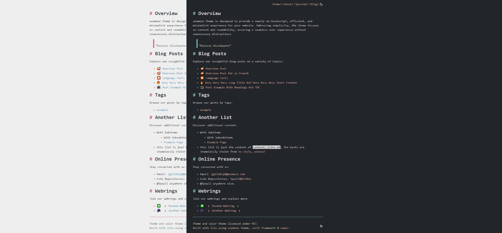

+++
title = "anemone"
description = "一个极简的 Zola 主题，优先考虑干净的 CSS 并避免繁重的 JavaScript。享受闪电般加载速度带来的无缝用户体验。让你的内容在整洁、优雅的设计中占据中心位置，增强可读性。响应式且高效，anemone 让焦点回归你的想法。"
template = "theme.html"
date = 2026-02-20T02:49:31+01:00

[taxonomies]
theme-tags = []

[extra]
created = 2026-02-20T02:49:31+01:00
updated = 2026-02-20T02:49:31+01:00
repository = "https://github.com/Speyll/anemone.git"
homepage = "https://github.com/Speyll/anemone"
minimum_version = "0.4.0"
license = "MIT"
demo = "https://anemone.pages.dev"

[extra.author]
name = "Speyll"
homepage = "https://speyllsite.pages.dev/"
+++        

# anemone

介绍 "anemone"，一个极简的 [Zola](https://www.getzola.org) 主题，优先考虑干净的 CSS 并避免繁重的 JavaScript。享受闪电般加载速度带来的无缝用户体验。让你的内容在整洁、优雅的设计中占据中心位置，增强可读性。响应式且高效，anemone 让焦点回归你的想法。

你可以在[这里](https://anemone.pages.dev/)浏览演示网站。

Anemone 是一个多功能的 Zola 主题，提供亮色和暗色变体。你可以轻松在亮色和暗色主题之间切换，以适应你的喜好。



## 安装

要开始使用 Anemone，请遵循以下简单步骤：

1. 下载主题到你的 `themes` 目录：

```bash
cd themes
git clone https://github.com/Speyll/anemone
```

2. 在你的 `config.toml` 中启用 Anemone：

```toml
theme = "anemone"
```

## 发布说明

#### 2025-04-09

此版本引入了项目的**完全重写**：全面简化、改进和优化。

**如果你是从旧版本更新：**
1. 打开你的 `config.toml` 文件并根据需要进行更新（参考最新版本）。
2. 从 `content/blog/_index.md` 中删除以下行：
   ```toml
   page_template = "blog-page.html"
   ```

#### 2024-03-02
此版本带来了多项改进和增强，主要集中在优化性能和用户体验上。以下是关键更改的摘要：

- **suCSS 集成：** 核心 CSS 现在利用由我制作的轻量级 [suCSS 框架](https://speyll.github.io/suCSS/)，提供更好的可维护性、稳健性和可扩展性。有了 suCSS，主题在不同浏览器中应保持一致的外观。

- **增强的主题切换：** 暗色和亮色主题切换已改进以提高一致性。现在，网站尊重用户的系统级主题设置，确保存无缝体验。此外，切换功能会记住选定的主题以供将来访问，提供了更好的可用性。

- **平滑过渡和音效：** 享受暗色和亮色模式之间更平滑的过渡，并伴有微妙的音效。请放心，增加的音效带来的性能开销极小，文件大小仅为 1kb。

- **类名和短代码更新：** 为了更好的组织和清晰度，一些类名和短代码已被修改。对于由此可能造成的任何不便，我深表歉意。

- **颜色选择的微调：**为了可读性，更改了一些暗色模式的颜色，仍然使用 [veqev](https://github.com/Speyll/veqev)。


## 选项

Anemone 提供了各种选项来自定义你的网站：

#### 默认分类法

要使用标签，请将以下代码添加到页面的元数据中：

```toml
[taxonomies]
tags = ["tag1", "tag2"]
```

#### 首页文章列表

通过将以下代码添加到 `config.toml` 来启用首页文章列表：

```toml
[extra]
list_pages = true
```

#### 多语言

该主题具有内置功能，允许你使用多种语言。有关如何使用此功能的详细说明，请参阅 [Zola 多语言文档](https://www.getzola.org/documentation/content/multilingual/)。此文档提供了有关如何充分利用此多语言功能的更多信息。

```toml
[languages.fr]
weight = 2
title = "anemone"
languageName = "Français"
languageCode = "fr"
```
#### 支持多语言的导航栏

在 `config.toml` 的 `extra` 部分使用以下代码自定义头部导航链接：

```toml
[extra]

header_nav = [
  { url = "/", name_en = "/home/", name_fr = "/accueil/" },
  { url = "/about", name_en = "/about/", name_fr = "/concernant/" },
  { url = "/journal", name_en = "/journal/", name_fr = "/journal/" },
  { url = "/blog", name_en = "/blog/", name_fr = "/blog/" }
]
```

#### 为页面添加目录 (TOC)

在页面的 Front Matter 中，设置 `extra.toc` 为 `true`：

```toml
[extra]
toc = true
```

#### 在博客文章中显示作者姓名

通过将 `display_author` 变量切换为 `true` 或 `false` 来自定义博客文章中作者姓名的显示：

```toml
[extra]
display_author = true
```

### Webrings

使用短代码添加 webring：

```html
{{/* webring(prev="#", webring="#", webringName="Random Webring", next="#") */}}
```

### 额外数据

- 在主配置和页面元数据中设置 `author`。
- 同样，在主配置中设置 `favicon`，它将被用作站点图标。
- 如果你想在页脚显示内容许可信息，请设置 `footer_content_license` 和 `footer_content_license_link`。


### 许可证

Anemone 主题根据 [GPLv3 许可证](LICENSE) 作为开源软件提供。
