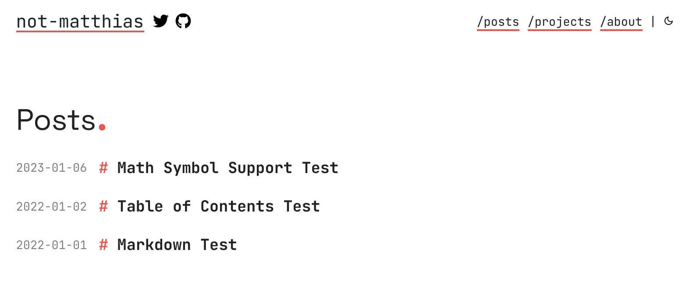

+++
title = "apollo"
description = "现代且极简主义的博客主题"
template = "theme.html"
date = 2026-03-05T22:45:50+01:00

[taxonomies]
theme-tags = []

[extra]
created = 2026-03-05T22:45:50+01:00
updated = 2026-03-05T22:45:50+01:00
repository = "https://github.com/not-matthias/apollo.git"
homepage = "https://github.com/not-matthias/apollo"
minimum_version = "0.14.0"
license = "MIT"
demo = "https://not-matthias.github.io/apollo"

[extra.author]
name = "not-matthias"
homepage = "https://github.com/not-matthias"
+++        

# apollo

由 [Zola](https://getzola.org) 驱动的现代且极简主义的博客主题。点击 [这里](https://not-matthias.github.io/apollo) 查看在线预览。

<sub><sup>以希腊知识、智慧和智力之神命名</sup></sub>

<details open>
  <summary>暗色主题</summary>


</details>

<details>
  <summary>亮色主题</summary>



</details>

## 特性

- [x] 分页
- [x] 主题（亮色、暗色、自动）
- [x] 项目页面
- [x] 使用 [GoatCounter](https://www.goatcounter.com/) / [Umami](https://umami.is/) / [Google Analytics](https://analytics.google.com/) 进行分析
- [x] 社交链接
- [x] MathJax 渲染
- [x] 分类法
- [x] 单个页面的 Meta 标签
- [x] 自定义首页
- [x] 评论
- [x] 搜索
- [x] RSS 订阅
- [x] Mermaid 图表支持
- [x] 目录
- [x] 可配置的卡片布局

## 安装

1. 下载主题

```
git submodule add https://github.com/not-matthias/apollo themes/apollo
```

2. 将以下内容添加到你的 `config.toml` 顶部

```toml
theme = "apollo"
taxonomies = [{ name = "tags" }]

[extra]
theme = "auto"
socials = [
  # 在此配置社交链接
]
menu = [
  # 在此配置菜单栏
]

# 更多选项请参阅：https://github.com/not-matthias/apollo/blob/main/config.toml#L14
```

3. 复制示例内容

```
cp -r themes/apollo/content/* content/
```

## 配置

查看所有 [你可以配置的选项](./content/posts/configuration.md) 和 [示例页面](./content/posts/)。

## 参考

此主题基于 [archie-zola](https://github.com/XXXMrG/archie-zola/)。
