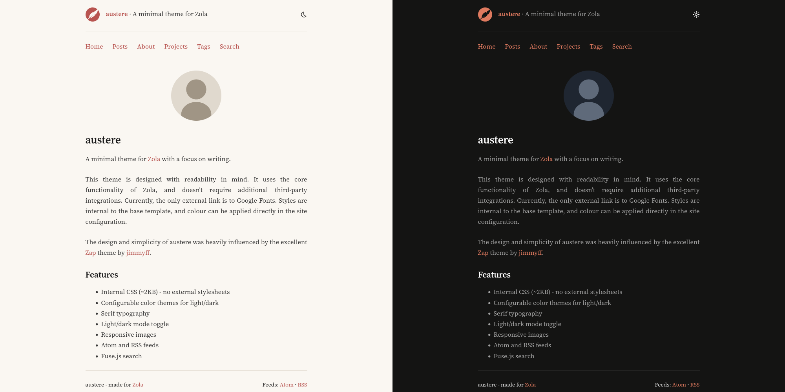

+++
title = "austere"
description = "一个专注于写作的 Zola 极简主题。"
template = "theme.html"
date = 2025-12-28T15:39:35Z

[taxonomies]
theme-tags = ['dark', 'blog', 'minimal', 'personal', 'responsive', 'seo', 'writing']

[extra]
created = 2025-12-28T15:39:35Z
updated = 2025-12-28T15:39:35Z
repository = "https://github.com/tomwrw/austere-theme-zola"
homepage = "https://github.com/tomwrw/austere-theme-zola"
minimum_version = "0.17.0"
license = "MIT"
demo = ""

[extra.author]
name = "tomwrw"
homepage = "https://www.tomwrw.com"
+++        

<p align="center">
  
</p>

<h1 align="center">austere</h1>

<p align="center">一个专注于写作的 <a href="https://getzola.org">Zola</a> 极简主题。</p>

---

**在线演示：** [我的个人网站](https://tomwrw.com)

austere 主题的设计考虑了可读性。它使用了 Zola 的核心功能，不需要额外的第三方集成。目前，唯一的外部链接是指向 Google Fonts。样式在基本模板内部，颜色可以直接在站点配置中应用。

austere 的设计和简洁性在很大程度上受到了 [jimmyff](https://github.com/jimmyff) 优秀的 [Zap](https://github.com/jimmyff/zola-zap) 主题的影响。

## 特性

- 内部 CSS (~2KB) - 无外部样式表
- 可配置的亮色/暗色主题
- 衬线排版
- 亮色/暗色模式切换
- 响应式图片
- Atom 和 RSS 订阅
- Fuse.js 搜索

## 截图

<p align="center">
  
</p>

## 安装

1. 下载此主题到你的 `themes` 目录：
   ```bash
   cd your-zola-site
   git submodule add https://github.com/tomwrw/austere-theme-zola themes/austere
   ```

2. 在你的 `config.toml` 中设置主题：
   ```toml
   theme = "austere"
   ```

3. 复制示例内容以开始（可选）：
   ```bash
   cp -r themes/austere/content/* content/
   ```

## 配置

### 示例配置

在这里你可以找到一个用于 austere 主题的 config.toml 示例。确保你更改了：

- Title
- Description
- Base URL


```toml
# 站点标题。
title = "austere"
# 站点描述。
description = "A minimal theme for Zola with a focus on writing."
# 你的站点基础 URL。
base_url = "https://www.tomwrw.co.uk"
# 无 SASS - CSS 是内部的（位于 base.html 模板中）。
compile_sass = false
# 启用搜索索引。
build_search_index = true
# 默认站点语言。
default_language = "en"
# 订阅。
generate_feeds = true
# 指定订阅文件名。
feed_filenames = ["atom.xml", "rss.xml"]
# 分类法。
taxonomies = [{ name = "tags", feed = true }]

[search]
# 搜索页面工作所必需。
index_format = "fuse_javascript"

[markdown]
# 代码高亮块所必需。
highlight_code = true
highlight_theme = "css"

[slugify]
# 控制页面/版块 URL 的 slug 化。
paths = "on"
# 控制分类法术语（标签、分类等）的 slug 化。
taxonomies = "on"
# 控制标题锚点（H1 到 H6 等）的 slug 化。
anchors = "on"

[extra]
# SEO 关键词。
keywords = "zola, theme, minimal"
# 页眉中的站点图标（可选 - 注释掉以隐藏）。
site_icon = "quill.svg"
# 页眉标语（可选 - 注释掉以隐藏）。
strapline = "A minimal theme for Zola"
# 页脚文本（可选 - 注释掉以隐藏）。
footer_text = "austere - made for <a href='https://getzola.org'>Zola</a>"
# Favicon（可选 - 注释掉以隐藏）。
favicon = "/favicon.ico"
# 首页上的个人资料图片（可选 - 注释掉以隐藏）。
profile_picture = "/images/profile.svg"

# 启用内联 SVG 图标（使用精灵图）。
inline_icons = true
icon_path = "static/icons/"
icons = ["light", "asleep", "rss"]

# 响应式图片
image_format = "auto"
image_quality = 80
images_default_size = 1024
images_sizes = [512, 1024, 2048]

# 导航菜单。
menu_links = [
  { url = "$BASE_URL/", name = "Home" },
  { url = "$BASE_URL/posts/", name = "Posts" },
  { url = "$BASE_URL/about/", name = "About" },
  { url = "$BASE_URL/projects/", name = "Projects" },
  { url = "$BASE_URL/tags/", name = "Tags" },
  { url = "$BASE_URL/search/", name = "Search" },
]

# 自定义颜色主题。在此调整以应用自己的颜色。
# 亮色。
[extra.colours.light]
background = "#FAF7F2"
text = "#1a1a1a"
text_muted = "#3a3a3a"
accent = "#9E4440"
accent_hover = "#7A3533"
code_bg = "#f0ebe3"
border = "#e0d9ce"
# 暗色。
[extra.colours.dark]
background = "#141413"
text = "#e8e8e8"
text_muted = "#a0a0a0"
accent = "#E07A5F"
accent_hover = "#F4A594"
code_bg = "#1e1e1d"
border = "#2a2a29"

```

### 主题选项

所有主题选项都在 `config.toml` 中的 `[extra]` 下：

#### 站点标识

| 选项 | 描述 | 默认值 |
|--------|-------------|---------|
| `strapline` | 页眉显示的标语 | *(无)* |
| `favicon` | favicon 路径 | *(无)* |
| `profile_picture` | 首页个人资料图片 | *(无)* |
| `keywords` | SEO meta 关键词 | *(无)* |
| `footer_text` | 页脚 HTML 内容 | *(无)* |

```toml
[extra]
strapline = "Welcome to my website"
favicon = "/favicon.ico"
profile_picture = "/images/me.png"
keywords = "blog, writing, zola"
footer_text = "Made with <a href='https://getzola.org'>Zola</a>"
```

#### 导航

```toml
[extra]
menu_links = [
  { url = "$BASE_URL/", name = "Home" },
  { url = "$BASE_URL/posts/", name = "Posts" },
  { url = "$BASE_URL/about/", name = "About" },
  { url = "$BASE_URL/projects/", name = "Projects" },
  { url = "$BASE_URL/tags/", name = "Tags" },
  { url = "$BASE_URL/search/", name = "Search" },
]
```

#### 颜色

自定义亮色和暗色模式的配色方案：

```toml
[extra.colours.light]
background = "#FAF7F2"
text = "#1a1a1a"
text_muted = "#3a3a3a"
accent = "#9E4440"
accent_hover = "#7A3533"
code_bg = "#f0ebe3"
border = "#e0d9ce"

[extra.colours.dark]
background = "#141413"
text = "#e8e8e8"
text_muted = "#a0a0a0"
accent = "#E07A5F"
accent_hover = "#F4A594"
code_bg = "#1e1e1d"
border = "#2a2a29"
```

#### 响应式图片

```toml
[extra]
image_format = "auto"      # auto, webp, jpg, png
image_quality = 80         # 1-100
images_default_size = 1024
images_sizes = [512, 1024, 2048]
```

#### 分析（可选）

```toml
[extra]
# Umami Analytics
umami_website_id = "your-website-id"
umami_src = "https://cloud.umami.is/script.js"  # optional, custom domain
umami_domains = "yoursite.com"                  # optional, limit tracking

# OR Google Analytics
google_analytics_tag_id = "G-XXXXXXXXXX"
```

## 内容

### 文章

在 `content/posts/` 中创建文章：

```markdown
+++
title = "My Post Title"
date = 2024-01-15
description = "A brief description for SEO"
[taxonomies]
tags = ["zola", "blogging"]
+++

Your content here...
```

对于带有图片的文章，使用文件夹结构：

```
content/posts/my-post/
├── index.md
└── image.jpg
```

### 页面

在 `content/` 中创建独立页面：

```markdown
+++
title = "About"
template = "page.html"
+++

Page content...
```

### 项目

创建 `content/projects/_index.md`:

```markdown
+++
title = "Projects"
template = "projects.html"
+++
```

然后创建 `content/projects/projects.toml`:

```toml
[[projects]]
title = "Project Name"
emoji = "🚀"
description = "What this project does"
url = "https://github.com/you/project"
image = "screenshot.png"  # optional, relative to projects folder
date = "2024"
status = "Active"
tags = ["rust", "web"]
```

### 搜索

创建 `content/search.md`:

```markdown
+++
title = "Search"
template = "search.html"
+++
```

## 短代码

### 响应式图片

```markdown
{{/* image(src="photo.jpg", alt="Description") */}}
```

### YouTube 嵌入

```markdown
{{/* youtube(id="dQw4w9WgXcQ") */}}
{{/* youtube(id="dQw4w9WgXcQ", autoplay=true) */}}
```

### Spotify 嵌入

```markdown
{{/* spotify(id="album-id") */}}
```

## 自定义

### 模板钩子

在你自己 `templates/macros/hooks.html` 中覆盖这些宏：

```html

<!-- Content before post body -->



<!-- Content after post body -->



<!-- Content after post tags -->



<!-- Content after post title in list view -->

```

### OpenGraph 图片

为任何页面添加预览图片：

```markdown
+++
[extra]
og_preview_img = "preview.jpg"
+++
```

## 要求

- Zola 0.17.0 或更高版本

## 许可证

MIT

## 致谢

- [Zap](https://github.com/jimmyff/zap) by [jimmyff](https://github.com/jimmyff) - 原始主题灵感
- [Zola](https://getzola.org) - 静态站点生成器
- [Fuse.js](https://fusejs.io) - 客户端搜索
- [Source Serif 4](https://fonts.google.com/specimen/Source+Serif+4) - 排版
- Favicon by [IconsMind](https://iconarchive.com/artist/iconsmind.html)
