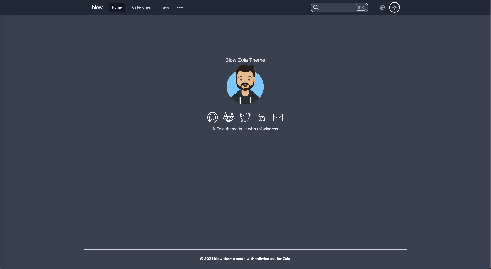

+++
title = "Blow"
description = "一个用 Tailwindcss 制作的 Zola 主题"
template = "theme.html"
date = 2024-09-29T16:55:23+02:00

[taxonomies]
theme-tags = []

[extra]
created = 2024-09-29T16:55:23+02:00
updated = 2024-09-29T16:55:23+02:00
repository = "https://github.com/tchartron/blow.git"
homepage = "https://github.com/tchartron/blow"
minimum_version = "0.9.0"
license = "MIT"
demo = "https://tchartron.com"

[extra.author]
name = "Thomas Chartron"
homepage = "https://tchartron.com"
+++        

# Blow
一个使用 [tailwindcss](https://tailwindcss.com/) 构建的 [Zola](https://www.getzola.org/) 主题。

(WIP) 示例 : [这里](https://tchartron.com)  

## 预览


## 使用
你应该遵循关于安装 Zola 主题的 [官方文档](https://www.getzola.org/documentation/themes/installing-and-using-themes/)。

我建议将主题添加为 git 子模块：
```bash
cd my-zola-website
git submodule add -b main git@github.com:tchartron/blow.git themes/blow
```

编辑你的 `config.toml` 文件中使用的主题
```toml
# 使用的站点主题。
theme = "blow"
```

然后编辑你的 `config.toml` 文件以覆盖主题的值：
```toml
[extra]
enable_search = true
enable_sidebar = true
enable_adsense = true
enable_multilingue = true
adsense_link = "https://pagead2.googlesyndication.com/pagead/js/adsbygoogle.js?client=myclientid"

[extra.lang]
items = [
    { lang = "en", links = [
        { base_url = "/", name = "English" },
        { base_url = "/fr", name = "French" },
    ] },
    { lang = "fr", links = [
        { base_url = "/", name = "Anglais" },
        { base_url = "/fr", name = "Français" },
    ] },
]

[extra.navbar]
items = [
    { lang = "en", links = [
        { url = "/", name = "Home" },
        { url = "/categories", name = "Categories" },
        { url = "/tags", name = "Tags" },
    ] },
    { lang = "fr", links = [
        { url = "/fr", name = "Accueil" },
        { url = "/fr/categories", name = "Categories" },
        { url = "/fr/tags", name = "Tags" },
    ] },
]
title = "title"

[extra.sidebar]
items = [
    { lang = "en", links = [
        { url = "/markdown", name = "Markdown" },
        { url = "/blog", name = "Blog" },
    ] },
    { lang = "fr", links = [
        { url = "/fr/markdown", name = "Markdown" },
        { url = "/fr/blog", name = "Blog" },
    ] },
]

# 首页
[extra.index]
title = "Main title"
image = "https://via.placeholder.com/200"
image_alt = "Placeholder text describing the index's image."

[extra.default_author]
name = "John Doe"
avatar = "https://via.placeholder.com/200"
avatar_alt = "Placeholder text describing the default author's avatar."

[extra.social]
codeberg = "https://codeberg.org/johndoe"
github = "https://github.com/johndoe"
gitlab = "https://gitlab.com/johndoe"
twitter = "https://twitter.com/johndoe"
mastodon = "https://social.somewhere.com/users/johndoe"
linkedin = "https://www.linkedin.com/in/john-doe-b1234567/"
stackoverflow = "https://stackoverflow.com/users/01234567/johndoe" 
telegram = "https://t.me/johndoe"
email = "john.doe@gmail.com"

[extra.favicon]
favicon = "/icons/favicon.ico"
favicon_16x16 = "/icons/favicon-16x16.png"
favicon_32x32 = "/icons/favicon-32x32.png"
apple_touch_icon = "/icons/apple-touch-icon.png"
android_chrome_512 = "/icons/android-chrome-512x512.png"
android_chrome_192 = "/icons/android-chrome-192x192.png"
manifest = "/icons/site.webmanifest"
```

你现在可以运行 `zola serve` 并访问 : `http://127.0.0.1:1111/` 查看你的站点

## 语法高亮
Blow 利用了 Zola 代码高亮功能。
它支持根据用户选择的主题（暗色 / 亮色）设置不同的配色方案。
为了使用它，你应该在 [这里](https://www.getzola.org/documentation/getting-started/configuration/#syntax-highlighting) 提供的列表中选择你想用于亮色和暗色主题的配色方案，并像此示例一样编辑你的 `config.toml` 文件：
```toml
highlight_theme = "css"

highlight_themes_css = [
  { theme = "ayu-dark", filename = "syntax-dark.css" },
  { theme = "ayu-light", filename = "syntax-light.css" },
]
```

## 自定义页脚内容
要覆盖默认页脚（版权声明），请按照 [Zola 文档](https://www.getzola.org/documentation/themes/extending-a-theme/#overriding-a-block) 中的描述，通过在你的 `templates` 目录中创建一个包含以下内容的 `layout.html` 来扩展主题的 `layout.html` 模板：

```jinja



Here is my own footer with a <a href="http://example.com">link</a>.

```

## 特性
- [X] 暗色/亮色模式（根据所选主题进行语法高亮）
- [X] 可自定义的导航栏链接
- [X] 标签和分类分类法
- [X] 支持 Command + K 快捷键的搜索功能
- [X] 社交链接（github, gitlab, twitter, linkedin, email）
- [X] 使用 cssnano 的 Postcss 构建过程（以及 tailwindcss tree shaking 以减小最终包大小）
- [X] 使用 minification 的 Uglifyjs 构建过程
- [X] 部署到 Github Pages 的示例脚本
- [X] 分页
- [X] 带有部分链接的侧边菜单
- [X] 目录（2 级和当前查看部分高亮）
- [X] 多语言
- [X] 404
- [X] 移动端响应式
- [X] Favicon
- [ ] Adsense

## 部署
Zola [文档](https://www.getzola.org/documentation/deployment/overview/) 中有一节关于部署，但你会找到一个将你的站点部署到 github pages 的 [示例](https://github.com/tchartron/blow/blob/main/deploy-github.sh)
