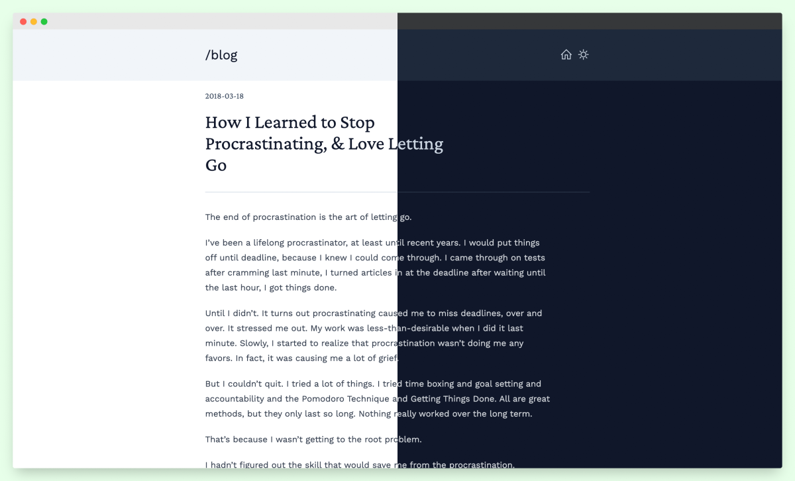

+++
title = "boring"
description = "一个极简主题"
template = "theme.html"
date = 2025-09-05T12:48:33+05:30

[taxonomies]
theme-tags = []

[extra]
created = 2025-09-05T12:48:33+05:30
updated = 2025-09-05T12:48:33+05:30
repository = "https://github.com/ssiyad/boring.git"
homepage = "https://github.com/ssiyad/boring"
minimum_version = "0.16.0"
license = "GPLv3"
demo = "https://boring-zola.netlify.app/"

[extra.author]
name = "Sabu Siyad"
homepage = "https://ssiyad.com"
+++        

# Boring

[Zola](https://www.getzola.org/) 的极简主题，由 [TailwindCSS](https://tailwindcss.com/) 驱动。

### 演示
https://boring-zola.netlify.app/



### 设置
在你的 zola 站点目录中：
- 获取主题

    ```bash
    git submodule add https://github.com/ssiyad/boring themes/boring
    ```

- 构建 CSS

    ```bash
    cd themes/boring
    yarn install --frozen-lockfile
    yarn build
    ```

- 更改特定于主题的变量。它们列在 [config.toml](./config.toml) 的 `extra` 部分中。

有关进一步说明，请参阅 [Zola 文档](https://www.getzola.org/documentation/themes/installing-and-using-themes/#using-a-theme)。

### 许可证
[GPLv3](./LICENSE)
