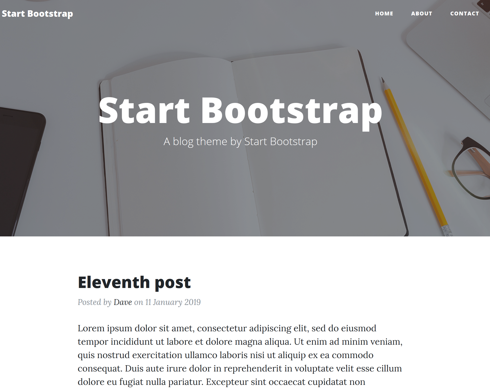

+++
title = "Clean Blog"
description = "Start Bootstrap Clean Blog 的 Zola 移植版"
template = "theme.html"
date = 2023-04-17T13:28:42+01:00

[taxonomies]
theme-tags = []

[extra]
created = 2023-04-17T13:28:42+01:00
updated = 2023-04-17T13:28:42+01:00
repository = "https://github.com/dave-tucker/zola-clean-blog.git"
homepage = "https://github.com/dave-tucker/zola-clean-blog"
minimum_version = "0.4.0"
license = "MIT"
demo = "https://zola-clean-blog.netlify.app/"

[extra.author]
name = "Dave Tucker"
homepage = "https://dtucker.co.uk"
+++        

zola-clean-blog
===============



StartBootstrap Clean Blog 主题的 Zola 移植版。

## 演示

[在线演示](https://zola-clean-blog.netlify.com)

## 使用

要使用此主题，请克隆此仓库到你的 `themes` 目录。
它要求你使用 categories（分类）和 tags（标签）分类法。
可以通过在 `config.toml` 中添加以下内容来完成：

```toml
theme = "zola-clean-blog"

taxonomies = [
    {name = "categories", rss = true, paginate_by=5},
    {name = "tags", rss = true, paginate_by=5},
]
```

## 特性

- 分页的首页/分类/标签页
- 可自定义菜单
- 可自定义社交链接

## 如何自定义

- 要替换页眉图片，请添加新图片到 `static/img/$page-bg.jpg`，其中 `$page` 是 `about`, `home`, `post` 或 `contact` 之一。

- 要替换版权字段，请创建你自己的 `templates/index.html` 来扩展模板并添加一个 `copyright` 块：
```


Copyright %copy; Example, Inc. 2016-2019

```

- 要添加新菜单项，请在你的 `config.toml` 中覆盖 `clean_blog_menu`。你可以使用 `$BASE_URL` 来引用你自己的站点。

- 要添加新社交链接，请在你的 `config.toml` 中覆盖 `clean_blog_social`。你可以使用 `$BASE_URL` 来引用你自己的站点。

- 要添加 Google Analytics，你可以使用你自己的 `index.html` 将你的脚本添加到 `extrascripts` 块中：
```


<script>
...
</script>

```
