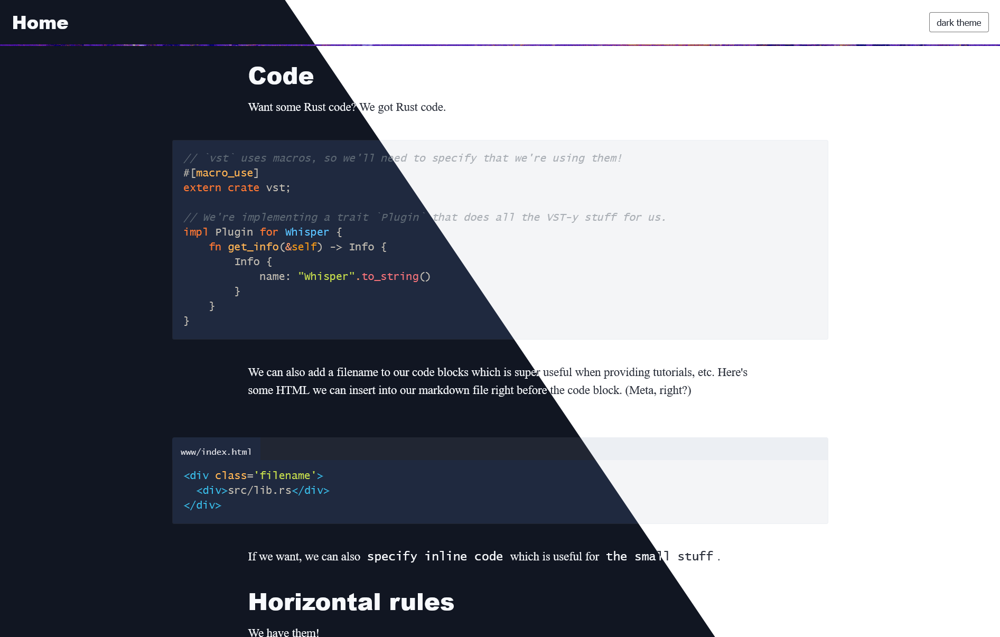

+++
title = "feather"
description = "一个模糊风格的博客主题"
template = "theme.html"
date = 2026-01-26T07:40:26-05:00

[taxonomies]
theme-tags = []

[extra]
created = 2026-01-26T07:40:26-05:00
updated = 2026-01-26T07:40:26-05:00
repository = "https://github.com/piedoom/feather.git"
homepage = "https://github.com/piedoom/feather"
minimum_version = "0.19.0"
license = "MIT"
demo = "http://feather.doomy.org/"

[extra.author]
name = "doomy"
homepage = "https://doomy.org"
+++        

# feather

一个适用于 [Zola](https://www.getzola.org/) 的轻量级博客主题（据我所知，这是专门为 Zola 创建的首批主题之一）。

# [在线演示 🔗](https://feather.doomy.org/)

[](https://feather.doomy.org/)

## 特性

- 完全响应式
- 为易读性而设计
- 所有 JS 都是非关键的，并能优雅降级

## 选项

Zola 允许主题在配置中[定义 `[extra]` 变量](https://www.getzola.org/documentation/getting-started/configuration/)。这里是主题变量的完整列表，附带示例值和注释。

```toml
# 你可能想要设置的常规变量...
title = "My site" # 否则，这将在导航中显示为 "Home"

[extra.feather]
# 指定要使用的主题，或使用系统偏好
# 如果设置，主题切换按钮将被隐藏
theme = "light"
head = "<script></script>" # 添加任何内容到 head
hide_nav_image = false # 隐藏导航图片
disqus_id = "my-site-com" # 如果你想要 disqus 评论，填写站点域名
cusdis_id = "12312-31231123-123123123" # 如果你使用 cusdis 评论服务，填写 id
social =  { url = "https://mastodon.social/@doomy", display = "@doomy@mastodon.social" } # 在页面上显示的通用社交信息
timezone = "America/New_York" # 用于计算文章发布时间的时区

[extra.feather.analytics]
goatcounter_id = "mydomain-com" # 隐私优先的分析 https://www.goatcounter.com
```

对于每篇文章，这些选项可用：

```toml
[extra.feather.opengraph]
image = "my_image.jpg" # 假设资源共存
```

# 使用

使用 feather 很简单。安装 [Zola](https://www.getzola.org/) 并按照[创建站点和使用主题的指南](https://www.getzola.org/documentation/themes/installing-and-using-themes/)操作。然后，将 `theme = "feather"` 添加到你的 `config.toml` 文件中。

如果你打算将你的站点发布到 GitHub Pages，请查看 [这篇教程](https://www.getzola.org/documentation/deployment/github-pages/)。

你可以指定 `tags` 分类法。

# 开发与贡献

因为 feather 附带了示例内容，你可以像任何 Zola 博客一样使用 `zola serve` 运行该主题。
