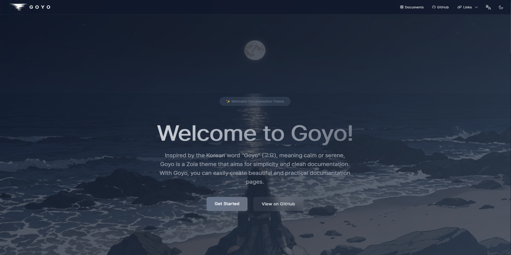

+++
title = "Goyo"
description = "简洁清爽的文档主题"
template = "theme.html"
date = 2026-02-27T18:48:22+09:00

[taxonomies]
theme-tags = ['documentation', 'Multilingual', 'Responsive', 'minimal']

[extra]
created = 2026-02-27T18:48:22+09:00
updated = 2026-02-27T18:48:22+09:00
repository = "https://github.com/hahwul/goyo"
homepage = "https://github.com/hahwul/goyo"
minimum_version = "0.17.0"
license = "MIT"
demo = "https://goyo.hahwul.com"

[extra.author]
name = "hahwul"
homepage = "https://www.hahwul.com"
+++        



<div align="center">
  <p>Goyo 是一个追求简洁与清晰文档体验的 <a href="https://www.getzola.org/">Zola</a> 主题。</p>
</div>

<p align="center">
  <a href="https://goyo.hahwul.com"></a>
  <a href="https://github.com/hahwul/goyo/blob/main/CONTRIBUTING.md"></a>
  <a href="https://www.getzola.org/"></a>
  <a href="https://tailwindcss.com"></a>
  <a href="https://daisyui.com"></a>
</p>

## 功能

- 深色/浅色主题与亮度设置
- 美观的落地页
- 响应式设计
- SEO 友好（Sitemap、RSS）
- 多语言支持（含 RTL）
- 自动生成侧边栏与自定义导航
- 内置搜索
- 内置资源（FontAwesome、Mermaid.js）
- 评论系统（Giscus、Utterances）
- 多种短代码（Mermaid、Asciinema、Katex、Alert、Badge、YouTube、Gist、Carousel、Collapse 等）
- 自定义字体支持
- 编辑页面、分享按钮与分类系统
- 高度可定制

## 安装

创建你的 zola 站点：

```bash
zola init yoursite
cd yoursite
```

将主题作为 git 子模块添加：

```bash
git init  # if your project is a git repository already, ignore this command
git submodule add https://github.com/hahwul/goyo themes/goyo
```

或直接克隆到 `themes` 目录：

```bash
git clone https://github.com/hahwul/goyo themes/goyo
```

然后在 `config.toml` 中将 `goyo` 设置为主题：

```toml
title = "Your Docs"
theme = "goyo"
```

## 配置

在 `config.toml` 中添加 `extra` 配置：

```toml
[extra]
# Navigation Configuration
nav = [
  { name = "Documents", url = "/introduction", type = "url", icon = "fa-solid fa-book" },
  { name = "GitHub", url = "https://github.com/hahwul/goyo", type = "url", icon = "fa-brands fa-github" },
  { name = "Links", type = "dropdown", icon = "fa-solid fa-link", members = [
    { name = "Creator Blog", url = "https://www.hahwul.com", type = "url", icon = "fa-solid fa-fire-flame-curved" }
  ] }
]

# Navigation Configuration (i18n / optional)
# `nav_{lang}`: Language-specific navigation menu (e.g., `nav_ko` for Korean).
# If defined, it will be used instead of the default `nav` for that language.
nav_ko = [
    { name = "문서", url = "/ko/introduction", type = "url", icon = "fa-solid fa-book" },
    { name = "GitHub", url = "https://github.com/hahwul/goyo", type = "url", icon = "fa-brands fa-github" },
    { name = "링크", type = "dropdown", icon = "fa-solid fa-link", members = [
        { name = "제작자 블로그", url = "https://www.hahwul.com", type = "url", icon = "fa-solid fa-fire-flame-curved" },
    ] },
]

# Footer Configuration
footer_html = "Powered by <a href='https://www.getzola.org'>Zola</a> and <a href='https://github.com/hahwul/goyo'>Goyo</a>"  # Footer HTML content

# Thumbnail Configuration
default_thumbnail = "images/default_thumbnail.jpg"  # Default thumbnail image path

# Google Tag Configuration
gtag = ""  # Google Analytics tracking ID

# Language Configuration
[extra.lang]
rtl = []  # List of RTL languages e.g. ["ar", "he"]
aliases = { en = "English", ko = "한국어" }  # Language display names for the language selector

# Edit URL Configuration
edit_url = ""  # Base URL for editing pages (e.g., "https://github.com/user/repo/edit/main")

# Logo Configuration (new structured format)
# Supports theme-specific logos that change when toggling between dark/light themes
[extra.logo]
text = "Goyo"  # Text to display if no logo image
image_path = "images/goyo.png"  # Default logo image path
# image_padding = "5px"  # Padding for logo image (optional)
# dark_image_path = "images/goyo-dark.png"  # Logo for dark theme (optional override)
# light_image_path = "images/goyo-light.png"  # Logo for light theme (optional override)

# Legacy logo configuration (still supported for backward compatibility)
# logo_text = "Goyo"
# logo_image_path = "images/goyo.png"
# logo_image_padding = "5px"

# Twitter Configuration (new structured format)
[extra.twitter]
site = "@hahwul"  # Site Twitter handle
creator = "@hahwul"  # Creator Twitter handle

# Legacy Twitter configuration (still supported for backward compatibility)
# twitter_site = "@hahwul"
# twitter_creator = "@hahwul"

# Theme Configuration (new structured format)
[extra.theme]
colorset = "dark"           # Default color scheme (dark/light)
brightness = "normal"       # Common brightness: "darker", "normal", "lighter"
# dark_brightness = "darker"  # Override brightness for dark theme (optional)
# light_brightness = "normal" # Override brightness for light theme (optional)
disable_toggle = false      # Hide theme toggle button
default_theme_dark = "goyo-dark" # Default dark theme (e.g., "goyo-dark", "dracula", "abyss")
default_theme_light = "goyo-light" # Default light theme (e.g., "goyo-light", "cupcake", "retro")

# Legacy theme configuration (still supported for backward compatibility)
# default_colorset = "dark"
# brightness = "normal"
# disable_theme_toggle = false

# Font Configuration (new structured format)
[extra.font]
enabled = false  # Set to true to use custom font
name = ""        # Name of the custom font (e.g., "Roboto", "Noto Sans KR")
path = ""        # Local path (e.g., "fonts/custom.woff") or remote URL

# Legacy font configuration (still supported for backward compatibility)
# custom_font_enabled = false
# custom_font_name = ""
# custom_font_path = ""

# Sidebar Configuration (new structured format)
[extra.sidebar]
expand_depth = 1         # Sidebar expansion depth (max 5)
disable_root_hide = false # Prevent hiding sidebar on root page

# Legacy sidebar configuration (still supported for backward compatibility)
# sidebar_expand_depth = 1
# disable_root_sidebar_hide = false

# Share Buttons Configuration (new structured format)
[extra.share]
copy_url = false  # Copy URL button
x = false         # Share on X button

# Legacy share configuration (still supported for backward compatibility)
# enable_copy_url = false
# enable_share_x = false

[extra.comments]
enabled = false  # Enable comments
system = ""  # Comment system (e.g., "giscus")
repo = ""  # Repository for comments (e.g., "hahwul/goyo")
repo_id = ""  # Repository ID (e.g., "R_kgDOXXXXXXX")
category = ""  # Comment category (e.g., "General")
category_id = ""  # Category ID (e.g., "DIC_kwDOXXXXXXXXXX")
```

更多信息可查看：[Configuration - Goyo Documents](https://goyo.hahwul.com/get_started/configuration/) 与 [Creating Landing - Goyo Documents](https://goyo.hahwul.com/get_started/creating-landing/)。

## 运行

```bash
zola serve

# 然后在浏览器打开 http://localhost:1111
```

## 贡献

Goyo 是一个用 ❤️ 打造的开源项目。如果你愿意参与贡献，请先阅读 [CONTRIBUTING.md](CONTRIBUTING.md) 并提交 Pull Request。


        
