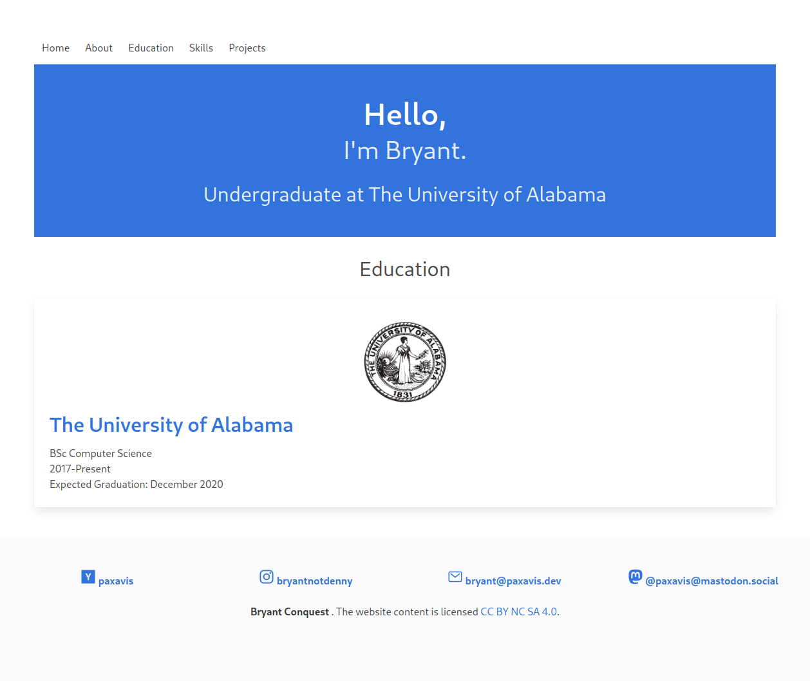

+++
title = "Hephaestus"
description = "一个极简的深色 Zola 主题"
template = "theme.html"
date = 2025-09-22T20:09:00+02:00

[taxonomies]
theme-tags = []

[extra]
created = 2025-09-22T20:09:00+02:00
updated = 2025-09-22T20:09:00+02:00
repository = "https://github.com/janbaudisch/zola-hephaestus.git"
homepage = "https://github.com/janbaudisch/zola-hephaestus"
minimum_version = "0.4.0"
license = "MIT"
demo = "https://zola-hephaestus.janbaudisch.dev"

[extra.author]
name = "Jan Baudisch"
homepage = "https://janbaudisch.dev"
+++        

# Hephaestus

> 一个极简的深色 Zola 主题。
>
> [hugo-theme-hephaestus][hugo-hephaestus] 的 [Zola][zola] 移植版。



## 原作

这是 Hugo 主题 [hugo-theme-hephaestus][hugo-hephaestus] ([许可证][upstream-license]) 的移植版。

## 安装

安装此主题最简单的方法是克隆它...

```
git clone https://github.com/janbaudisch/zola-hephaestus.git themes/hephaestus
```

... 或者将其用作子模块。

```
git submodule add https://github.com/janbaudisch/zola-hephaestus.git themes/hephaestus
```

无论哪种方式，你都必须在 `config.toml` 中启用该主题。

```toml
theme = "hephaestus"
```

## 选项

有关示例配置，请参阅 [`config.toml`][config]。

### 链接

链接显示在页脚中。它们使用 [Font Awesome][fontawesome] 样式化，你可以选择图标集（默认为 [brands][fontawesome-brands]）。

```toml
[extra]
links = [
    { title = "E-Mail", url = "mailto:mail@example.org", iconset = "fas", icon = "envelope" },
    { title = "GitHub", url = "https://github.com", icon = "github" },
    { title = "Twitter", url = "https://twitter.com", icon = "twitter" }
]
```

### 菜单

菜单显示在顶部。

```toml
[[extra.menu]]
name = "Posts"
url = "/posts"

[[extra.menu]]
name = "Tags"
url = "/tags"
```

### 日期格式

指定如何显示日期。格式在 [这里][date-format-docs] 描述。

默认值：`%Y-%m-%d`

```toml
[extra]
date_format = "%Y-%m-%d"
```

[zola]: https://www.getzola.org
[hugo-hephaestus]: https://github.com/JugglerX/hugo-theme-hephaestus
[fontawesome]: https://fontawesome.com
[fontawesome-brands]: https://fontawesome.com/icons?d=gallery&s=brands&m=free
[upstream-license]: https://github.com/janbaudisch/zola-hephaestus/blob/master/upstream/LICENSE.md
[config]: https://github.com/janbaudisch/zola-hephaestus/blob/master/config.toml
[date-format-docs]: https://docs.rs/chrono/latest/chrono/format/strftime/index.html
