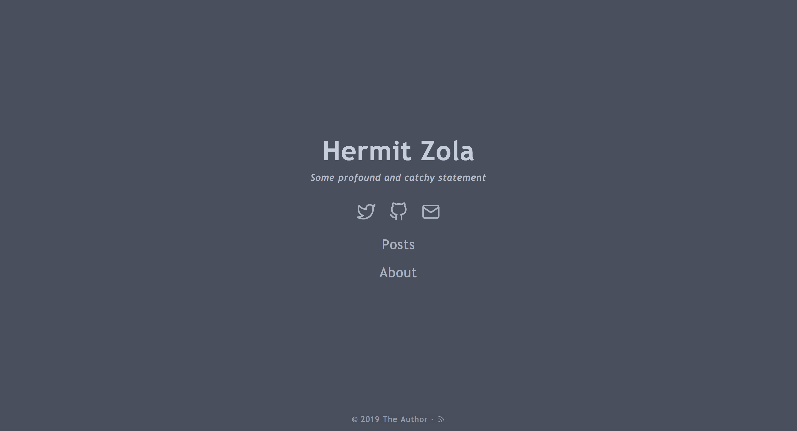

+++
title = "Hermit_Zola"
description = "极简 Zola 主题"
template = "theme.html"
date = 2025-04-06T11:23:44+02:00

[taxonomies]
theme-tags = []

[extra]
created = 2025-04-06T11:23:44+02:00
updated = 2025-04-06T11:23:44+02:00
repository = "https://github.com/VersBinarii/hermit_zola.git"
homepage = "https://github.com/VersBinarii/hermit_zola"
minimum_version = "0.4.0"
license = "MIT"
demo = "https://versbinarii.gitlab.io/blog/"

[extra.author]
name = "VersBinarii"
homepage = "https://versbinarii.gitlab.io/blog/"
+++        

[](https://travis-ci.org/VersBinarii/hermit_zola)

# Hermit 

> 这是 [Hermit theme](https://github.com/Track3/hermit) 的 [Zola](https://www.getzola.org/) 移植版

Hermit 是一个极简且快速的 Zola 博客主题。



[查看演示](https://versbinarii.gitlab.io/blog/)

## 安装

首先将此主题下载到你的 `themes` 目录：

```bash
$ cd themes
$ git clone https://github.com/VersBinarii/hermit_zola
```
然后在你的 `config.toml` 中启用它：

```toml
theme = "hermit_zola"
```

## 配置

```toml
[extra]
home_subtitle = "一些深刻且朗朗上口的陈述"

footer_copyright = ' &#183; <a href="https://creativecommons.org/licenses/by-nc/4.0/" target="_blank" rel="noopener">CC BY-NC 4.0</a>'

hermit_menu = [
    { link = "/posts", name = "Posts" },
    { link = "/about", name = "About" }
]

hermit_social = [
    { name = "twitter", link = "https://twitter.com" },
    { name = "github", link = "https://github.com" },
    { name = "email", link = "mailto:author@domain.com" }
]


[extra.highlightjs]
enable = true
clipboard = true
theme = "vs2015"

[extra.disqus]
enable = false
# 从你的 Disqus 账户获取
shortname = "my-supa-dupa-blog"

[extra.author]
name = "The Author"
email = "author@domain.com"

[extra.google_analytics]
enable = false
id = "UA-4XXXXXXX-X"
```

### 目录
可以通过添加以下内容启用目录：
```
+++
[extra]
toc=true
+++
```
到页面的 Front Matter。然后图标将出现在页面标题上方，允许切换目录。

## 许可证

[MIT](LICENSE)

感谢 [Track3](https://github.com/Track3) 创作了原作！
