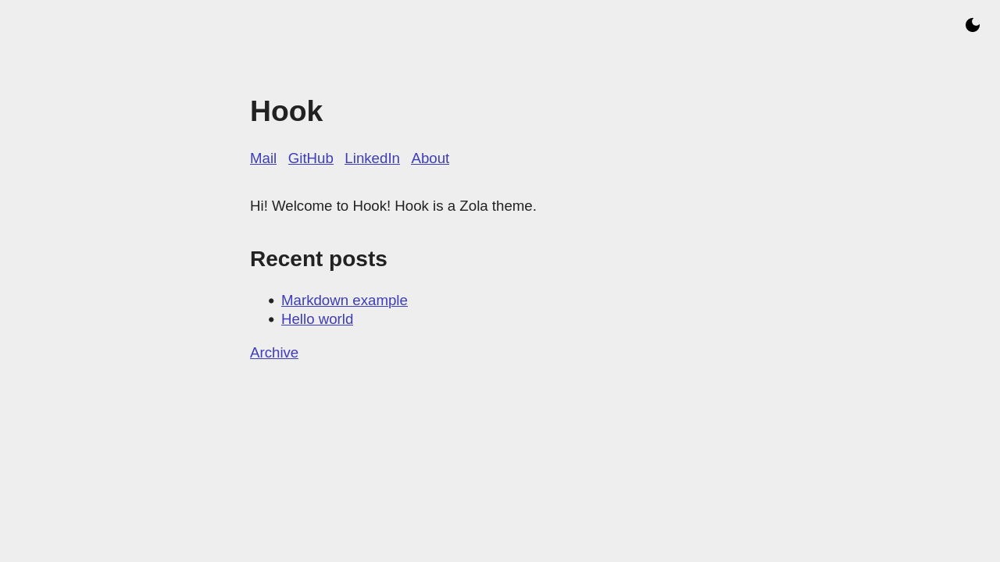

+++
title = "Hook"
description = "简洁清爽的个人网站/博客主题"
template = "theme.html"
date = 2025-08-27T21:56:55+02:00

[taxonomies]
theme-tags = []

[extra]
created = 2025-08-27T21:56:55+02:00
updated = 2025-08-27T21:56:55+02:00
repository = "https://github.com/InputUsername/zola-hook.git"
homepage = "https://github.com/InputUsername/zola-hook"
minimum_version = "0.19.0"
license = "MIT"
demo = "https://inputusername.github.io/zola-hook/"

[extra.author]
name = "Koen Bolhuis"
homepage = "https://koen.bolhu.is"
+++        

# Hook

一个用于 [Zola](https://getzola.org) 的简洁个人网站/博客主题。

[Demo](https://inputusername.github.io/zola-hook/)

## 安装

将此仓库克隆到你的 `themes` 目录：
```sh
cd themes
git clone https://github.com/InputUsername/zola-hook.git hook
```

然后在 `config.toml` 中启用：
```toml
theme = "hook"
```

## 功能

内置以下模板：
- `index.html` - the homepage;
- `page.html` - pages and posts (extends `index.html`);
- `section.html` - archive of pages in a section, mostly for a blog (extends `page.html`);
- `404.html` - 404 page (extends `page.html`).

模板包含以下 Tera blocks：
- `title` - to override the default `<title>` (`config.title`);
- `description` - to override the `<meta name="description">`'s content (`config.description`);
- `extra_head` - to override styles and anything else in `<head>`;
- `header` - to change the header (best to put this in a `<header>`);
- `content` - to change the content (best to put this in a `<main>`).

你可以在 front matter 中用 `description` 设置 section 或页面描述。
默认会使用 `config.toml` 中的 `description`。

你可以在 `config.toml` 中定义首页头部链接：
```toml
[extra]

links = [
    { title = "Link display text", href = "http://example.com" },
    # ...
]
```

根分区中的页面可设置 `extra.in_header = true`，将其加入首页头部链接。

如果根 `_index.md` 存在，其内容会显示在首页中。

其下方会显示最近 20 篇文章列表。为此需要存在 `blog/_index.md` 分区
（若不存在会报错）。同时还会提供按年份归档的文章列表链接。

Hook 支持根据用户偏好自动切换浅色/深色模式，也提供手动切换按钮
（需要 JavaScript）。

## 截图

### 首页



### 博客文章


### 博客归档


### 深色模式


## 许可证

MIT 许可证，详见 [`LICENSE`](https://github.com/InputUsername/zola-hook/blob/main/LICENSE)。

        
