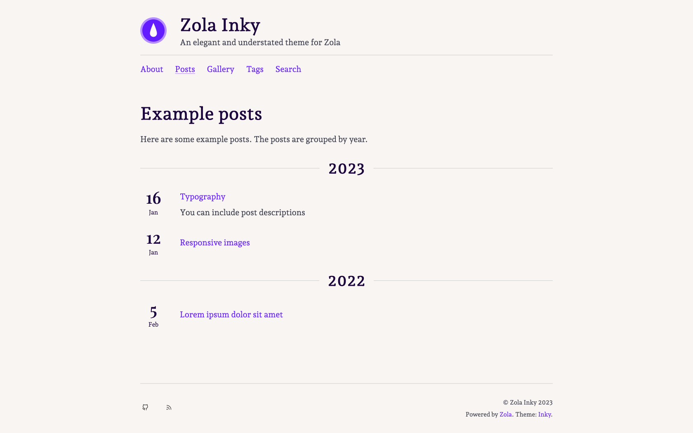

+++
title = "Inky"
description = "一个优雅且克制的 Zola 主题"
template = "theme.html"
date = 2025-08-01T14:35:17+01:00

[taxonomies]
theme-tags = []

[extra]
created = 2025-08-01T14:35:17+01:00
updated = 2025-08-01T14:35:17+01:00
repository = "https://github.com/jimmyff/zola-inky.git"
homepage = "https://github.com/jimmyff/zola-inky"
minimum_version = "0.17.0"
license = "MIT"
demo = "https://jimmyff.github.io/zola-inky/"

[extra.author]
name = "jimmyff"
homepage = "https://www.jimmyff.co.uk"
+++        


# Zola-Inky

> 一个优雅且克制的 Zola 主题

Zola Inky（[查看演示](https://jimmyff.github.io/zola-inky)）是 [jimmyff](https://github.com/jimmyff) 与 [mr-karan](https://github.com/mr-karan) 为 [Zola](https://www.getzola.org/) 静态站点生成器开发的主题。该主题最初基于 [hugo-ink](https://github.com/knadh/hugo-ink)，由 mr-karan 完成移植，随后由 jimmyff 进一步打包和开发。主题以 MIT 许可证发布在 [Github](https://github.com/jimmyff/zola-inky)。更多使用信息请查看 [readme](https://github.com/jimmyff/zola-inky/blob/main/README.md)，最新变更请查看 [changelog](https://github.com/jimmyff/zola-inky/blob/main/CHANGELOG.md)。

[](https://jimmyff.github.io/zola-inky)

## 更新日志

最新改动请查看 [changelog](CHANGELOG.md)。

## 功能

- 响应式设计
- 响应式图片
- 画廊模板
- 分类系统支持
- 搜索
- 可通过模板 hooks 自定义

## 快速开始

1. 将主题添加到你的 `themes/` 目录（推荐方式：git submodule）。
2. 复制主题中的 `config.toml` 到项目根目录，并按需修改，别忘了在文件顶部添加 `theme = 'zola-inky'`。
3. 将 `content/` 目录内容复制到你的项目根目录下并按需调整文件。

## 主题自定义

- __修改设置__：将 `config.toml` 复制到你的项目中并按需调整（确保文件顶部设置主题变量，见上文“快速开始”）。
- __修改主题配色__：将 `sass/variables.scss` 按相同路径复制到项目中并按需修改。
- __向模板注入内容__：复制 `templates/macros/hooks.html` 并按需修改。

## 使用响应式图片短代码

使用响应式图片后，图片会生成多个尺寸，并通过 `srcset` 为不同设备提供最合适的版本。你可以在 Markdown 中这样使用：

```md
{{/* image(src="yourimage.jpg", alt="This is my image") */}}
```

## 功能请求与支持

很抱歉，我无法接受该主题的功能请求或提供用户支持。你可以参考 [Zola 文档](https://www.getzola.org/documentation/getting-started/overview/) 与 [Tera 文档](https://tera.netlify.app/docs/)，也可以使用 [Zola 讨论论坛](https://zola.discourse.group/)。如果你发现主题 bug，请在 Github 提交 issue。

## 贡献

非常欢迎贡献！如果你计划为主题添加功能，欢迎先开 issue 讨论方案，我们会评估是否适合合并。请注意以下几点：

- 仅接受通用性较强的功能，过于特定的功能建议保留在你自己的模板中。
- 注意不要破坏缩进，许多 IDE 对 Tera 语法支持有限。
- 保持精简，过度臃肿的改动很可能导致 PR 被拒绝。
- 考虑向后兼容性，理想情况下用户直接升级不应遇到意外变化。

欢迎成为新的主题维护者，但建议先提交一两个 pull request！

        
