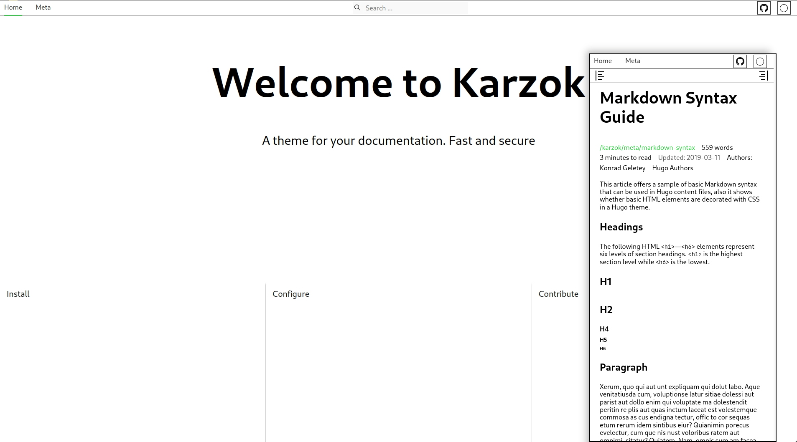

+++
title = "karzok"
description = "用于快速搭建文档站点的主题"
template = "theme.html"
date = 2024-07-18T16:03:24Z

[taxonomies]
theme-tags = []

[extra]
created = 2024-07-18T16:03:24Z
updated = 2024-07-18T16:03:24Z
repository = "https://github.com/kogeletey/karzok.git"
homepage = "https://github.com/kogeletey/karzok"
minimum_version = "0.15.0"
license = "MIT"
demo = "https://karzok.re128.org"

[extra.author]
name = "Konrad Geletey"
homepage = ""
+++        

<p align="center">
  <a href="https://ci.codeberg.org/kogeletey/karzok" target="_blank"></a>
  <a href="https://codeberg.org/kogeletey/karzok/blob/develop/LICENSE"></a>
  <a href="https://github.com/kogeletey/karzok/releases"></a>
</p>
<p align="center">
    <a href="https://karzok.re128.org"> Documentation </a>
</p>

# Karzok

- 无 class、无框架依赖
- 类 Jinja 模板风格
- JavaScript 可选，仅搜索、数学公式、提示框和深色模式需要
- 无圆角等花哨设计趋势



## 快速开始

- [find out more](https://karzok.re128.org/install/)

### 依赖要求

- [Node.js](https://nodejs.org/)

### 1. 创建新的 zola 站点

```sh
zola init zola_site
```

### 2. 将主题下载到 themes 目录：

```sh
git clone https://codeberg.org/kogeletey/karzok zola_site/themes
```

或作为子模块安装：

```sh
cd zola_site
git init # if your project is a git repository already, ignore this command
git submodule add https://codeberg.org/kogeletey/karzok zola_site/themes
```

### 3. 配置：用你常用的编辑器打开 `config.toml`

```toml
base_url = "https://karzok.example.net" # set-up for production
theme = "karzok"
```

See more in [configuration](https://karzok.re128.org/configure/)

### 4. 添加初始内容

```zsh
    cp ./themes/content/_index.md content/_index.md
```

之后你就可以自由发挥进行创作。

### 5. 运行项目

i. 开发环境

1. 安装构建所需 Node 依赖

```zsh
pnpm ci
pnpm run build
```

2. 在项目根目录运行 `zola serve`

```zsh
zola serve
```

在浏览器打开 [http://127.0.0.1:1111](http://127.0.0.1:1111)。保存改动后会自动热重载。

ii. 生产环境

- 使用容器

1. 编写容器文件

```Dockerfile
FROM ghcr.io/kogeletey/karzok:latest AS build-stage
# or your path to image
ADD . /www
WORKDIR /www
RUN sh /www/build.sh 

FROM nginx:stable-alpine

COPY --from=build-stage /www/public /usr/share/nginx/html

EXPOSE 80
```

2. 运行容器
```zsh
docker build -t <your_name_image> . &&\
docker run -d -p 8080:8080 <your_name_image> 
```
- 使用 gitlab-ci 与 gitlab-pages

```yml
image: ghcr.io/kogeletey/karzok:latest # or change use your registry

pages: 
  script:
    - sh /www/build.sh   
    - mv /www/public public
  artifacts:
    paths:
      - public/
```

Open in favorite browser [https://localhost:8080](http://localhost:8080)

## 许可证

这是自由软件：你可以按自己的意愿使用、研究、分享和改进它。  
具体来说，你可以在 [MIT](https://mit-license.org/) 条款下重新分发和/或修改它。

## 贡献

请先阅读 [Code of Conduct](https://karzok.re128.org/reference/code_of_conduct/)。

### 反馈缺陷与功能建议

On the [codeberg issues](https://codeberg.org/kogeletey/karzok/issues) or
[github issues](https://github.com/kogeletey/karzok/issues)

        
