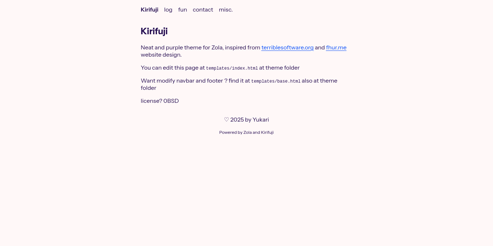

+++
title = "kirifuji"
description = "一个简洁整洁的博客主题。"
template = "theme.html"
date = 2025-11-07T19:18:47+07:00

[taxonomies]
theme-tags = ['neat', 'purple', 'blog']

[extra]
created = 2025-11-07T19:18:47+07:00
updated = 2025-11-07T19:18:47+07:00
repository = "https://codeberg.org/yukari/kirifuji-zola.git"
homepage = "https://github.com/yukari/kirifuji-zola"
minimum_version = "0.4.0"
license = "0BSD"
demo = ""

[extra.author]
name = "Yukari Kirifuji"
homepage = ""
+++        

## Kirifuji



简洁、响应式且紫色的 Zola 主题，灵感来自 [terriblesoftware.org](https://terriblesoftware.org) 和 [fhur.me](https://fhur.me) 的网站设计。

要安装此主题：

```
git clone https://codeberg.org/yukari/kirifuji-zola themes/kirifuji
```

或者，使用此选项以保持最新更改：

```
git init # 如果你没有初始化 git
git submodule add https://codeberg.org/yukari/kirifuji-zola.git themes/kirifuji
```

然后更改 `config.toml`：

```toml
theme = "kirifuji"

[extra]
# 隐藏 "Powered by Zola and Kirifuji" 页脚文本
# hideThemeName = true

# 导航菜单设置
navigationMenu = [
    { name = "log", path = "/log"},
    { name = "fun", path = "/fun"},
    { name = "contact", path = "/contact"},
    { name = "misc.", path = "/misc"}
]
```


### 许可证

- [0BSD](LICENSE)
- Alan Sans 字体: [OFL-1.1](static/AlanSans-LICENSE.txt)
