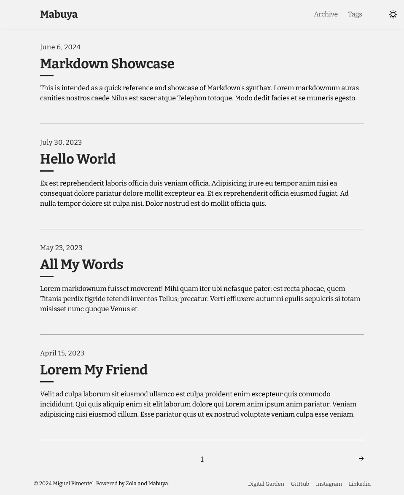

+++
title = "Mabuya"
description = "🦎 一个极简的 Zola 主题，用于构建轻量且利于 SEO 的博客。"
template = "theme.html"
date = 2025-09-04T09:40:00-05:00

[taxonomies]
theme-tags = []

[extra]
created = 2025-09-04T09:40:00-05:00
updated = 2025-09-04T09:40:00-05:00
repository = "https://github.com/semanticdata/mabuya.git"
homepage = "https://github.com/semanticdata/mabuya"
minimum_version = "0.18.0"
license = "MIT"
demo = "https://mabuya.vercel.app/"

[extra.author]
name = "Miguel Pimentel"
homepage = "https://github.com/semanticdata"
+++        

<div align="center">
<h1>🦎 Mabuya</h1>
  
  
  
  
  
<br />

[Mabuya](https://mabuya.vercel.app/) 是一个轻量级的 [Zola](https://www.getzola.org) 主题，用于创建快速、SEO 优化的博客。
使用 Mabuya 作为你项目的基础，将你的工作放在首位。

<a href="https://mabuya.vercel.app/">
</a>

<br />
<br />


</div>

## ⓘ 背景

在搜索主题时，我偶然发现了 [Tale](https://github.com/aaranxu/tale-zola)。不幸的是，最后一次更新是在 2021 年 12 月。不久之后，我决定分叉该项目并添加我自己的风格。

名称 **Mabuya** 来自 [Mabuya hispaniolae](https://en.wikipedia.org/wiki/Mabuya_hispaniolae?useskin=vector)，这是一种可能已经灭绝[^1]的石龙子物种，特产于我的祖国多米尼加共和国。

## ✨ 特性

- ✅ 简单博客
- ✅ 分页
- ✅ 标签
- ✅ 暗色主题和切换
- ✅ 返回顶部按钮

## 📈 改进

在开发该主题时，我添加了新功能并进行了许多生活质量的改进。以下是一个简短列表：

- 重构了样式表，使其更容易 [理解](https://www.merriam-webster.com/dictionary/grok)。
- 添加了暗色主题和切换。
- 添加了新的页脚导航。
- 创建了一个自定义 GitHub Action，以比任何其他 GitHub Actions 更快的速度部署 Zola 站点，无需使用 Docker。
- 完善了桌面到移动设备以及反之亦然的页面过渡。
- 集中了自定义变量，使其更容易自定义站点的颜色。
- 解决了 PR [#7](https://github.com/aaranxu/tale-zola/pull/7)，修复了原始 Zola 主题中存在的分页问题。
- 解决了 Issue [#4](https://github.com/aaranxu/tale-zola/issues/4)，修复了自定义文本未正确使用的问题。
- （暂时）解决了 Issue [#1](https://github.com/aaranxu/tale-zola/issues/1)，移除了错误的置顶标记。
- 针对速度和无障碍进行了优化。微调颜色以使文本更易读等。
- 许多其他小的改进最终导致了完美的 [PageSpeed Insights](https://developers.google.com/speed/docs/insights/v5/about) 得分：

<div align=center>

|  |
| --- |

</div>

## 🚀 快速开始

在使用该主题之前，你需要安装 [Zola](https://www.getzola.org/documentation/getting-started/installation/) ≥ v0.18.0。之后你需要：

1. 克隆仓库：

```bash
git clone git@github.com:semanticdata/mabuya.git
```

2. 更改目录到新克隆的仓库：

```bash
cd mabuya
```

3. 本地服务站点：

```bash
zola serve
```

有关更多详细说明，请访问关于安装和使用主题的 [文档](https://www.getzola.org/documentation/themes/installing-and-using-themes/) 页面。

## 🎨 自定义

你可以自己更改配置、模板和内容。参考 [config.toml](config.toml) 和 [templates](templates) 以获取思路。在大多数情况下，你只需要修改 [config.toml](config.toml) 的内容即可自定义博客的外观。确保访问 Zola [文档](https://www.getzola.org/documentation/getting-started/overview/)。

添加自定义 CSS 就像将样式添加到 [sass/_custom.scss](sass/_custom.scss) 一样简单。这是可能的，因为 SCSS 文件向后兼容 CSS。这意味着你可以将普通 CSS 代码输入到 SCSS 文件中，它是有效的。

## 🔄 工作流

### 🔨 仅构建

```yml
steps:
  - name: Checkout
    uses: actions/checkout@v4
  - name: Install Zola
    uses: taiki-e/install-action@zola
  - name: Build Zola
    run: zola check --drafts --skip-external-links
    env:
      BUILD_ONLY: true
      GITHUB_TOKEN: ${{/* secrets.GITHUB_TOKEN */}}
```

### 📢 部署

```yml
steps:
  - name: Checkout
    uses: actions/checkout@v4
  - name: Install Zola
    uses: taiki-e/install-action@zola
  - name: Build site
    run: zola build
    env:
      GITHUB_TOKEN: ${{/* secrets.GITHUB_TOKEN */}}
  - name: Upload site artifact
    uses: actions/upload-pages-artifact@v3
    with:
      path: public
  - name: Deploy to GitHub Pages
    id: deployment
    uses: actions/deploy-pages@v4
```

## 🚩 报告问题

我们使用 GitHub Issues 作为 **Mabuya** 的官方 bug 追踪器。请搜索 [现有 issues](https://github.com/semanticdata/mabuya/issues)。可能已经有人报告了同样的问题。如果你的问题或想法尚未解决，[打开一个新 issue](https://github.com/semanticdata/mabuya/issues/new)。

## 🤝 贡献

我们需要你的帮助！在提交 Pull Request 之前，请参阅 [CONTRIBUTING](./CONTRIBUTING.md) 和我们的 [行为准则](.github/CODE_OF_CONDUCT.md)。

## 💜 致谢

Mabuya 是 [Tale](https://github.com/aaranxu/tale-zola) 的 *分叉*，而 Tale 本身是现已归档的 Jekyll 主题 [Tale](https://github.com/chesterhow/tale) 的 *移植版*。

整个站点使用的图标由 [UXWing](https://uxwing.com/license/) 友情提供。阅读他们的 [许可证](https://uxwing.com/license/)。

## ©️ 许可证

此仓库中的源代码根据 [MIT 许可证](./LICENSE) 提供。

[^1]: *Mabuya hispaniolae* 的保护状况是 *极度濒危，可能已灭绝*。
