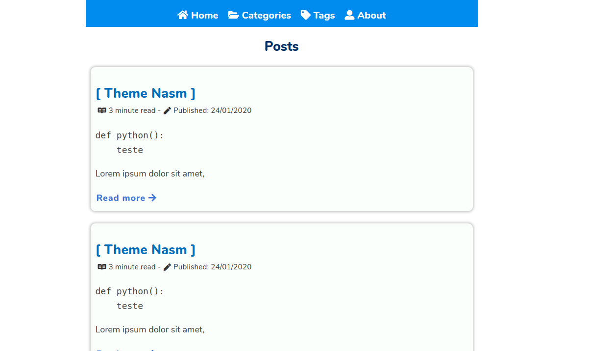

+++
title = "Nasm"
description = "一个受 Netwide Assembler 网站启发的极简 Zola 主题"
template = "theme.html"
date = 2025-09-22T20:09:00+02:00

[taxonomies]
theme-tags = []

[extra]
created = 2025-09-22T20:09:00+02:00
updated = 2025-09-22T20:09:00+02:00
repository = "https://github.com/janbaudisch/zola-nasm.git"
homepage = "https://github.com/janbaudisch/zola-nasm"
minimum_version = "0.4.0"
license = "MIT"
demo = "https://zola-nasm.janbaudisch.dev"

[extra.author]
name = "Jan Baudisch"
homepage = "https://janbaudisch.dev"
+++        

# Nasm

> 一个受 [Netwide Assembler][nasm] 网站启发的极简 Zola 主题。



## 安装

安装此主题最简单的方法是克隆它...

```
git clone https://github.com/janbaudisch/zola-nasm.git themes/nasm
```

... 或者将其用作子模块。

```
git submodule add https://github.com/janbaudisch/zola-nasm.git themes/nasm
```

无论哪种方式，你都必须在 `config.toml` 中启用该主题。

```toml
theme = "nasm"
```

## 选项

有关示例配置，请参阅 [`config.toml`][config]。

### 菜单

菜单显示在顶部。

```toml
[[extra.menu]]
name = "Posts"
url = "/posts"

[[extra.menu]]
name = "Tags"
url = "/tags"
```

### 日期格式

指定如何显示日期。格式在 [这里][date-format-docs] 描述。

默认值：`%Y-%m-%d`

```toml
[extra]
date_format = "%Y-%m-%d"
```

[zola]: https://www.getzola.org
[nasm]: https://www.nasm.us
[config]: https://github.com/janbaudisch/zola-nasm/blob/master/config.toml
[date-format-docs]: https://docs.rs/chrono/latest/chrono/format/strftime/index.html
