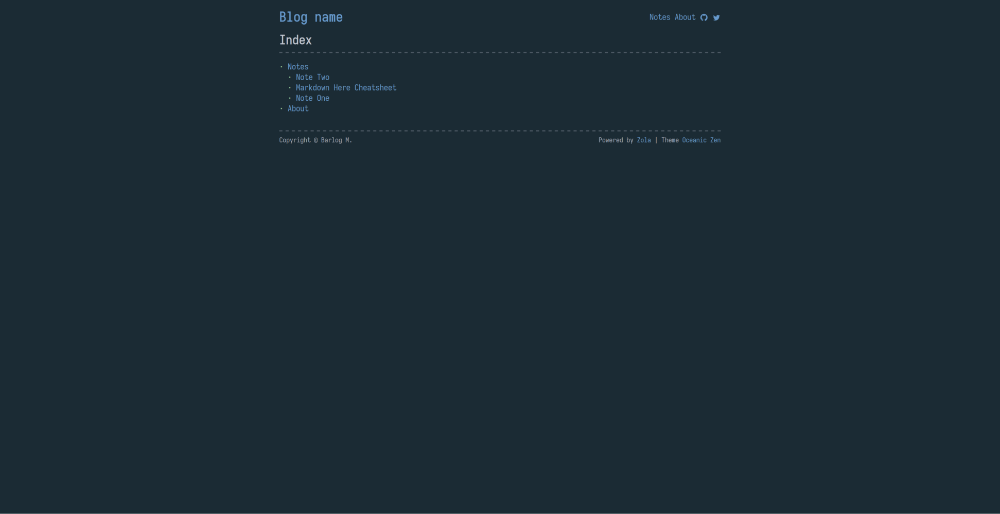
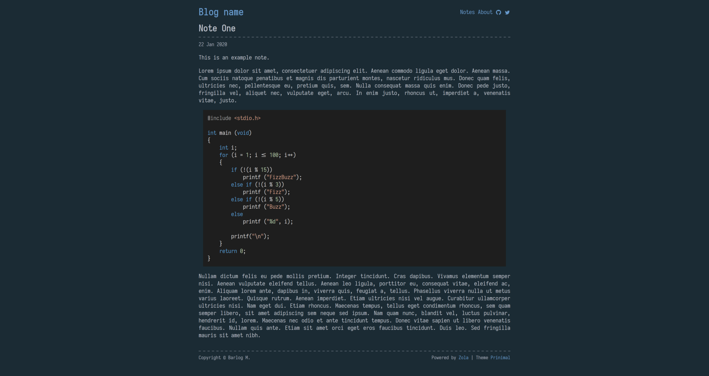

+++
title = "Oceanic Zen"
description = "极简主义博客主题"
template = "theme.html"
date = 2024-08-25T18:51:47-04:00

[taxonomies]
theme-tags = []

[extra]
created = 2024-08-25T18:51:47-04:00
updated = 2024-08-25T18:51:47-04:00
repository = "https://github.com/barlog-m/oceanic-zen.git"
homepage = "https://github.com/barlog-m/oceanic-zen"
minimum_version = "0.12.0"
license = "MIT"
demo = "https://oceanic-zen.netlify.app"

[extra.author]
name = "Barlog M."
homepage = "https://barlog.li"
+++        

# Oceanic Zen

[](https://app.netlify.com/sites/oceanic-zen/deploys)

Oceanic Zen 是一个 [Zola](https://www.getzola.org/) 静态站点生成器的主题

[Oceanic Zen](https://oceanic-zen.netlify.app/) 是一个用于个人博客的极简主义主题。




## 安装

下载主题到你的 `themes` 目录：

```bash
$ cd themes
$ git clone https://github.com/barlog-m/oceanic-zen.git
```

或者添加为 git 子模块

```bash
$ git submodule add https://github.com/barlog-m/oceanic-zen.git themes/oceanic-zen
```

在你的 `config.toml` 中启用它：

```toml
theme = "oceanic-zen"
```

## 选项

主题支持一些额外选项

```toml
[extra]
author = "blog author name"
github = "github author name"
twitter = "twitter author name"
```

字体 [Iosevka](https://typeof.net/Iosevka/)
