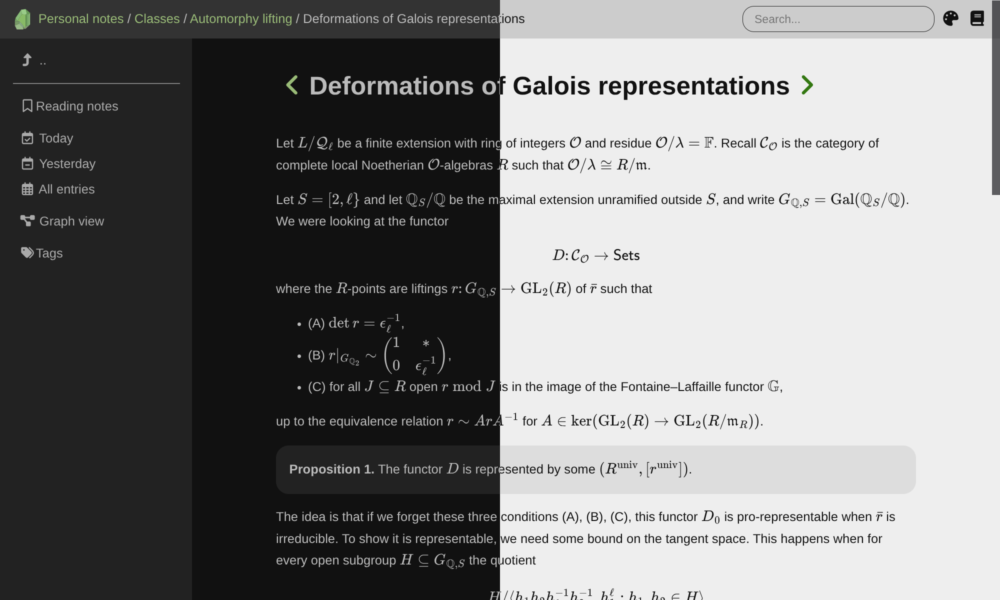

+++
title = "Olivine"
description = "用于个人知识库的 Zola 主题"
template = "theme.html"
date = 2025-12-22T10:21:49-08:00

[taxonomies]
theme-tags = []

[extra]
created = 2025-12-22T10:21:49-08:00
updated = 2025-12-22T10:21:49-08:00
repository = "https://github.com/dongryul-kim/olivine.git"
homepage = "https://github.com/dongryul-kim/olivine"
minimum_version = "0.20.0"
license = "MIT"
demo = "https://dongryul-kim.github.io/olivine/"

[extra.author]
name = "Dongryul Kim"
homepage = "https://web.stanford.edu/~dkim04/"
+++        


# Olivine

一个简洁的 [Zola](https://github.com/getzola/zola) 个人知识库主题。  
灵感来自 [Obsidian](https://obsidian.md)。



## 功能

* 日记（Journaling）
* 标签
* 知识图谱
* 搜索
* 浅色/深色模式
* 键盘快捷键
* 反向链接（Backlinks）

## 安装

安装 Olivine 最简单的方式是使用 [quickstart
repository](https://github.com/dongryul-kim/olivine-quickstart)。

```
git clone --depth 1 --recurse-submodules git@github.com:dongryul-kim/olivine-quickstart.git <your-folder-name>
```

### 手动安装

你也可以使用 Zola 主题的标准安装方式。  
请参考 Zola 文档中的 [installing and using
themes](https://www.getzola.org/documentation/themes/installing-and-using-themes/)。

此外还有一步 Olivine 专属设置：创建 `content/olivine-internal-graph.md`，内容如下：
```
+++
title = "Graph"
template = "internal/graph.html"
+++
```
再创建 `content/olivine-internal-sitemap.md`，内容如下：
```
+++
title = "Sitemap"
template = "internal/sitemap.html"
+++
```
最后创建 `content/journal/_index.md`，内容如下：
```
+++
title = "Journal"
template = "internal/journal.html"
extra.siblings = true
+++
```

## 致谢

特别感谢：
* [year-calendar](https://github.com/year-calendar/js-year-calendar) for the
  calendar widget,
* [cytoscape](https://github.com/cytoscape/cytoscape.js) for the graph widget,
* [tikzjax](https://github.com/maker-jr/tikzjax) for rendering TikZ diagrams.


        
