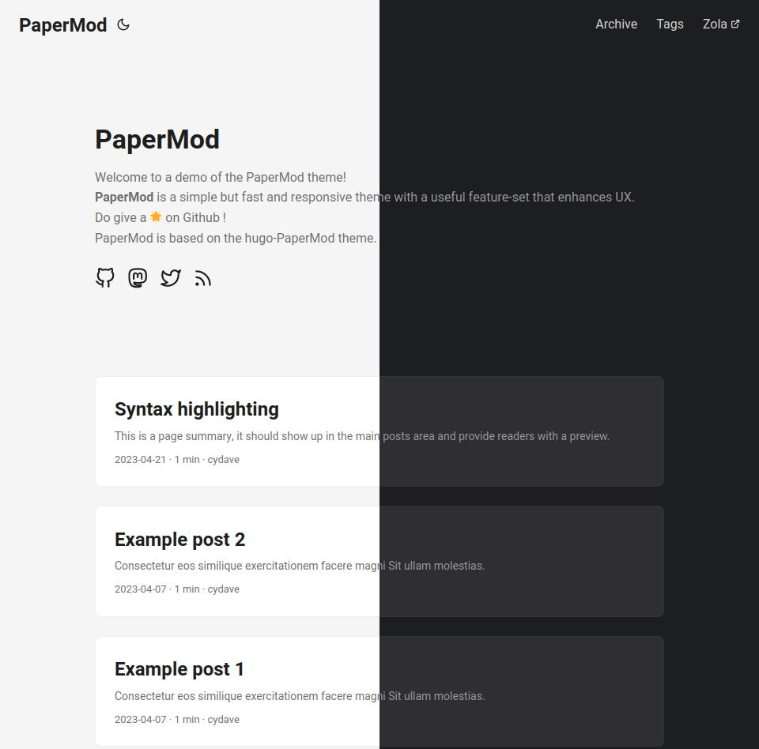

+++
title = "PaperMod"
description = "一个快速、干净、响应式的主题，移植到 Zola。"
template = "theme.html"
date = 2025-12-12T10:01:47-05:00

[taxonomies]
theme-tags = []

[extra]
created = 2025-12-12T10:01:47-05:00
updated = 2025-12-12T10:01:47-05:00
repository = "https://github.com/dawnandrew100/zola-theme-papermod-2"
homepage = "https://github.com/cydave/zola-theme-papermod"
minimum_version = "0.4.0"
license = "MIT"
demo = "https://cydave.github.io/zola-theme-papermod/"

[extra.author]
name = "cydave"
homepage = "https://github.com/cydave"
+++        

# Zola PaperMod

此仓库是 [cydave's papermod](https://github.com/cydave/zola-theme-papermod) 的非官方继任者！

此主题是我的网站 [Seq.rs](https://github.com/dawnandrew100/seq.rs) 的骨干，主要会根据我对该网站的需求进行更新。

话虽如此，如果其他人有想要添加的内容，非常欢迎在这个分叉上提交 pull request！



一个正在进行的 [hugo-PaperMod](https://github.com/adityatelange/hugo-PaperMod) 主题（由 [@adityatelange](https://github.com/adityatelange) 制作）到 [Zola](https://www.getzola.org/) 的移植版。

由于 Zola 0.19 引入的配置更改，目前仅支持 Zola 0.19.1 及更高版本。

演示 @ https://dawnandrew100.github.io/zola-theme-papermod-2/

## 特性

+ [x] 博客文章归档
+ [x] 博客文章 RSS 订阅
+ [x] 标签
+ [x] 基于标签的 RSS 订阅
+ [x] 可选：自定义分类法
+ [x] 亮色 / 暗色主题切换（具有可配置的默认偏好）
+ [x] 代码片段的语法高亮（Zola 内置语法高亮）
+ [x] 自定义导航
+ [x] 通过在 Front Matter 中添加 `extra = {exclude_from_home = true}` 或将 markdown 文件添加到 `content/static/` 文件夹来从首页隐藏页面
+ [x] 代码复制按钮
+ [x] 搜索页面
+ [ ] SEO 元数据
+ [ ] 语言切换器（多语言支持）

## 安装

1. 下载主题

```sh
git submodule add https://github.com/dawnandrew100/zola-theme-papermod-2 themes/papermod_2
```

2. 将 `theme = "papermod_2"` 添加到你的 zola `config.toml`
3. 复制示例内容以开始

```sh
cp -r themes/papermod_2/content content
```

## 从 papermod 切换到 papermod_2

1. 移除 papermod 子模块

```sh
git submodule deinit -f path/to/papermod
git rm -f path/to/papermod
rm -rf .git/modules/path/to/papermod # 或者手动移除
```

2. 下载 papermod_2

```sh
git submodule add https://github.com/dawnandrew100/zola-theme-papermod-2 themes/papermod_2
git submodule update --init --recursive
```

## 选项

Papermod 自定义项存在于指定的 `extra.papermod` 部分下。
请参阅 [config.toml](config.toml) 了解可用选项。

## 贡献

如果你想帮助将 hugo-PaperMod 移植到 Zola，请随意选择一个功能并开始工作。所有帮助，无论多小的贡献，都非常感激。
