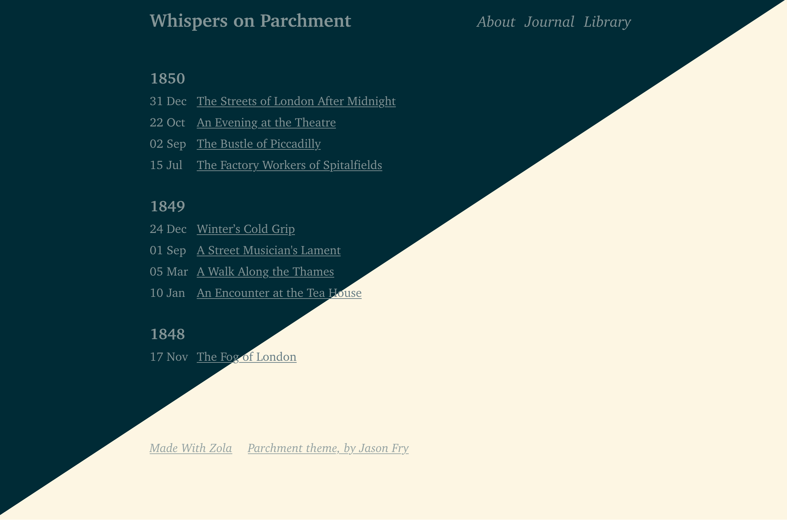

+++
title = "parchment"
description = "Parchemnt 主题，由 jasonfry.co.uk 制作"
template = "theme.html"
date = 2025-09-25T21:57:54+01:00

[taxonomies]
theme-tags = []

[extra]
created = 2025-09-25T21:57:54+01:00
updated = 2025-09-25T21:57:54+01:00
repository = "https://github.com/jsonfry/parchment"
homepage = "https://github.com/json/parchment"
minimum_version = "0.19.0"
license = "MIT"
demo = "https://whispers-on-parchment.jasonfry.co.uk"

[extra.author]
name = "Jason Fry"
homepage = "https://jasonfry.co.uk"
+++        

# Parchment Zola 主题

一个用于静态站点生成器 [Zola](https://getzola.org) 的网站主题。

编写旨在产生干净、语义化、易于阅读的 HTML 和 CSS。目的是让新手按下 `F12` 就能理解发生了什么。没有 div 汤，没有 javascript，没有第三方框架。

用于 [jasonfry.co.uk](https://jasonfry.co.uk)。

演示可在 [whispers-on-parchment.jasonfry.co.uk](https://whispers-on-parchment.jasonfry.co.uk) 获得



## 安装

首先将此主题下载到你的 `themes` 目录：

```bash
cd themes
git clone https://github.com/jsonfry/parchment.git
```
然后在你的 `config.toml` 中启用它：

```toml
theme = "parchment"
```

## Zola 特性

不支持分类法。

## 自定义

### 基础模板

你可以自定义以下内容：

- 添加你自己的东西到 `<head>`（例如 favicons），你自己的 CSS。
- 向页脚添加一些内容
- 向 body 末尾添加一些东西，如分析。 

在 `templates/index.html` 中创建一个如下文件。

如果你不想包含默认 CSS，则删除 `{{/* super() */}}` 这一行

```html



    {{/* super() */}}
    <link rel="apple-touch-icon" sizes="180x180" href="/apple-touch-icon.png" />
    <link rel="icon" type="image/png" sizes="32x32" href="/favicon-32x32.png" />
    <link rel="icon" type="image/png" sizes="16x16" href="/favicon-16x16.png" />
    <link rel="manifest" href="/site.webmanifest" />

    <style>
        body {
            font-family: "Comic Sans MS", "Comic Sans", cursive;
        }
    </style>



    <p>由人类创建</p>
    
    <p>
        <a href="/atom.xml" title="subscribe - rss feed">
            rss
        </a>
    </p>
    



    <script
      src="https://tinylytics.app/embed/your-code.js"
      defer
    ></script>

```

### 颜色

配色方案基于 [Solarized](https://ethanschoonover.com/solarized/)，并包含暗色和亮色主题，将遵循浏览器/操作系统设置。颜色通过 CSS 变量设置，你可以通过在 `head` 块中设置你自己的 CSS 来覆盖它们（或以任何你设置 CSS 的方式）。

```css
    :root {
        --background: white;
        --background-highlights: white;
        --primary: black;
        --secondary: blue;
    }

    @media (prefers-color-scheme: dark) {
        :root {
            --background: black;
            --background-highlights: black;
            --primary: white;
            --secondary: cyan;
        }
    }
```

### TOML 配置选项

以下可选内容可在 `config.toml` 文件中设置。

```toml
[extra]
 head_title = "My Custom <head> Title"
 [[extra.footer_menu]]
    [[extra.footer_menu.links]]
      text = "Parchment theme, by Jason Fry"
      href = "https://jasonfry.co.uk"
    [[extra.footer_menu.links]]
      text = "Made With Zola"
      href = "https://getzola.org"
```

### 文章导航后

有一个块可以在文章底部出现的导航后添加内容。

`templates/page.html`
```html



    <p>Reply via email - my first name @ my website address</p>

```
### 一切看起来太小/太大

一切都使用 CSS REM 设置，所以只需使用 CSS 更改 HTML 元素的字体大小：

```css
html { font-size: 32px; }
```
