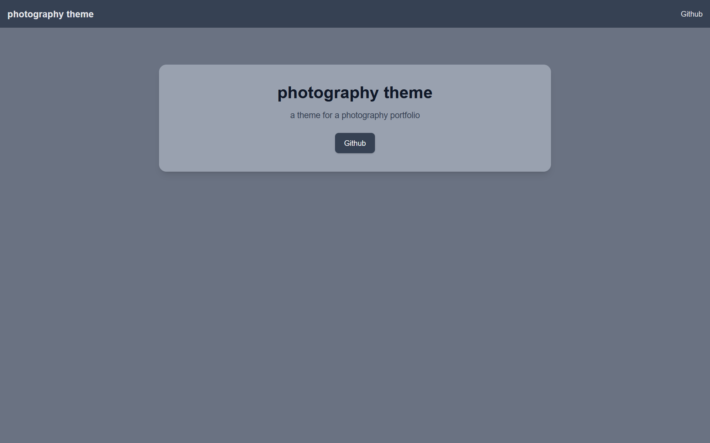

+++
title = "photography theme"
description = "一个包含许多功能（包括 AI 拦截器）的摄影作品集主题"
template = "theme.html"
date = 2026-02-01T20:53:02+01:00

[taxonomies]
theme-tags = ['Blog', 'portfolio', 'photography', 'SEO']

[extra]
created = 2026-02-01T20:53:02+01:00
updated = 2026-02-01T20:53:02+01:00
repository = "https://codeberg.org/arbs09/photography-theme.git"
homepage = "https://arbs09.dev/projects/photography-theme/"
minimum_version = "0.19.2"
license = "MIT"
demo = ""

[extra.author]
name = "arbs09"
homepage = "https://arbs09.dev"
+++        

# photography website theme


## 安装
初始化 git:

```bash
git init
```

将此主题添加到 `themes` 文件夹：

```bash
git submodule add --depth=1 https://github.com/arbs09/photography-theme.git themes/photography
git submodule update --init --recursive
```

你现在可以在你的 `config.toml` 中启用主题：

```toml
theme = "photography"
```

## 更新
只需运行：

```bash
git submodule update --remote --merge
```

## 配置

### 选项

#### 首页 / 导航 / 页脚链接
你可以编辑首页、导航和页脚上的链接。

```toml
[extra]
home_links = [
    {url = "https://example.com", name = "Example"},
]
nav_links = [
    {url = "https://example.com", name = "Example"},
]
footer_links = [
    {url = "https://example.com", name = "Example"},
]
```

#### 版权
要编辑页脚中的版权，只需使用此项：

```toml
[extra]
copyright = "Example"
```

#### Ai 退出

如果你想退出（某些）Ai 机器人抓取你的站点，你可以将以下内容添加到你的 config.toml 中。
```toml
[extra]
no_ai = true
```

#### 跟踪
如果你想通过 html head 中的 javascript 集成跟踪，你可以在 config.toml 中像这样配置它。

```toml
[extra]
tracking_js = "<your js part>
```
