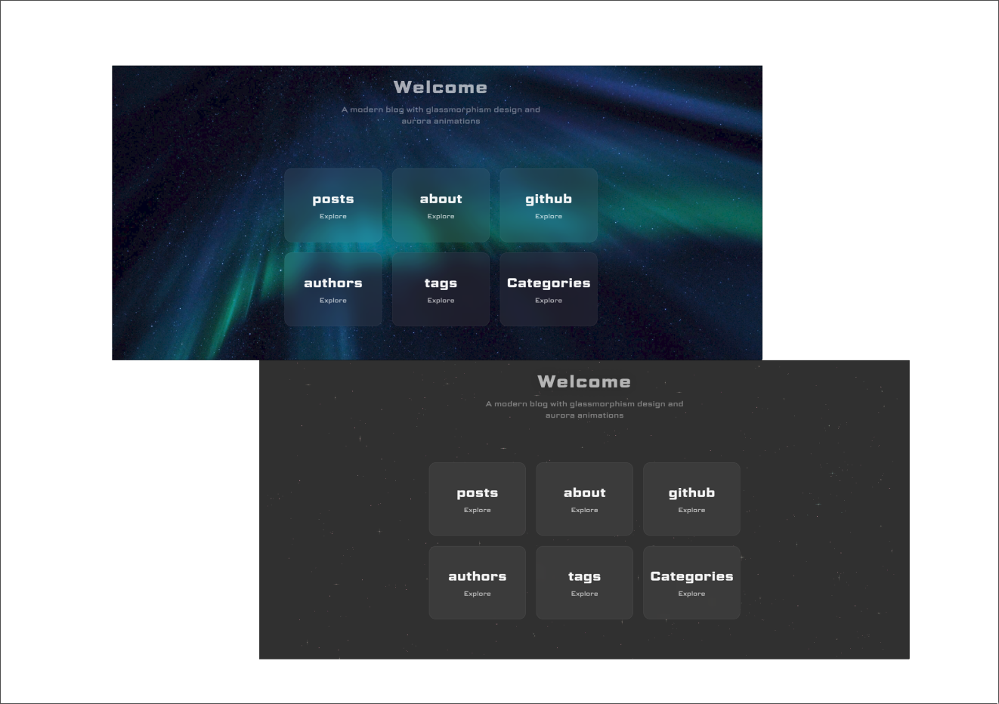

+++
title = "Prism"
description = "采用玻璃拟态设计的现代 Zola 主题"
template = "theme.html"
date = 2026-03-09T09:27:07+05:00

[taxonomies]
theme-tags = []

[extra]
created = 2026-03-09T09:27:07+05:00
updated = 2026-03-09T09:27:07+05:00
repository = "https://github.com/jahamars/zola-prism.git"
homepage = "https://github.com/jahamars/zola-prism"
minimum_version = "0.19.0"
license = "AGPL-3.0"
demo = "https://xpltt.vercel.app/"

[extra.author]
name = "Jahongir Ahmadaliev"
homepage = "https://jahongir.ru"
+++        

# Prism
一个采用玻璃拟态设计的现代 Zola 主题
[demo](https://xpltt.vercel.app/)



## 安装

将主题克隆到 `themes` 目录：
```bash
git submodule add https://github.com/jahamars/prism themes/prism
```

在 `config.toml` 中启用主题：
```toml
theme = "prism"
```

## 配置

```toml

# CORE ZOLA SETTINGS
base_url = "https://your-site.com/"          # Your site URL
title = "Your Site Title"                     # Site title (shown in header)
description = "Your site description"         # Meta description for SEO
default_language = "en"                       # Site language code (en, ru, etc)

compile_sass = true                           # Compile Sass to CSS
minify_html = true                            # Minify HTML output for performance

# TAXONOMIES - Categories, tags, authors
taxonomies = [
    { name = "tags", feed = true },           # Enable tags with RSS feed
    { name = "authors", feed = true },        # Enable authors with RSS feed
    { name = "categories", feed = true }      # Enable categories with RSS feed
]

# MARKDOWN SETTINGS
[markdown]
render_emoji = true                           # Convert :smile: to 😊
external_links_target_blank = true            # Open external links in new tab
external_links_no_follow = true               # Add rel="nofollow" to external links
external_links_no_referrer = true             # Add rel="noreferrer" for privacy
smart_punctuation = true                      # Convert -- to em-dash, etc

# Syntax highlighting, see https://github.com/getzola/giallo for options
highlighting = { theme = "github-dark" }

# THEME SETTINGS [extra]
[extra]

# Navigation
home = "back"                                 # Text for home button (e.g., "home", "back", "←")

# Background options (choose ONE):
background_image = "https://example.com/bg.jpg"  # URL to background image
# OR
# background_gradient = "linear-gradient(135deg, #1e3a8a 0%, #7c3aed 50%, #ec4899 100%)"

# Table of Contents
show_toc = true                               # Show table of contents on posts

# Main navigation menu
sam_menu = [
    { text = "posts", link = "/posts" },
    { text = "about", link = "/about" },
    { text = "github", link = "https://github.com/username/repo" },
    { text = "authors", link = "/authors" },
    { text = "tags", link = "/tags" },
    { text = "categories", link = "/categories" }
]

sam_bottom_menu = true                        # Show navigation menu at page bottom

# Post metadata display
show_word_count = true                        # Display word count on posts
show_reading_time = true                      # Display estimated reading time

# Comments
comments = true                               # Enable/disable Giscus comments globally

# SEO & Meta
keywords = "blog, tech, programming"          # Meta keywords (optional)
banner = "static/banner.png"                  # OG:image for social media (optional)

# GISCUS COMMENTS - GitHub-based comments system
[extra.giscus]
enabled = true                                # Enable Giscus comments
repo = "username/repo"                        # GitHub repo for comments
repo_id = "R_xxxxx"                           # GitHub repo ID (get from giscus.app)
category = "Announcements"                    # Discussion category
category_id = "DIC_xxxxx"                     # Category ID (get from giscus.app)
mapping = "pathname"                          # Map comments to: pathname, url, title, og:title
strict = "0"                                  # Strict title matching (0 or 1)
reactions_enabled = "1"                       # Enable reactions (0 or 1)
emit_metadata = "0"                           # Emit discussion metadata (0 or 1)
input_position = "bottom"                     # Comment input: top or bottom
theme = "catppuccin_frappe"                   # Giscus theme (see giscus.app for options)
lang = "en"                                   # Language code

# FOOTER
[extra.sam_footer]
text = "Built using Zola & Prism theme"       # Footer text (supports HTML)

# AUTHOR INFO - Used in meta tags and structured data
[extra.author]
name = "Your Name"                            # Author name
email = "your@email.com"                      # Author email (optional)
url = "https://yoursite.com"                  # Author website (optional)

# FEATURES - Toggle theme features on/off
[extra.features]
copy_code_button = true                       # Show copy button on code blocks
reading_progress_bar = true                   # Show reading progress bar at top
smooth_scroll = true                          # Enable smooth scrolling for anchor links

# ANALYTICS (optional) - Add if needed
[extra.analytics]
google_analytics_id = "G-XXXXXXXXXX"          # Google Analytics 

```


### 页面级设置（在 .md 文件 front matter 中）

```md 
+++
title = "Post Title"
date = 2024-01-15 
[taxonomies]
tags = ["rust", "web"]
authors = ["Author Name"]
categories = ["Programming"] 
[extra]
toc = true                     # Override global show_toc setting
no_header = false              # Hide page header
no_comments = false            # Disable comments on this page
+++
```


### 补充说明
Giscus 配置获取地址：https://giscus.app/  
语法高亮主题列表：https://www.getzola.org/documentation/getting-started/configuration/#syntax-highlighting  
日期格式说明：https://docs.rs/chrono/latest/chrono/format/strftime/index.html


## 许可证

AGPL-3.0

        
