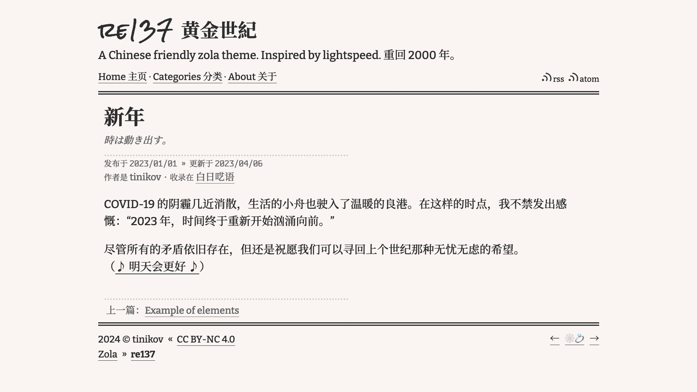

+++
title = "re137"
description = "一个中文友好的 zola 主题。灵感来自 lightspeed。"
template = "theme.html"
date = 2025-02-10T15:39:54+09:00

[taxonomies]
theme-tags = []

[extra]
created = 2025-02-10T15:39:54+09:00
updated = 2025-02-10T15:39:54+09:00
repository = "https://github.com/tinikov/re137.git"
homepage = "https://github.com/tinikov/re137"
minimum_version = "0.4.0"
license = "MIT"
demo = "https://re137.vercel.app"

[extra.author]
name = "tinikov"
homepage = "https://tinikov.com"
+++        

# re137



[演示](https://re137.vercel.app)

## 安装

克隆此主题到你的 `themes` 目录：

```bash
cd themes
git clone https://github.com/tinikov/re137
```

或通过子模块添加：

```bash
cd themes
git submodule add git@github.com:tinikov/re137
```

然后在你的 `config.toml` 中启用它：

```toml
theme = "re137"
```

## 结构和必须配置

文章应直接位于 `content` 文件夹下，单页（例如 `about.md`）应位于 `content/pages` 文件夹下。

内容中的索引部分（`content/_index.md`）应启用按日期排序的文章：

```toml
sort_by = "date"
```

页面中的索引部分（`content/pages/_index.md`）应禁用 `render` 选项：

```toml
render = false
```

在两个索引部分中，建议启用锚点选项：

```toml
insert_anchor_links = "right"
```

## 选项

### 启用分类

要启用分类页面，应在 `config.toml` 中设置 `taxonomies`：

```toml
taxonomies = [{ name = "categories" }]
```

### 顶部菜单

在 `config.toml` 的 `[extra]` 中设置一个键为 `re137_menu_links` 的字段：

```toml
re137_menu_links = [
    { url = "$BASE_URL", name = "主页" },
    { url = "$BASE_URL/categories", name = "分类" },
    { url = "$BASE_URL/about", name = "关于" },
    { url = "$BASE_URL/rss.xml", name = "RSS" },
]
```

### 页面选项

在文章和单页的 Front Matter 中，支持的选项如下：

```toml
title = " "
path = "about" # 仅用于单页
authors = ["TC", "BB"] # 如果有多个作者
date = 2000-01-01T00:00:00+00:00
updated = 2004-01-01T00:00:00+00:00
description = " "
draft = true
[taxonomies]
categories = [" "]
[extra]
author_gen = false # 不生成作者
toc_gen = true # 生成目录
```

### 杂项

你可以在 `config.toml` 的 `[extra]` 中添加更多自定义选项

```toml
# 当你分享这个网站给别人时显示的图片
ogimage = " "

# SEO 设置
seo = true
google_search_console = " "

# 显示 Indiewebring 跳转按钮
indiewebring = true

# 用于 mastodon 认证
mastodon = "https://o3o.ca/@tinikov"

# 只需要用户名
github = "tinikov"

# 在页脚显示建立日期
establishdate = "2024"

# CC BY-NC 4.0 (https://creativecommons.org/licenses/by-nc/4.0/)
license = true

# 在页脚显示 "🫧 Zola theme re137"
show_zola_theme = true
```
