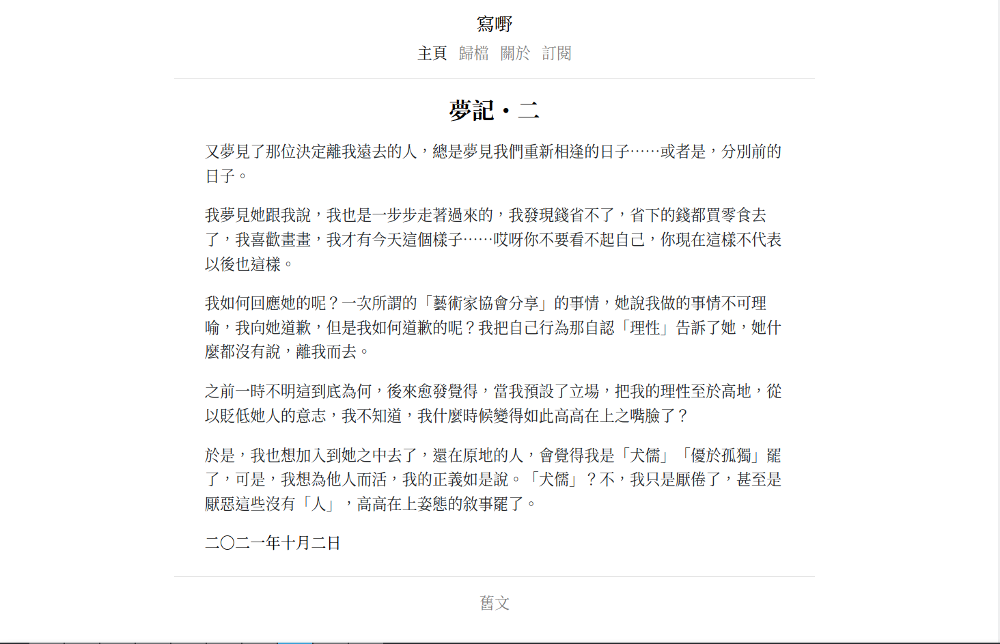

+++
title = "Seje2"
description = "一个漂亮的 zola 主题"
template = "theme.html"
date = 2025-04-02T10:52:01+08:00

[taxonomies]
theme-tags = []

[extra]
created = 2025-04-02T10:52:01+08:00
updated = 2025-04-02T10:52:01+08:00
repository = "https://github.com/eatradish/seje2.git"
homepage = "https://github.com/eatradish/Seje2"
minimum_version = "0.15.0"
license = "MIT"
demo = "https://blog.miraclemilk.me/Seje2"

[extra.author]
name = "Mag Mell"
homepage = "https://blog.utopiosphere.net"
+++        

# Seje2



[演示](https://eatradish.github.io/Seje2)
[简体中文](https://github.com/eatradish/Seje2/blob/main/README_zh_cn.md)

## 安装

首先将此主题下载到你的 `themes` 目录：

```bash
cd themes
git clone https://github.com/eatradish/Seje2
```
然后在你的 `config.toml` 中启用它：

```toml
theme = "Seje2"
```

此主题需要你的索引部分（`content/_index.md`）分页才能工作：

```toml
paginate_by = 5
```

因此，文章应直接位于 `content` 文件夹下。

并且需要你的索引部分（`about/_index.md`）分页才能工作：

```toml
title = "..."

[extra]
year = 2019
month = 11
day = 3
```

## 选项

### 顶部菜单

在 `extra` 中设置一个键为 `seje2_menu_links` 的字段：

```toml
seje2_menu_links = [
    {url = "$BASE_URL", name = "Home"},
    {url = "$BASE_URL/categories", name = "Categories"},
    {url = "$BASE_URL/tags", name = "Tags"},
    {url = "https://google.com", name = "Google"},
]
```

如果你在 url 中放入 `$BASE_URL`，它会自动被替换为实际的站点 URL。

### MathJax Latex 支持

在 `extra` 中设置一个布尔键 `seje_mathjax`：

```toml
seje_mathjax = true
```

### 许可证

在 `extra` 中设置一个键为 `license` 的字段：

```toml
license = "@ 宇宙眼镜人"
```
