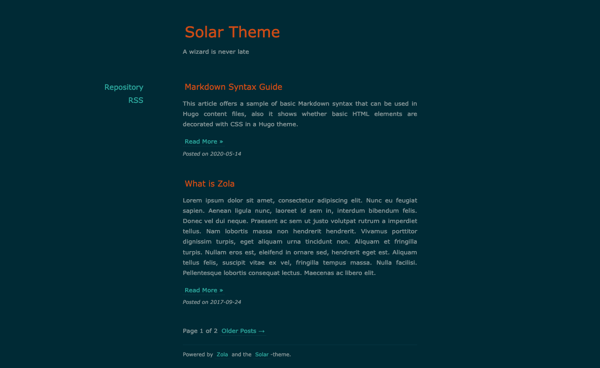

+++
title = "solar-theme-zola"
description = "一个为 Zola 移植的 solar-theme-hugo 主题"
template = "theme.html"
date = 2023-03-20T15:48:51+08:00

[taxonomies]
theme-tags = []

[extra]
created = 2023-03-20T15:48:51+08:00
updated = 2023-03-20T15:48:51+08:00
repository = "https://github.com/hulufei/solar-theme-zola.git"
homepage = "https://github.com/hulufei/solar-theme-zola"
minimum_version = "0.4.0"
license = "MIT"
demo = "https://zola-themes-demos.github.io/solar/"

[extra.author]
name = "hulufei"
homepage = "https://github.com/hulufei"
+++        

# Solar Theme for Zola

将 [Solar theme for Hugo](https://github.com/bake/solar-theme-hugo) 移植到 Zola。



## 安装

首先将此主题下载到你的 `themes` 目录：

```bash
$ cd themes
$ git clone https://github.com/hulufei/solar-theme-zola.git
```
然后在你的 `config.toml` 中启用它：

```toml
theme = "solar-theme-zola"
```

添加 `title` 和 `description`:

```toml
title = "Your Blog Title"
description = "Your blog description"
```

## 选项

### 配色方案

使用 `highlight_theme` 选项将配色方案设置为 (Solarized) `dark` 或 (Solarized) `light`：

```toml
highlight_theme = "solarized-dark"
```

### 侧边栏菜单

在 `extra` 中设置一个键为 `site_menus` 的字段：

```toml
site_menus = [
  { url = "https://github.com/hulufei/solar-theme-zola", name = "Repository" },
  { url = "rss.xml", name = "RSS" },
]
```
每个链接都需要有一个 `url` 和一个 `name`。
