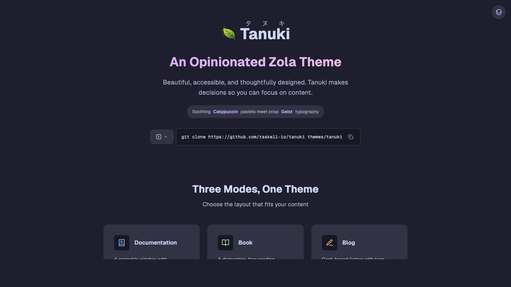

+++
title = "tanuki"
description = "一个异想天开、灵感来自任天堂的 Zola 主题，采用 Catppuccin 配色、Geist 排版和 Lucide 图标。支持文档（带版本控制）、电子书、博客/落地页和产品落地页。以顽皮的日本狸猫（タヌキ）命名。"
template = "theme.html"
date = 2026-02-19T07:35:31+01:00

[taxonomies]
theme-tags = []

[extra]
created = 2026-02-19T07:35:31+01:00
updated = 2026-02-19T07:35:31+01:00
repository = "https://github.com/raskell-io/tanuki"
homepage = "https://github.com/raskell-io/tanuki"
minimum_version = "0.19.0"
license = "MIT"
demo = "https://tanuki.raskell.io"

[extra.author]
name = "Raffael Schneider"
homepage = "https://raskell.io"
+++        

<div align="center">

<h1 align="center">
  
  <br>
  Tanuki
</h1>

<p align="center">
  <em>一个自以为是的 Zola 主题，适用于文档、书籍和博客。</em><br>
  <em>美观、易用且设计周到。</em>
</p>

<p align="center">
  <a href="https://www.getzola.org/">
    
  </a>
  <a href="https://catppuccin.com/">
    
  </a>
  <a href="LICENSE">
    
  </a>
</p>

<p align="center">
  <a href="https://tanuki.raskell.io">在线演示</a> •
  <a href="https://tanuki.raskell.io/docs/">文档</a> •
  <a href="https://tanuki.raskell.io/book/">书籍示例</a> •
  <a href="https://tanuki.raskell.io/blog/">博客示例</a>
</p>

<hr />

</div>



## 特性

- **三种模式** — 文档（带版本控制）、书籍和博客布局
- **Catppuccin 配色** — 舒缓的 Mocha（暗色）和 Latte（亮色）调色板
- **Geist 排版** — 干净、可读的可变字体
- **Lucide 图标** — 清晰、一致的图标
- **可调整大小的侧边栏** — 拖动调整大小，跨会话持久化
- **全文搜索** — 基于 Elasticlunr 的即时搜索
- **深色/浅色切换** — 三向切换，带系统偏好检测
- **打印支持** — 将所有页面打印为单个文档（文档/书籍模式）
- **键盘导航** — 箭头键上一页/下一页，`/` 搜索
- **SEO 和无障碍** — JSON-LD 结构化数据，ARIA 地标，语义化 HTML

## 安装

```bash
cd your-zola-site
git clone https://github.com/raskell-io/tanuki themes/tanuki
```

或者作为 git 子模块：

```bash
git submodule add https://github.com/raskell-io/tanuki themes/tanuki
```

## 快速开始

### 文档模式

```toml
base_url = "https://docs.example.com"
title = "My Project Docs"
theme = "tanuki"
build_search_index = true

[markdown]
highlight_code = true
highlight_theme = "css"

[extra]
mode = "docs"
github = "https://github.com/you/project"

# 可选：版本选择器
[extra.versions]
current = "2.0.0"
list = [
    { version = "2.0.0", url = "/", label = "latest" },
    { version = "1.0.0", url = "/v1/" },
]
```

### 书籍模式

```toml
base_url = "https://book.example.com"
title = "The Complete Guide"
theme = "tanuki"
build_search_index = true

[markdown]
highlight_code = true
highlight_theme = "css"

[extra]
mode = "book"
github = "https://github.com/you/book"
```

### 博客模式

```toml
base_url = "https://blog.example.com"
title = "My Blog"
theme = "tanuki"
generate_feeds = true

taxonomies = [
    { name = "tags", feed = true },
]

[markdown]
highlight_code = true
highlight_theme = "css"

[extra]
mode = "blog"

[extra.hero]
title = "Welcome to my blog"
subtitle = "Thoughts on code and craft"

[[extra.nav]]
name = "Blog"
url = "/blog/"

[[extra.nav]]
name = "About"
url = "/about/"
```

## 键盘快捷键

| 按键 | 动作 |
|-----|--------|
| `←` / `→` | 上一页 / 下一页 |
| `/` | 打开搜索 |
| `Esc` | 关闭覆盖层 |

## 浏览器支持

现代浏览器（Chrome 88+, Firefox 78+, Safari 14+, Edge 88+）

## 致谢

- [Catppuccin](https://catppuccin.com) — 调色板
- [Geist](https://vercel.com/font) — 排版
- [Lucide](https://lucide.dev) — 图标
- [Zola](https://www.getzola.org) — 静态站点生成器

## 许可证

[MIT](LICENSE)

---

<p align="center">Made with care by <a href="https://raskell.io">raskell.io</a></p>
