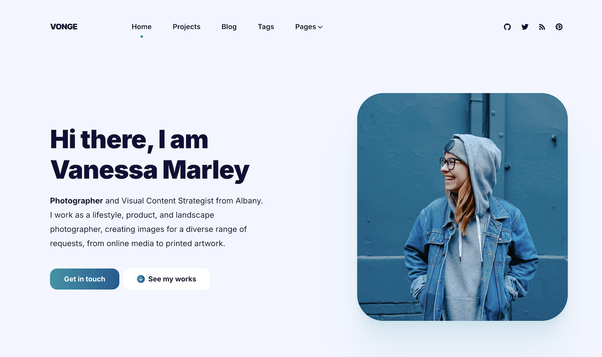

+++
title = "Vonge"
description = "Vonge 是一个个人作品集/博客网站模板"
template = "theme.html"
date = 2026-02-17T21:06:42+01:00

[taxonomies]
theme-tags = []

[extra]
created = 2026-02-17T21:06:42+01:00
updated = 2026-02-17T21:06:42+01:00
repository = "https://github.com/paberr/vonge-zola-theme"
homepage = "https://github.com/paberr/vonge-zola-theme/"
minimum_version = "0.4.0"
license = "MIT"
demo = "https://paberr.github.io/vonge-zola-theme/"

[extra.author]
name = "Pascal Berrang"
homepage = "https://pascal-berrang.de"
+++        

# Vonge Zola 主题


这是 [Vonge Hugo Bookshop 模板](https://github.com/CloudCannon/vonge-hugo-bookshop-template) 的 Zola 移植版，最初由 [CloudCannon](https://cloudcannon.com/) 创建，并根据 MIT 许可证授权。

Vonge 是一个用于个人作品集、博客或落地页的干净、现代的主题。此 Zola 版本旨在 **完全通过 `config.toml` 和结构化 Front Matter 块进行配置**，并且 **不依赖于 Bookshop**。

> ✨ 此主题适合想要具有专业设计和内容块驱动配置的极简灵活 Zola 主题的开发者。

演示 @ https://paberr.github.io/vonge-zola-theme/

## 🚀 特性

* 使用内容块的灵活首页和内页
* 通过 Front Matter 中的 `extra.content_blocks` 自定义内容
* 清晰的排版和响应式布局
* 带有分页的博客版块
* 作品集和推荐支持
* SEO 友好的结构
* MIT 授权

## 📦 安装

1. 下载主题

```
git submodule add https://github.com/paberr/vonge-zola-theme themes/vonge
```

2. 至少将以下内容添加到你的 zola `config.toml`

```toml
theme = "vonge"
taxonomies = [
    { name = "tags", feed = true},
]
```

3. 复制示例内容以开始

```
cp -r themes/vonge/content/* content
```

## 👷 使用

此主题使用 **结构化 Front Matter** 来构建灵活的页面布局。每个页面可以使用 `extra.content_blocks` 数组定义其块。

### 示例：`content/blog/_index.md`

```toml
+++
title = "Blog"
sort_by = "date"
paginate_by = 6

[extra]
content_blocks = [
  { block = "page-heading", title = "Blog", description = "Vonge 博客提供生产力、提示、灵感和巨额利润策略。了解如何建立一个成功的博客或如何让你的博客变得更好！" },
  { block = "posts-list", show_posts = true },
  { block = "newsletter", newsletter_title = "Join my mailing list", newsletter_description = "Get inspiration, updates and, cool stuff!", newsletter_identifier = "", newsletter_button = "Subscribe" }
]
+++
```

你可以通过编辑主题的模板和 SCSS 来创建自己的自定义块或扩展现有块。

## 📖 文档

有关所有配置选项、内容块和页面变量的完整参考，请参阅 [DOCUMENTATION.md](DOCUMENTATION.md)。

## 🙏 致谢

此主题基于 [CloudCannon](https://cloudcannon.com/) 的原始 [Vonge Hugo Bookshop 模板](https://github.com/CloudCannon/vonge-hugo-bookshop-template)，改编用于 Zola。所有原始设计归功于作者。

## 📄 贡献

非常欢迎对移植版的所有贡献！
