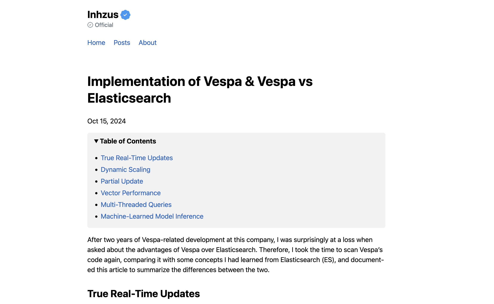

+++
title = "futu"
description = "Futu 主题"
template = "theme.html"
date = 2025-04-21T13:31:26+08:00

[taxonomies]
theme-tags = []

[extra]
created = 2025-04-21T13:31:26+08:00
updated = 2025-04-21T13:31:26+08:00
repository = "https://github.com/inhzus/zola-futu.git"
homepage = "https://github.com/inhzus/zola-futu/"
minimum_version = "0.20.0"
license = "MIT"
demo = ""

[extra.author]
name = "inhzus"
homepage = "https://inhzus.io/"
+++        

# Zola Futu

Zola-futu 是一个用于 [Zola](https://www.getzola.org) SSG 的干净快速的主题。它是 [Futu](https://github.com/yuanji-dev/futu) 的移植版。

在此处查看在线预览：[https://inhzus.io](https://inhzus.io).



## 快速开始

```
# 1. 克隆仓库
git clone https://github.com/inhzus/zola-futu

# 2. 进入克隆目录
cd zola-futu

# 3. 本地服务站点
zola serve

# 4. 在浏览器中打开 http://127.0.0.1:1111/
```

有关更多详细说明，请访问关于安装和使用主题的 [文档](https://www.getzola.org/documentation/) 页面，并访问此 [config.yaml](https://github.com/inhzus/inhzus.com/blob/main/config.toml) 作为示例完整版配置。

## 特性

- 响应式设计
- 自定义导航
- 目录
- GitHub 风格 [脚注](https://docs.github.com/en/get-started/writing-on-github/getting-started-with-writing-and-formatting-on-github/basic-writing-and-formatting-syntax#footnotes)
- [MathJax 支持](https://www.mathjax.org)
- [Giscus](https://giscus.app)
- [Twitter Cards](https://developer.x.com/en/docs/x-for-websites/cards/overview/abouts-cards) & [OpenGraph Protocol](https://ogp.me)
- 支持 [Google Analystics](https://developers.google.com/analytics) & [Microsoft Clarity](https://clarity.microsoft.com)
- [Follow.app](https://follow.is) feed claim
- [Mastodon](https://joinmastodon.org/) 集成
