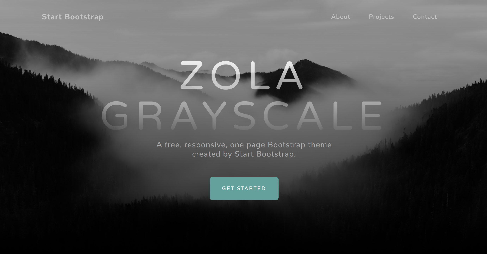

+++
title = "zola-grayscale"
description = "Start Bootstrap Grayscale 主题的 Zola 移植版"
template = "theme.html"
date = 2024-11-24T16:09:25+11:00

[taxonomies]
theme-tags = []

[extra]
created = 2024-11-24T16:09:25+11:00
updated = 2024-11-24T16:09:25+11:00
repository = "https://github.com/mattimustang/zola-grayscale.git"
homepage = "https://github.com/mattimustang/zola-grayscale"
minimum_version = "0.19.0"
license = "MIT"
demo = "https://mattimustang.github.io/zola-grayscale/"

[extra.author]
name = "Matthew Flanagan"
homepage = "https://github.com/mattimustang"
+++        

# Zola Grayscale



Start Bootstrap Grayscale 主题的 Zola 移植版。

已更新至最新 Bootstrap 5.3.3。

<!-- toc -->

- 演示
- 自定义方式
  - 配置
  - 导航
  - 联系方式
  - 首屏（Masthead）
    - 背景图
  - 内容
  - 关于
  - 项目
  - 订阅
  - 联系
  - 页脚
- 宏（Macros）
  - 调试
  - 标题
  - Google Analytics
- 杂项

<!-- tocstop -->

## 演示

[Live Demo](https://mattimustang.github.io/zola-grayscale/)

## 如何自定义

大多数自定义通过模板继承完成。  
页面的每个区块和子区块都提供 ``，你可以用自己的内容覆盖。


Start by copying `themes/zola-grayscale/contact.toml` and
`themes/zola-grayscale/navigation.toml` to your site root folder.

Then create your own site `templates/index.html` with the following contents:

```html

```

If you don't want a particular section in your page override it with an empty
block, for example this will remove the `about` section of the page:

```html

```

### 配置

`config.toml` 中包含页面使用的基础配置，例如：

* title
* author
* description
* google_analytics_tag (optional)
* sb_forms_api_token

### 导航

The page navigation is customised through the `navigation.toml` file.
Edit this file to change the names and paths to link to.
You can add additional `item`'s and they will be automatically added to the
navigation bar.

The home link in the left of the navigation bar uses `config.title` by default
or can be customised with the `nav_home_title` block.

```html
Home
```

### 联系方式

The contacts section of the page is managed via in the `contacts.toml` which has
two types of items:

* `contact` for the contact cards.
* `social` for the social network links.

Modifying, adding, or removing items from these lists will automatically update
that section of the page.
Both contact item types use [Font Awesome](https://fontawesome.io/icons/) icons
for their `icon` value.

### 首屏（Masthead）

The entire `masthead` section can be overridden with your own markup like so:

```html

...

```

The following sub-blocks are provided for further customisation:

* `masthead_title`:
  defaults to `config.title`
* `masthead_description`:
  defaults to `config.description`
* `masthead_button`
* `masthead_button_url`
* `masthead_button_tag`
* `masthead_button_label`

#### 背景图

The background image of the `masthead` can be changed by creating the directory
`static/assets/img` copying your own image to
`static/assets/img/bg-masthead.jpg` in your own site.

### 内容

A `content` block wraps the About](#about), [Projects sections of
the page to allow you to completely replace the content of the page with your
own markup.

```html

...

```

### 关于

The entire `about` section can be overridden with your own markup like so:

```html

...

```

The following sub-blocks are provided for further customisation:

* `about_title`
* `about_description`
* `about_image`

### 项目

The entire `projects` section can be overridden with your own markup like so:

```html

...

```

The section has these sub-blocks:

* `projects_id`:
  set the html id attribute for the projects section.
* `featured_project` with these sub-blocks for customisation:

    * `featured_project_thumbnail`:
      Allows overriding the markup of the project thumbnail.
    * `featured_project_content`:
      Allows overriding the markup of the project content.
    * `featured_project_title`
    * `featured_project_description`

* `project_1` with these sub-blocks for customisation:

    * `project_1_thumbnail`:
      Allows overriding the markup of the project thumbnail.
    * `project_1_content`:
      Allows overriding the markup of the project content.
    * `project_1_title`
    * `project_1_description`

* `project_2` with these sub-blocks for customisation:

    * `project_2_thumbnail`:
      Allows overriding the markup of the project thumbnail.
    * `project_2_content`:
      Allows overriding the markup of the project content.
    * `project_2_title`
    * `project_2_description`

* `extra_projects` to add extra content as you wish.

### 订阅

The entire `signup` section can be overridden with your own markup like so:

```html

...

```

The following sub-blocks are provided for further customisation:

* `signup_id`:
  set the html id attribute for the signup section.
* `signup_icon`:
  the Font Awesome icon to use.
* `signup_title`
* `signup_form`

### 联系

The entire `contact` section can be overridden with your own markup like so:

```html

...

```

The following sub-blocks are provided for further customisation:

* `contact_id`:
  set the html id attribute for the contact section.
* `contact_contact`
* `contact_social`

### 页脚

The entire `footer` section can be overridden with your own markup like so:

```html

...

```

The following sub-blocks are provided for further customisation:

* `footer_copyright`
* `footer_debug`:
  customise the debug macro call.
* `extra_footer`:
  to add extra content as you wish.

## 宏（Macros）

### 调试

The `debug` macro can be used by setting `config.extra.debug` to `true`.
This will then add a `debug` button to the footer of the page to allow you to
inspect, by default, the `__tera_context` in a pop-out sidebar.

If you want to debug other context information you can customise it like so.
For example, to debug the `config` context:

```html
{{/* debug::debug(context=config, name="config") */}}
```

### 标题

The `title` macro can be used to set the title for any additional pages you
might create.

### Google Analytics

The `google_analytics` macro can be used to insert code for Google Analytics.
Set `config.extra.google_analytics_tag` to your tag id.

## 杂项

The `extra_head` block can be used to add extra markup to the end of the
`<head>` of the page.
The `extra_scripts` block can be used to add extra scripts to the end of the
page.

`static/css/custom.css` can be created and used to add any custom CSS.

        
