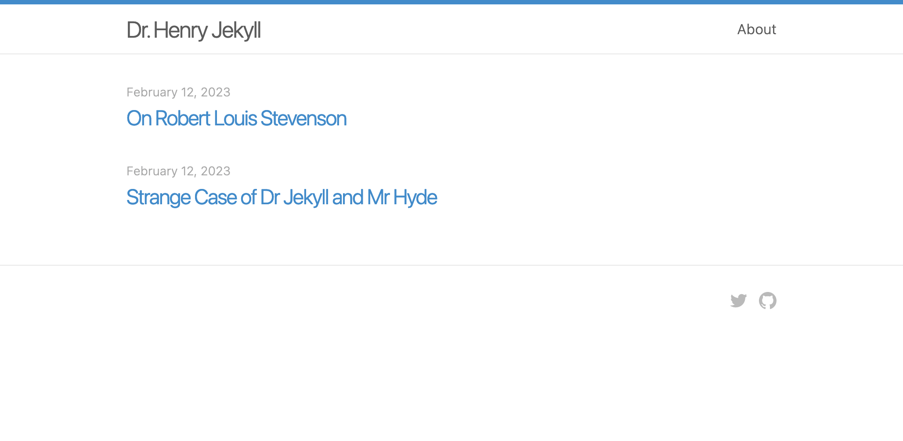

+++
title = "henry"
description = "一个永恒的博客主题"
template = "theme.html"
date = 2023-08-15T16:34:12+03:00

[taxonomies]
theme-tags = []

[extra]
created = 2023-08-15T16:34:12+03:00
updated = 2023-08-15T16:34:12+03:00
repository = "https://github.com/sirodoht/zola-henry.git"
homepage = "https://github.com/sirodoht/zola-henry"
minimum_version = "0.4.0"
license = "MIT"
demo = "https://sirodoht.github.io/zola-henry/"

[extra.author]
name = "sirodoht"
homepage = ""
+++        

# henry

Henry 是一个基于原始 Jekyll 样式的单栏 [Zola](https://github.com/getzola/zola) 主题。

演示 -> [https://sirodoht.github.io/zola-henry/](https://sirodoht.github.io/zola-henry/)




## 安装

首先将此主题下载到你的 `themes` 目录：

```sh
$ cd themes
$ git clone https://github.com/sirodoht/zola-henry.git henry
```

然后在你的 `config.toml` 中启用它：

```toml
theme = "henry"
```

## 选项

### 导航链接

在 `extra` 中设置一个键为 `henry_links` 的字段：

```toml
[extra]
henry_links = [
    {url = "about", name = "About"},
    {url = "https://github.com/benbalter", name = "GitHub"},
]
```

每个链接都需要有一个 `url` 和一个 `name`。

### 页脚 GitHub 图标链接

默认情况下，Henry 在页脚右侧提供 GitHub 图标链接。你可以在 `config.toml` 中更改其链接 href。

```toml
[extra]
henry_github = "https://github.com/sirodoht/zola-henry"
```

### 页脚 Twitter 图标链接

Twitter 太主流了，有点逊，但 100% 的用户都要求，所以我们提供了它。

```toml
[extra]
henry_twitter = "https://twitter.com/benbalter"
```

## 许可证

MIT
