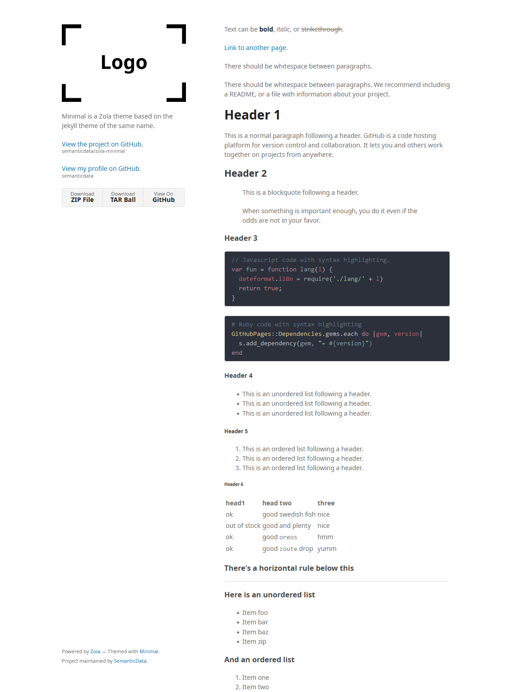

+++
title = "Minimal"
description = "📚 Minimal 是同名 Jekyll 主题的 Zola 移植版。"
template = "theme.html"
date = 2025-03-04T17:37:46-06:00

[taxonomies]
theme-tags = []

[extra]
created = 2025-03-04T17:37:46-06:00
updated = 2025-03-04T17:37:46-06:00
repository = "https://github.com/semanticdata/zola-minimal.git"
homepage = "https://github.com/semanticdata/zola-minimal/"
minimum_version = "0.20.0"
license = "MIT"
demo = "https://zola-minimal.vercel.app/"

[extra.author]
name = "Miguel Pimentel"
homepage = "https://miguelpimentel.do/"
+++        

<div align="center">
<h1>📚 Minimal</h1>
  
  
  
  
  
</div>

<div align="center">

[Minimal](https://zola-minimal.vercel.app/) 是一个 [Zola](https://www.getzola.org) 主题，旨在帮助你构建轻量、快速且 SEO 友好的落地页或网站。

它基于 [同名](https://github.com/pages-themes/minimal) 的 [Jekyll](https://jekyllrb.com/) 主题。

查看 [演示](https://zola-minimal.vercel.app/)。

</div>



## 🚀 快速开始

在使用此主题之前，你需要安装 [Zola](https://www.getzola.org/documentation/getting-started/installation/) ≥ v0.18.0。

```sh
# 1. 克隆仓库
git clone git@github.com:semanticdata/zola-minimal.git

# 2. 进入克隆目录
cd zola-minimal

# 3. 本地服务站点
zola serve

# 4. 在浏览器中打开 http://127.0.0.1:1111/
```

有关更多详细说明，请访问关于安装和使用主题的 [文档](https://www.getzola.org/documentation/themes/installing-and-using-themes/) 页面。

## 🎨 自定义

你可以自己更改配置、模板和内容。参考 [config.toml](config.toml) 和 [templates](templates) 以获取思路。在大多数情况下，你只需要修改 [config.toml](config.toml) 的内容即可自定义博客的外观。确保访问 Zola [文档](https://www.getzola.org/documentation/getting-started/overview/)。

添加自定义 CSS 就像将样式添加到 [sass/_custom.scss](sass/_custom.scss) 一样简单。这是可能的，因为 SCSS 文件向后兼容 CSS。这意味着你可以将普通 CSS 代码输入到 SCSS 文件中，它是有效的。

## 🚩 报告问题

我们使用 GitHub Issues 作为 **Minimal** 的官方 bug 追踪器。请搜索 [现有 issues](https://github.com/semanticdata/zola-minimal/issues)。可能已经有人报告了同样的问题。如果你的问题或想法尚未解决，[打开一个新 issue](https://github.com/semanticdata/zola-minimal/issues/new)。

## 💜 致谢

Zola Minimal 是 Jekyll 主题 [Minimal](https://github.com/pages-themes/minimal) 的分叉。

## © 许可证

此仓库中的源代码根据 [MIT 许可证](LICENSE) 提供。
