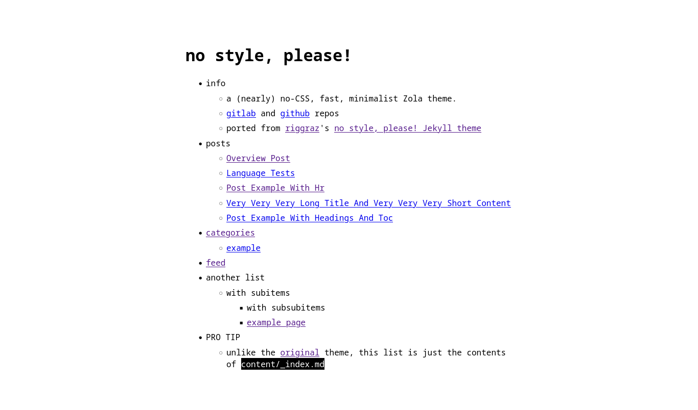

+++
title = "no style, please!"
description = "一个（几乎）无 CSS、快速、极简的 Zola 主题"
template = "theme.html"
date = 2025-10-16T17:33:00+03:00

[taxonomies]
theme-tags = []

[extra]
created = 2025-10-16T17:33:00+03:00
updated = 2025-10-16T17:33:00+03:00
repository = "https://git.sr.ht/~gumxcc/zola-no-style-please"
homepage = "https://git.sr.ht/~gumxcc/zola-no-style-please"
minimum_version = "0.4.0"
license = "MIT"
demo = "https://zola-no-style-please.demo.gumx.cc"

[extra.author]
name = "Ahmed"
homepage = "https://gumx.cc"
+++        

# no style, please!

一个（几乎）无 CSS、快速、极简的 [Zola](https://www.getzola.org/) 主题。
从 [riggraz](https://riggraz.dev/) 的 [no style, please! Jekyll 主题](https://riggraz.dev/no-style-please/) 移植而来，你可以在 [这里](https://zola-no-style-please.demo.gumx.cc/) 找到演示。

主要项目在 [sourcehut](https://sr.ht/~gumxcc/zola-no-style-please) 上，在 [GitHub](https://github.com/gumxcc/zola-no-style-please) 和 [GitLab](https://gitlab.com/gumxcc/zola-no-style-please) 上有镜像。



## 安装

首先将此主题下载到你的 `themes` 目录：

```bash
cd themes
git clone https://gitlab.com/4bcx/no-style-please.git
```

然后在你的 `config.toml` 中启用它：

```toml
theme = "no-style-please"
```

## 选项

### 默认分类法

提供了用于 `tags`、`categories` 和 `contexts` 分类法的特殊模板。但是，自定义分类法也有通用模板。

要使用分类法，在页面元数据中添加

```toml
[taxonomies]
tags = [ 'tag1', 'tag2' ]
categories = [ 'category A', 'B class' ]
genre = [ 'rock', 'alternative' ]   # 自定义分类法
```

### 首页文章列表

要在首页启用文章列表，请在 `config.toml` 中添加以下内容

```toml
[extra]
list_pages = true
```

如果你不想在列表中标题旁边添加文章日期，请添加以下内容：

```toml
no_list_date = true
```

### 页眉和页脚导航链接

同样在 `config.toml` 的 `extra` 部分

```toml
[extra]

header_nav = [
    { name = "~home", url = "/" },
    { name = "#tags", url = "/tags" },
    { name = "+categories", url = "/categories" },
    { name = "@contexts", url = "/contexts" },
    { name = "example", url = "http://example.com", new_tab=true },
]
footer_nav = [
    { name = "< previous", url = "#" },
    { name = "webring", url = "#" },
    { name = "next >", url = "#" },
]
```

### 为页面添加目录 (TOC)

在页面 Front Matter 中，将 `extra.add_toc` 设置为 `true`

```toml
[extra]
add_toc = true
```

### 额外数据

- `author` 可以在主配置和页面元数据中设置
- `image` 变量可以在页面中使用，以将图片添加到 HTML `<meta>` 标签
- 主配置中的 `logo` 同理，除此之外它也被用作站点图标

### 水平线短代码 `hr()`

添加在主题分隔符中插入文本的选项

```html
{{/* hr(data_content="footnotes") */}}
```

渲染为


### 可反转图片 `iimg()`

默认情况下，图片在暗色模式下不会反转。要添加可反转图片，请使用以下内容

```html
{{/* iimg(src="logo.png", alt="alt text") */}}
```

在亮色模式下


在暗色模式下


### 禁用 Twitter 卡片

默认情况下会生成 Twitter 元标签，要禁用它们，请在你的 `config.toml` 中将 `extra.twitter_card` 设置为 `false`

```toml
[extra]
twitter_card = true
```

## 待办

- [ ] 添加 RTL 支持
- [ ] 编写适当的测试页面

## 许可证

该主题根据 [MIT 许可证](https://opensource.org/licenses/MIT) 作为开源软件提供。
