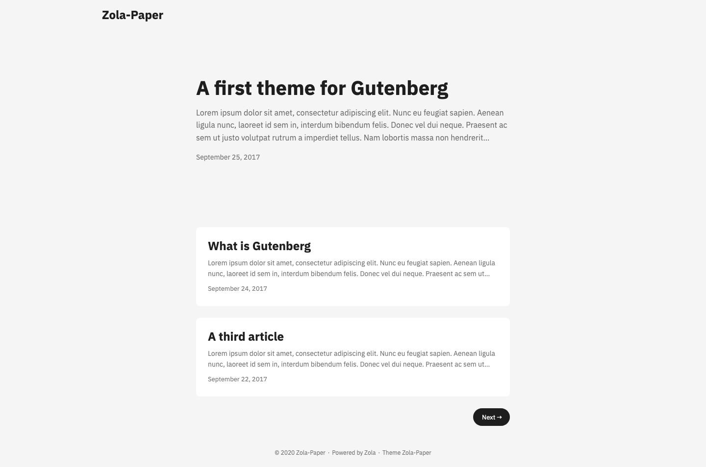

+++
title = "zola-paper"
description = "一个受 hugo-paper 启发的干净主题。"
template = "theme.html"
date = 2023-03-15T01:35:18-07:00

[taxonomies]
theme-tags = []

[extra]
created = 2023-03-15T01:35:18-07:00
updated = 2023-03-15T01:35:18-07:00
repository = "https://github.com/schoenenberg/zola-paper.git"
homepage = "https://github.com/schoenenberg/zola-paper"
minimum_version = "0.11.0"
license = "MIT"
demo = "https://schoenenberg.github.io/zola-paper"

[extra.author]
name = "Maximilian Schoenenberg"
homepage = "https://schoenenberg.dev"
+++        

# Zola-Paper

一个受 hugo-paper 启发的干净主题。

[Hugo-Paper](https://github.com/nanxiaobei/hugo-paper/) 的 [Zola](https://getzola.org) 移植版（带有一些微调）。

**演示:** [https://schoenenberg.github.com/zola-paper](https://schoenenberg.github.com/zola-paper)




## 安装

安装此主题最简单的方法是克隆它 ...

```bash
git clone https://github.com/schoenenberg/zola-paper.git themes/zola-paper
```

... 或者将其用作子模块。

```bash
git submodule add https://github.com/schoenenberg/zola-paper.git themes/zola-paper
```

无论哪种方式，你都必须在 `config.toml` 中启用该主题。

```toml
theme = "zola-paper"
```

## Open Graph 集成

此主题集成了 Open Graph *meta* 标签。这些是根据上下文和可用信息设置的。请参见以下示例：

```markdown
+++
title = "Lorem ipsum!"

[extra]
author = "Max Mustermann"
author_url = "https://www.facebook.com/example.profile.3"
banner_path = "default-banner"

[taxonomies]
tags = ["rust", "zola", "blog"]
+++

Lorem ipsum dolor sit amet, consectetur adipiscing elit. Nunc eu feugiat sapien. Aenean ligula nunc, laoreet id sem in, interdum bibendum felis. Donec vel dui neque.
<!-- more -->
Ut luctus dolor ut tortor hendrerit, sed hendrerit augue scelerisque. Suspendisse quis sodales dui, at tempus ante. Nulla at tempor metus. Aliquam vitae rutrum diam. Curabitur iaculis massa dui, quis varius nulla finibus a. Praesent eu blandit justo. Suspendisse pharetra, arcu in rhoncus rutrum, magna magna viverra erat, ...

```

`extra` 部分的必需属性是 `author`。所有其他属性都是可选的。`banner_path` 属性的路径必须相对于内容目录。
