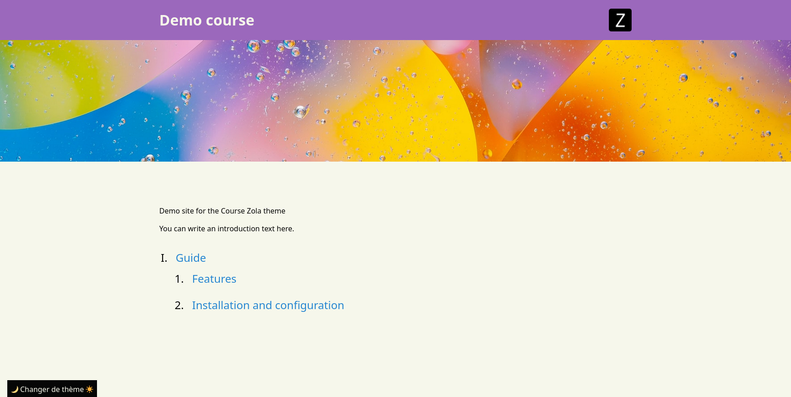

+++
title = "Course"
description = "一个专为在线课程或教程设计的 Zola 主题"
template = "theme.html"
date = 2023-03-21T12:00:20+01:00

[taxonomies]
theme-tags = []

[extra]
created = 2023-03-21T12:00:20+01:00
updated = 2023-03-21T12:00:20+01:00
repository = "https://github.com/elegaanz/zola-theme-course.git"
homepage = "https://github.com/elegaanz/zola-theme-course"
minimum_version = "0.17.1"
license = "GPL-3.0"
demo = "https://c.gelez.xyz/"

[extra.author]
name = "Ana Gelez"
homepage = "https://ana.gelez.xyz"
+++        

# Zola Theme : Course

此主题允许你使用 Zola 发布结构化为部分和子部分的课程/教程。




它会自动链接课程的页面与下一页和上一页，方便导航。每页顶部还有一个导航栏，可以轻松浏览整个教程，让读者永远不会迷路。

每个页面都可以有插图。

它允许你自定义站点的某些部分，如调色板。

它还具有亮色/暗色模式切换器。

它还有一些 SEO 功能。

它是为法语课程制作的，所以界面的某些部分可能是法语的。
你可以通过编辑 `themes/zola-theme-course/templates/` 中的文件轻松将其调整为你的语言。

## 使用

创建你的 Zola 站点，并导入此主题：

```bash
zola init NAME
cd NAME/themes
git clone https://github.com/elegaanz/zola-theme-course.git
cd ..
```

然后用这一行更新你的 `config.toml`：

```toml
theme = "zola-theme-course"
```

你还可以添加这些行来自定义主题的行为：

```toml
[extra]
site_name = "My course"
icon = "image.png"
icon_desc = "Icon of the course"
description = "A great course!"
default_illus = "illus.png"
primary_color = "#FFFFFF"
accent_color = "#FFFFFF"
source_url = "https://github.com/me/my-course"
```

### 文件结构

为了正确显示你的课程，它需要遵循特定的结构。

- `content/_index.md` 是显示在首页的文本
- 每个部分应该有自己的文件夹，带有一个 `_index.md`
- 每个子部分应该有自己的 markdown 文件（可以是子文件夹中的 `index.md`）
- 所有 `_index.md` 文件都应该在 Front Matter 中有 `sort_by = "weight"`，然后你可以使用 `weight` 选项对部分和子部分进行排序。

使用此主题，页面还可以有额外选项：

```toml
[extra]
# 不显示页面标题，对首页很有用
no_title = true
# 用作横幅的图片名称
illus = "illus.jpg"
# 在此页面上添加 JSON-LD 元数据，对首页很有用
jsonld = true
```

标准的 `title` 和 `description` 字段也会被考虑在内。
