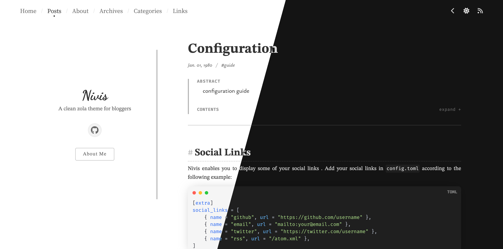

+++
title = "nivis"
description = "一个适合博主的干净 zola 主题"
template = "theme.html"
date = 2026-01-18T01:53:17+08:00

[taxonomies]
theme-tags = ['Clean', 'Blog', 'Responsive']

[extra]
created = 2026-01-18T01:53:17+08:00
updated = 2026-01-18T01:53:17+08:00
repository = "https://github.com/Resorie/zola-theme-nivis.git"
homepage = "https://github.com/Resorie/zola-theme-nivis"
minimum_version = "0.21.0"
license = "MIT"
demo = "https://resorie.github.io/blog/"

[extra.author]
name = "Resory"
homepage = "https://resorie.github.io/blog/"
+++        

Nivis: 一个适合博主的干净 zola 主题。



在线演示: [示例站点](https://resorie.github.io/zola-theme-nivis/) | [我的博客](https://resorie.github.io/blog/)。

此主题受到主题 [Float](https://float-theme.netlify.app/) 和 [anatole](https://longfangsong.github.io/) 的启发（并源自它们）。也去看看这两个精彩的主题吧！ :smile:

## 特性 :star:

- 干净和极简设计
- 优雅的排版
- 响应式布局
- 暗色/亮色模式支持

## 入门 :rocket:

使用 `git submodule` 将主题添加到你的站点：
```bash
git submodule add -b master --depth=1 https://github.com/Resorie/zola-theme-nivis.git themes/nivis/
git submodule update --init --recursive
```

然后，在 `config.toml` 中更改你的主题配置：
```toml
theme = "nivis"
```

通过将示例内容复制到你的站点文件夹来启动你的站点：
```bash
cp -r themes/nivis/content content
```

继续前往 [示例站点](https://resorie.github.io/zola-theme-nivis/) 获取更多信息。享受它吧！ :kissing_heart:

## 待办 :clipboard:

- [ ] 切换亮色/暗色模式时添加过渡
- [ ] 更好的特殊页面自定义
- [ ] 最小化网络资源
