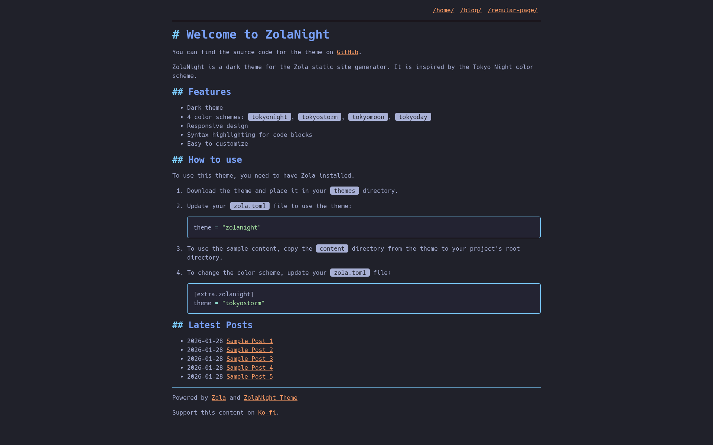

+++
title = "zolanight"
description = "ZolaNight 是一个受 Tokyo Night 配色方案启发的暗色主题"
template = "theme.html"
date = 2026-02-09T23:01:22+08:00

[taxonomies]
theme-tags = ['dark', 'blog', 'responsive', 'syntax-highlighting', 'tokyo-night']

[extra]
created = 2026-02-09T23:01:22+08:00
updated = 2026-02-09T23:01:22+08:00
repository = "https://github.com/mxaddict/zolanight"
homepage = "https://github.com/mxaddict/zolanight"
minimum_version = "0.18.0"
license = "MIT"
demo = "https://zolanight.codedmaster.com"

[extra.author]
name = "mxaddict"
homepage = "https://www.codedmaster.com"
+++        

# ZolaNight

[ZolaNight](https://github.com/mxaddict/zolanight) 是一个用于 [Zola](https://getzola.org) 静态站点生成器的暗色主题，灵感来自 [Tokyo Night](https://github.com/folke/tokyonight.nvim) 配色方案。它旨在轻量化并专注于清晰的内容呈现。



## 在线演示

在此处探索 ZolaNight 主题的在线演示：
[https://zolanight.codedmaster.com](https://zolanight.codedmaster.com)

你可以在 [codedmaster.com](https://www.codedmaster.com/) 找到我使用此主题的个人博客。

## 特性

- **暗色主题：** 提供多种暗色配色方案：`tokyonight`（默认）、`tokyostorm`、`tokyomoon` 和 `tokyoday`。
- **响应式设计：** 适应各种屏幕尺寸，在任何设备上都能获得最佳观看效果。
- **语法高亮：** 使用 `catppuccin-mocha` 主题为代码块提供美观的语法高亮。
- **清晰排版：** 使用 `Source Code Pro` 字体，外观现代、易读。
- **基本导航：** 为根部分和页面提供基本导航。
- **博客就绪：** 在首页显示最近的博客文章（可配置），并包含用于分类的标签支持。
- **现代重置：** 基于现代 CSS 重置构建，在不同浏览器中保持一致的样式。
- **易于自定义：** 专为直接修改和个性化而设计。

## 安装和使用

1. **下载主题：** 将 `zolanight` 主题目录放置到你的 Zola 站点的 `themes` 文件夹中。

2. **启用主题：** 更新你的 `config.toml`（或 `zola.toml`）文件以使用该主题：

   ```toml
   theme = "zolanight"
   ```

3. **可选：示例内容：** 要查看带有预填充内容的主题效果，请将 `content` 目录从主题仓库复制到你的项目根目录。

4. **更改配色方案：** 通过在 `config.toml`（或 `zola.toml`）的 `[extra.zolanight]` 部分下添加以下内容来自定义配色方案：

   ```toml
   [extra.zolanight]
   theme = "tokyostorm" # 选择 "tokyonight", "tokyostorm", "tokyomoon", "tokyoday"
   ```

## 配置

`zola.toml` 文件包含以下特定于主题的配置：

```toml
base_url = "https://zolanight.codedmaster.com"       # 你的站点基础 URL
title = "ZolaNight Theme Demo"                       # 你的站点标题
description = "A demo site for the ZolaNight theme." # 你的站点描述
compile_sass = true                                  # 启用 Sass 编译
generate_feeds = true                                # 生成 RSS/Atom 订阅
feed_limit = 10                                      # 订阅中的项目数
feed_filenames = ["atom.xml"]                        # 订阅文件名
taxonomies = [{ name = "tags" }]                     # 启用标签分类法

[markdown.highlighting]
theme = "catppuccin-mocha" # 代码高亮主题

[extra.zolanight]
theme = "tokyonight"               # 默认主题，如上所示覆盖
home_list_latest_blog_posts = true # 切换首页上的最新文章
google_analytics_id = ""           # 设置用于分析代码段的 GA ID
ko_fi_url = ""                     # 链接到你的 Ko-fi 页面以进行捐赠。
```

## 许可证

此主题根据 [MIT 许可证](LICENSE) 授权。
