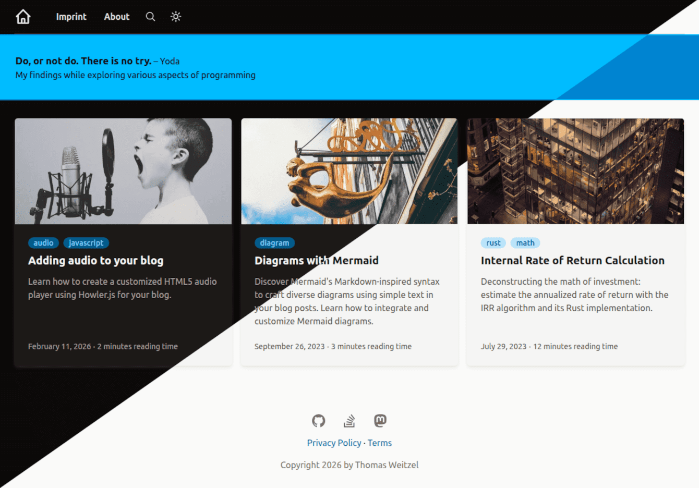

+++
title = "Zolarwind"
description = "一个 GDPR 友好的 Zola 博客主题：无第三方请求、Tailwind CSS、KaTeX、Mermaid、本地化"
template = "theme.html"
date = 2026-03-03T13:22:37+01:00

[taxonomies]
theme-tags = []

[extra]
created = 2026-03-03T13:22:37+01:00
updated = 2026-03-03T13:22:37+01:00
repository = "https://github.com/thomasweitzel/zolarwind.git"
homepage = "https://github.com/thomasweitzel/zolarwind"
minimum_version = "0.22.1"
license = "MIT"
demo = "https://weitzel.dev"

[extra.author]
name = "Thomas Weitzel"
homepage = "https://weitzel.dev"
+++        

# Zolarwind 主题

Zolarwind 是一个支持 Tailwind CSS、KaTeX 和 Mermaid 的 Zola 博客主题。
它的目标用户是想要基于 Tailwind 的样式、图表和数学渲染的博客。
内置了单语言构建的本地化支持。



---

## 特性

- **默认 GDPR 友好**：无第三方请求、无 cookie、无跟踪。
  所有 JS/CSS 均为自托管，因此默认的 Zolarwind 站点不需要同意横幅。

- **Tailwind CSS**：使用 Tailwind 进行布局和 UI。

- **Mermaid 集成**：从文本渲染图表。

- **KaTeX 集成**：在文章中渲染数学公式。

- **本地化支持**：主题字符串位于语言文件中；选择你想要的一个。
  如果尚未支持你的语言，只需创建包含翻译的资源文件即可。

- **暗色/亮色模式**：包括暗色/亮色切换，并在用户切换后为会话保留偏好。

- **客户端搜索**：由 Zola 索引和 MiniSearch 提供支持的内置搜索页面。

- **系列支持**：将文章分组到系列分类法中，并在系列文章上提供有序导航。

- **Artalk 评论**：可选集成自托管的 Artalk 服务器。参见 `docs/artalk.md`。

---

## 重要说明

截至 2026-01-09 的 Zola v0.22.0，颜色语法高亮已更改，需要不同的配置。
该主题反映了这一变化。
此主题不兼容 Zola v0.21.0 及更早版本。

---

## 目录
- 目录
- 特性
- 重要说明
- 演示网站
- 先决条件
- 安装
  - 独立（快速开始）
  - 作为主题（集成）
- 配置
  - 基本配置
  - Markdown 高亮配置
  - 额外配置
- 子路径 base_url 支持
- Front matter
  - Front Matter 示例
  - 字段描述
- 系列
- 短代码
- 搜索
- 本地化
- 集成主题文件夹
  - 选项 1：自动集成（推荐）
  - 选项 2：手动集成
- 开发
- 隐私
- 备注
- 贡献
- 许可证

---

## 演示网站

你可以在 [演示网站](https://weitzel.dev) 上查看该主题。
此外，还有一个 [德语演示](https://pureandroid.com)。

---

## 先决条件

要使用该主题，你需要安装以下软件：

- [Git](https://git-scm.com/downloads)，版本控制所需。

- [Node.js](https://nodejs.org/en/download)，一个开源、跨平台的 JavaScript 运行时环境。Node.js 是 **可选的**。只有当你想要更改 `css/main.css` 中的 CSS 时才需要它。该主题带有预编译的 CSS，无需 Node.js 即可完全运行。

- [Zola](https://github.com/getzola/zola/releases)，一个静态站点生成器。**这是使用 Zolarwind 构建站点的唯一绝对要求**。

---

## 安装

### 独立（快速开始）

如果你想使用此仓库作为新博客的基础，这是最快的方法：

1. **克隆仓库：**
   ```bash
   git clone https://github.com/thomasweitzel/zolarwind.git
   cd zolarwind
   ```

2. **运行站点：**
   ```bash
   zola serve
   ```
   现在在浏览器中打开 `zola serve` 提供的链接。

3. **配置：**
   根据你的需要在 `zola.toml` 中调整 `base_url` 和其他设置。

### 作为主题（集成）

如果你已经有一个 Zola 站点并想将 Zolarwind 作为主题在 `themes/` 文件夹中使用，请参阅集成主题文件夹部分以获取详细说明或使用自动脚本。

---

## 配置

你的 `zola.toml` 文件控制 Zola 站点的自定义。
此主题使用的配置设置：

### 基本配置：

- **base_url**: 指定站点将构建的 URL。
  在这种情况下，站点将为 `https://example.org` 构建。
  将其调整为你自己的域名。

- **compile_sass**: 决定是否自动编译 `sass` 目录中存在的所有 Sass 文件。
  在这里，它设置为 `false`，意味着此主题不会自动编译 Sass 文件。

- **default_language**: 设置站点的默认语言。
  提供的配置使用英语 (`en`) 作为默认语言。
  截至目前，`i18n` 目录中提供了德语 (`de`)。

- **theme**: 站点使用的主题。
  提供的行已被注释掉，表明主题文件取自 `templates` 目录。
  如果你将主题移动到 `themes/zolarwind` 目录，请为此条目使用 `zolarwind`。

- **build_search_index**: 如果设置为 `true`，将从 `default_language` 的页面和版块内容构建搜索索引。
  在此配置和此主题中，它已启用 (`true`)。

- **generate_feeds**: 决定是否自动生成 Atom 订阅（文件 `atom.xml`）。
  它设置为 `true`，意味着将生成订阅。

- **taxonomies**: 站点使用的分类法（分类系统）数组。
  在这里，定义了 `tags`（启用订阅）和 `series`（禁用订阅），每个的分页限制为 6。

### Markdown 高亮配置：

- **light_theme** 和 **dark_theme**: 亮色和暗色模式下用于代码高亮的主题。
  Zola 将 `giallo-light.css` 和 `giallo-dark.css` 写入 `static/`。
  模板加载这两个文件并根据选定的主题切换它们。
  如果你想要在两种模式下使用相同的样式，请将两者设置为相同的主题。
  Zolarwind 期望两者都设置，因为高亮文件加载在渲染 Markdown 内容（文章/页面）的模板上。
  如果你直接在其他模板中添加代码块，请在那里也包含高亮文件。
  注意：如果你更改 `light_theme` 或 `dark_theme`，请删除 `static/giallo-light.css` 和 `static/giallo-dark.css` 并运行 `zola build` 重新生成它们；Zola 不会覆盖现有的 giallo 文件。

- **error_on_missing_language**: 如果未找到要高亮的语言，Zola 应如何处理？设置为 `true` 以便缺失语言导致构建错误。

- **style**: 如何高亮代码。选项为 `class` 或 `inline`。在这里，我们使用设置 `class`。

- **extra_grammars**: JSON 格式的额外语法高亮配置文件的数组，用于 Zola/Giallo 不直接支持的语言。

### 额外配置：

`[extra]` 部分是你可以放置任何你想在模板中访问的自定义变量的地方。

- **title**: 必需。
  站点的标题。
  在这里，它设置为 "Zolarwind"。

- **path_language_resources**: 必需。
  包含语言资源文件的目录路径。
  在此配置中，它设置为 `i18n/`。
  如果你将主题移动到 `themes/zolarwind` 目录，请为此条目使用 `themes/zolarwind/i18n/`。

- **generator**: 可选。
  指定用于创建静态网站的生成器。
  此站点使用 `Zola v0.22.1` 生成。

- **favicon_svg**: 可选。
  提供 SVG 格式的站点 favicon 路径。
  提供的路径指向 `/img/yin-yang.svg`。

- **copyright**: 可选。
  版权声明的模板。
  它包含一个占位符 `{year}`，该占位符会动态替换为你 `zola build` 运行的当前年份。

- **site_description**: 可选。
  简短描述显示在站点的横幅上。

- **quote**: 可选。
  定义引言及其作者的结构。
  此引言来自尤达。

- **menu_pages**: 可选。
  主导航菜单项的数组。
  每个项目都有 `title` 和 `url`。

- **footer_pages**: 可选。
  将出现在站点页脚的页面的数组。
  每个项目都有 `title` 和 `url`。

- **social_links**: 可选。
  社交媒体链接的数组。
  每个链接都有名称、指示是否启用的布尔值、URL 和 SVG 图标。

- **toc**: 可选。
  当页面未在 Front Matter 中设置 `extra.toc` 时，页内目录的默认开关。
  省略时默认为 `false`。

- **toc_levels**: 可选。
  页内目录的默认标题级别范围。
  省略时默认为 `{ min = 2, max = 3 }`。
  有效范围是 `1..6` 且 `min` 必须 `<= max`（值被限制在此范围内）。

- **displaymode.sun** 和 **displaymode.moon**: 可选。
  暗色/亮色模式切换使用的内联 SVG 图标。
  定义两者以启用切换；如果缺少任何一个，则不渲染切换。

---

## 子路径 base_url 支持

只要所有内部链接和资产都使用 Zola 的 `get_url` 助手解析，此主题就可以安全地在子路径（例如 `https://example.org/blog/`）下运行。这就是为什么模板对 CSS、JS、图片和菜单链接使用 `get_url`。在 `zola.toml` 中保持内部链接为根相对路径（例如 `"/pages/about/"`），以便 Zola 可以可靠地添加 `base_url` 子路径前缀。

如果你添加或调整模板，避免硬编码 `href="/..."` 或 `src="/..."`。总是首选：

```tera
{{/* get_url(path="/img/example.jpg") */}}
```

### 使用子路径进行本地测试

`zola serve` 总是挂载在 `/`，所以它不测试子路径行为。要在本地测试子路径，请构建到子目录并从那里服务输出：

```bash
zola build --base-url http://127.0.0.1:1111/demo/zolarwind -o public/demo/zolarwind
python -m http.server --directory public 1111
```

`python -m http.server` 只是一个静态文件服务器示例；任何可以服务 `public/` 的服务器都可以（例如 Apache、Nginx 或 `static-web-server`）。

然后在浏览器中打开服务器提供的链接。

---

## Front matter

对于博客文章（`content/blog` 文件夹中的 Markdown 文件），每篇文章都有自己的文件夹。
这种结构将文章的所有资源保存在一个地方，包括图片、视频和其他文件。

每篇文章都关联一张图片，显示在博客主页和文章详情页上。
如果你没有在 `extra.image` 下提供图片，将使用默认图片。

### Front Matter 示例

你可以将其复制并粘贴到新文章中（例如 `content/blog/perception-vs-math/index.md`）：

```toml
+++
date = 2026-02-05
title = "Intuition vs. mathematical facts"
description = "Examine the reliability of tests using probability trees and Bayes' theorem."
authors = ["Jane Doe"]

[taxonomies]
tags = ["math", "statistics"]

[extra]
math = true
diagram = true
image = "banner.jpg"
+++
```

### 字段描述

- **date**: 博客文章的日期，例如 `2026-02-05`。

- **title**: 博客文章的标题，例如 `Intuition vs. mathematical facts`。
 
- **description**: 博客文章的描述。它用作博客主页上的摘要。
 
- **authors**: 所有文章作者的可选数组，例如 `["Jane Doe"]`。
  你可以将其留空，但这将在 feed (`atom.xml`) 中显示为 `Unknown`。

- **taxonomies**: 支持可选的 `tags` 和 `series` 分类法。
  标签显示在文章和标签索引页上，系列显示在系列页面和系列文章底部的系列导航上。

- **extra.math**: `false`（默认）或 `true`。
  如果设置为 `true`，文章将渲染为支持 KaTeX 以显示数学公式。
  如果省略该条目或设置为 `false`，文章将不支持 KaTeX。
  Markdown 在 KaTeX 之前解析，因此 `$...$` 内的 `*` 和反斜杠等字符首先由 Markdown 解释，这可能会改变公式。
  为避免这种情况，请使用安全的 KaTeX 短代码并省略短代码体内的 `$`/`$$` 分隔符：

  ```text
   a^2 + b^2 
   1*2+3*4 
  ```

- **extra.diagram**: `false`（默认）或 `true`。
  控制加载渲染 Mermaid 图表所需的 JavaScript。
  如果设置为 `true`，文章将渲染为支持 Mermaid 以通过使用 `diagram()` 短代码显示图表。

- **extra.toc**: `false`（默认）或 `true`。
  启用此文章/页面的页内目录。
  如果省略，则使用全局 `extra.toc` 默认值。
  为了获得一致的 TOC，内容标题从 `##` 开始，然后仅按升序嵌套（`##` → `###` → `####` → `#####` → `######`）。

- **extra.toc_levels**: 可选。
  覆盖目录使用的标题级别范围。
  如果省略，则使用全局 `extra.toc_levels` 默认值。
  `1..6` 以外的值会被限制。

- **extra.image**: 文章的可选图片。
  如果省略，将使用默认图片。
  图片显示在博客主页和文章详情页上。

---

## 系列

Zolarwind 通过 Zola 分类法支持系列。系列导航出现在属于系列的文章底部。

1. 在 `zola.toml` 中启用分类法：
   ```toml
   taxonomies = [
       { name = "tags", paginate_by = 6, feed = true },
       { name = "series", paginate_by = 6, feed = false },
   ]
   ```
   系列订阅不如文章/标签订阅常用，因此默认禁用它以保持输出最小化；如果你希望订阅者关注系列页面，请启用它。

2. 将文章分配给系列：
   ```toml
   [taxonomies]
   series = ["my-series"]
   ```

3. 可选排序：在文章 Front Matter 中设置 `extra.series_order`。如果省略，系列列表回退到文章日期。

系列索引页面可在 `/series/` 和 `/series/<name>/` 处获得。
注意：如果没有文章使用 `series` 分类法，Zola 不会生成 `/series/`，因此它将 404。

---

## 短代码

Zolarwind 提供了一些短代码。当你想要该功能时使用它们，而不是作为格式化助手。
带有参数和示例的完整文档：`docs/shortcodes.md`。

- **KaTeX 公式**: 当 Markdown 会干扰数学语法时安全地渲染 KaTeX。
- **diagram**: 从围栏文本块渲染 Mermaid 图表。
- **图片**: 渲染带有标题和可选亮色/暗色变体的本地图片。
- **audio_simple**: 主题卡片中的原生 `<audio>` 播放器。
- **audio**: 使用捆绑 JS 控件的自定义音频播放器。

---

## 搜索

此主题附带一个本地、客户端搜索页面，由 Zola 的搜索索引（Elasticlunr 输出）和 MiniSearch 提供支持。

1. 在 `zola.toml` 中启用搜索索引：
   ```toml
   build_search_index = true
   ```
2. 创建一个使用搜索模板的页面（例如 `content/pages/search.md`）。如果你的 `content/pages/_index.md` 使用 `sort_by = "date"`，页面需要一个 `date`（或 `weight`）以避免被忽略。你可以选择设置 `extra.results_per_page` 来控制分页，设置 `extra.pagination_window` 来控制当前页面每侧显示的页数。
   ```toml
   +++
   date = 2026-01-14
   title = "Search"
   template = "search.html"
   [extra]
   results_per_page = 5
   pagination_window = 2
   +++
   ```
3. 搜索图标出现在页眉中并链接到 `/pages/search/`。
   注意：仅当 `build_search_index = true` 时才渲染搜索图标。

当在另一个 Zola 站点中使用此主题时，在该站点仓库中添加 `content/pages/search.md`。主题 `content/` 不会被 Zola 加载。

搜索索引仅针对当前 `default_language` 构建。

注意：如果 `build_search_index = true` 但你没有创建 `content/pages/search.md`，搜索链接将 404。

---

## 本地化

考虑博客文章发布页面上的这段文字作为示例：`Published on July 04, 2023; 1,234 words`。
如果你的博客是德语的，你希望它是 `Veröffentlicht am 04. Juli 2023; 1.234 Wörter`。
不仅文本应该翻译，日期和数字格式也不同。
并且你想要像 `1 word` 或 `1 Wort` 这样的文本，因为在适用的情况下应使用单数形式。
此主题负责处理这个问题。

要使用此主题本地化你的博客：

1. 通过在 `zola.toml` 中设置 `default_language` 来选择你想要的语言。
   截至目前，`i18n` 目录中提供了英语 (`en`) 和德语 (`de`) 语言资源。
   如果尚未支持你的语言，只需创建包含翻译的新资源文件即可。
   使用 `en.toml` 文件作为你自己翻译的模板。
   使用正确的语言代码作为文件名，例如世界语用 `eo.toml`。
   此主题仅支持从左到右 (ltr) 阅读的语言。

2. 主题将自动以所选语言显示所有特定于主题的字符串资源。

3. 你提供的内容应与此语言匹配。
   但这要是你的责任。
   主题不会翻译你的内容。

此主题使用 `default_language` 作为每次构建单个区域设置的构建时开关。
它不针对单次构建中的 Zola 多语言输出。

如果你需要定义自己的日期格式，请在 [这里](https://docs.rs/chrono/latest/chrono/format/strftime/index.html) 查看支持的说明符。

---

## 集成主题文件夹

默认情况下，此仓库是一个独立的 Zola 站点。
如果你想将 Zolarwind 作为主题集成到现有的 Zola 网站中，你有两个选项：

### 选项 1：自动集成（推荐）

有一个辅助脚本 `integrate-theme-folder.sh`，它自动执行所有必要的文件移动和配置更新（在 Linux/Bash 上测试）。

**注意：** 仅在 Zolarwind 的全新检出上运行它，因为它会就地移动和编辑文件。

```bash
./integrate-theme-folder.sh
```

### 选项 2：手动集成

此部分适用于那些喜欢手动移动文件或在非 Linux 系统上的人。
你可以通过将相关主题文件移动到 `themes/zolarwind` 目录来集成主题。
所有其他文件保留在根目录中。
如果你那里有自己的文件，你需要将它们与此主题的文件合并。
你还需要相应地调整根目录中的 `zola.toml` 和 `package.json` 文件。

大多数 `extra.*` 设置是可选的（除了 `title` 和 `path_language_resources`），但如果省略，相关的 UI 元素将不会渲染（菜单、页脚链接、社交图标或主题切换）。如果启用了搜索，请在站点仓库中添加 `content/pages/search.md`。主题 `content/` 不会被 Zola 加载（参见搜索部分）。

手动集成部分显示了需要移动的目录。
这是独立站点的目录结构，其中主题在根目录中：

```
/
├── css
├── i18n
├── static
│   ├── css
│   ├── img
│   ├── js
│   ├── giallo-dark.css
│   └── giallo-light.css
├── syntaxes
├── templates
└── theme.toml
```

创建一个新目录 `themes/zolarwind` 并将特定于主题的文件移动到那里。下面的树显示了保留在站点根目录的内容和移动到 `themes/zolarwind` 下的内容：

```
/
├── static
│   ├── css
│   ├── giallo-dark.css
│   └── giallo-light.css
├── syntaxes
└── themes
    └── zolarwind
        ├── css
        ├── i18n
        ├── static
        │   ├── img
        │   └── js
        ├── templates
        └── theme.toml
```

目录 `syntaxes` 保留在其原始位置。如果你想移动它，你必须调整 `zola.toml` 中的 `extra_grammars` 条目。

`static/css` 目录是一个特殊情况。
它包含生成的名为 `generated.css` 的 Tailwind CSS 文件。
它将保留在其原始位置。
Zola 总是服务站点的 `static/` 目录，即使使用了主题。
此文件是从 `css/main.css` 文件生成的，它是 CSS 生成的输入。

`giallo-dark.css` 和 `giallo-light.css` 文件也保留在根 `static/` 目录中，因为模板从那里加载它们。

生成过程可以通过 `package.json` 文件中的脚本触发。
你 **仅** 需要在更改主题的模板文件或直接在内容文件中使用新的 Tailwind CSS 类时调整并运行 `package.json` 中的脚本。
由于源文件 `css/main.css` 已移动到目录 `themes/zolarwind/css/main.css`，我们需要相应地调整 `package.json` 中的脚本。

这是独立站点的相关部分的样子：

```json
"scripts": {
  "css:build": "npx tailwindcss -i ./css/main.css -o ./static/css/generated.css --minify",
  "css:watch": "npx tailwindcss -i ./css/main.css -o ./static/css/generated.css --watch",
  "server": "zola serve"
}
```

现在更改它，使输入文件 `css/main.css` 变为文件 `themes/zolarwind/css/main.css`：

```json
"scripts": {
  "css:build": "npx tailwindcss -i ./themes/zolarwind/css/main.css -o ./static/css/generated.css --minify",
  "css:watch": "npx tailwindcss -i ./themes/zolarwind/css/main.css -o ./static/css/generated.css --watch",
  "server": "zola serve"
}
```

由于你现在将 Zolarwind 用作主题，你需要在 `zola.toml` 文件中声明它。
主题文件已移动到目录 `themes/zolarwind`，因此你需要通过更改 `path_language_resources` 条目相应地调整 `zola.toml` 文件中对主题文件的唯一引用：

```toml
# 使用的站点主题
theme = "zolarwind"

# ...

# 语言资源文件的路径
[extra]
path_language_resources = "themes/zolarwind/i18n/"
```

---

## 开发

要自定义 CSS，请编辑 `templates` 和 `css` 目录中的文件。
确保 CSS 文件 `static/css/generated.css` 已更新。
此文件是从 `css/main.css` 和通过自动内容检测识别的文件生成的。

主题使用自定义调色板（`neutral`, `primary`, `ok`, `warn`, `fail`）而不是默认的 Tailwind 颜色。
当在模板或内容中添加新类时，重建 CSS 以包含生成的调色板类。

如果源文件默认被排除，可以使用 `@source` 指令将其添加到 `css/main.css` 中：

```css
@source "../node_modules/@my-company/ui-lib";
```

当这些文件更改时，运行 `package.json` 中的 `css:build` 脚本。这需要 `Node.js` 和 `package.json` 中的依赖项（通过 `npm install` 安装）。运行 `npm run css:watch` 监视文件并在更改时触发 CSS 生成。这确保 `static/css/generated.css` 保持最新。

建议打开两个终端：一个用于 Zola 服务器 (`zola serve`)，另一个用于 CSS 监视脚本 (`npm run css:watch`)。当文件被修改时，浏览器会重新加载更新后的 CSS。

---

## 隐私

此主题不设置 cookie，也不从第三方站点加载资源。暗色/亮色模式偏好仅在用户显式切换主题后存储在 `sessionStorage` 中。

KaTeX、Mermaid 和 MiniSearch 捆绑在 `static/` 中，因此它们可以从你自己的域提供服务并保持固定在已知版本。
如果你改为从内容分发网络 (CDN) 加载它们，请考虑以下 GDPR 影响：

- **第三方请求和数据隐私**：当你从 CDN 加载资源时，它会触发对 CDN 服务器的第三方请求。
  这些服务器可能会记录你的 IP 地址、用户代理和其他请求相关的元数据。
  在 GDPR 下，IP 地址可以被视为个人数据。
  通过从你的域提供这些库，你减少了第三方数据传输，限制了你向外部实体暴露的个人数据量。

- **Cookies**：许多 CDN 出于各种原因（包括分析或性能优化）设置 cookie。
  这些 cookie 可以跨使用同一 CDN 的不同网站跟踪用户，可能会侵犯他们的隐私权。
  通过在你的域上托管这些库，你可以控制 cookie 并确保符合 GDPR。

- **同意**：如果你使用的 CDN 设置 cookie 或收集数据，你可能需要在从该 CDN 加载资源之前获得用户的明确同意。
  这可能会使用户体验复杂化，并导致选择退出的用户站点性能下降。
  通过自托管，你可以规避此问题。

- **透明度和控制**：通过自托管，你确切知道你正在使用的这些库的版本，并可以确保没有修改或意外行为。
  使用 CDN，库存在被破坏的风险，这可能会影响所有使用该资源的站点。

- **欧盟以外的数据传输**：如果 CDN 服务器位于欧盟以外，你可能会将数据传输到欧盟以外，
  这增加了另一层 GDPR 合规要求。
  通过自托管，你确保用户数据不会离开该地区，除非你专门选择欧盟以外的托管解决方案。

---

## 备注

### Markdown 排版

此主题不使用 `@tailwindcss/typography` 来设置 Markdown 文件的样式。
相反，它在 `css/main.css` 文件中使用 `@apply`。
Tailwind CSS 中的 `@apply` 指令允许将实用程序类组合成自定义 CSS 类。
这允许在单个类中应用多个实用程序样式以进行 Markdown 内容样式设置。

这种方法提供了对视觉结果的控制。
它需要手动设置样式，而不是使用 `@tailwindcss/typography` 插件。
 
这重新创建了排版插件已经提供的常见排版模式。

---

## 贡献

总是欢迎贡献！
如果你看到改进的地方或想要添加功能，请提交 PR。

我特别对更多翻译感兴趣。
查看 `i18n` 文件夹以了解可用的内容和不可用的内容。
使用文件 `en.toml` 作为你自己翻译的模板。

---

## 许可证

此主题遵循 MIT 许可证。
有关详细信息，请参阅 LICENSE 文件。

### 第三方声明

- Heroicons (MIT License): https://heroicons.com
- KaTeX (MIT License): https://katex.org
- Mermaid (MIT License): https://mermaid.js.org
- MiniSearch (MIT License): https://lucaong.github.io/minisearch/
- mhchem (Apache 2.0 License): https://mhchem.github.io/MathJax-mhchem/
- Unsplash images (Unsplash License): https://unsplash.com/license
