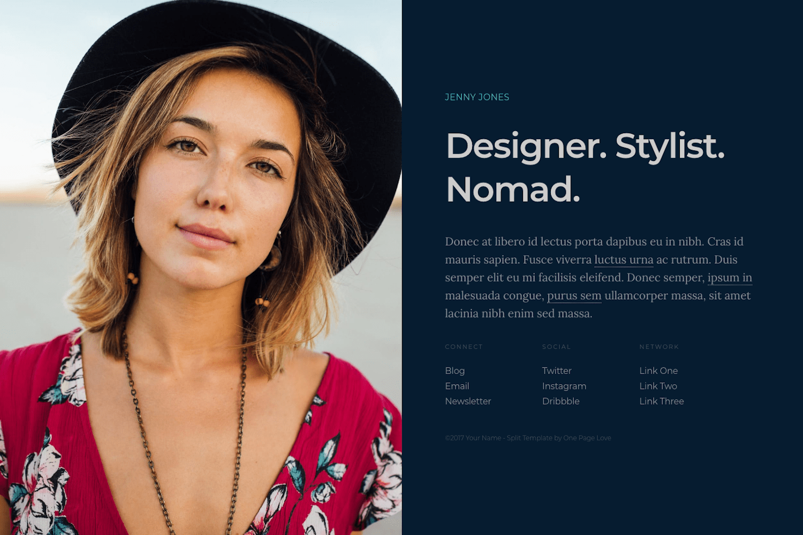

+++
title = "Zplit"
description = "一个用于专业在线展示的单页主题。"
template = "theme.html"
date = 2024-11-26T15:44:23+01:00

[taxonomies]
theme-tags = []

[extra]
created = 2024-11-26T15:44:23+01:00
updated = 2024-11-26T15:44:23+01:00
repository = "https://github.com/gicrisf/zplit.git"
homepage = "https://github.com/gicrisf/zplit"
minimum_version = "0.15.0"
license = "Creative Commons Attribution 3.0 License"
demo = "https://zplit.netlify.app"

[extra.author]
name = "Giovanni Crisalfi"
homepage = "https://github.com/gicrisf"
+++        

# Zplit

Zplit 是一个单页、中央分隔的布局，专为专业在线展示而设计。它的左侧是一张大图或视频，右侧是内容。Zplit 是 [One Page Love](//onepagelove.com) 的 [Split](//onepagelove.com/split) 的 [Zola](https://www.getzola.org/) 移植版。



**演示**: [https://zplit.netlify.app/](https://zplit.netlify.app/)

## 安装

下载此主题到你的 `themes` 目录：

```bash
$ cd themes
$ git clone https://github.com/gicrisf/zplit.git
```

然后，编辑你的 `config.toml` 启用主题：

```toml
theme = "zplit"
```

## 入门

主题最重要的文件位于根目录，名为 =config.toml=。编辑此文件以自定义你的偏好。查找 `[extra]` 等部分来设置 `author` 等变量，或 `[extra.content]` 来修改 intro_tagline。

如果不清楚或不明显，你可能错过了 [Zola 官方文档的“配置”部分](https://www.getzola.org/documentation/getting-started/configuration/)。即使你是静态站点生成器的新手，也不要担心，花点时间阅读文档，因为它涵盖了基本概念。

之后，我们将更详细地讨论两个特定部分，因为这些对于 Zplit 主题是独特的：
- 背景图片
- 列表（链接）

### 背景图片

编辑 `[extra.visual]` 部分以设置你选择的背景图片。

```toml
[extra.visual]

background = "<your-image-file-path-goes-here>"
```

你可以找到这个已经作为默认写入的示例：

```toml
[extra.visual]

background = "images/background.jpg"
position = "center center"
```

如你所见，你可以编辑图片的相对位置，默认为居中。

### 列表

你可以在 `config.toml` 文件的 `[extra.lists]` 部分设置最多 3 个链接列表：
- connect
- social
- network

操作它们非常容易：只需在 TOML 列表中添加/删除元素，如此示例所示（也已存在于默认文件中）：

``` toml
social = [
    {url = "https://t.me/zwitterio", text = "Telegram"},
    {url = "https://twitter.com/gicrisf", text = "Twitter"},
    {url = "https://github.com/gicrisf", text = "Github"},
]
```

你想要另一个项目吗？只需把它扔到堆里。你没有限制。
记住设置 `url` 字段为你想要引导用户的链接本身，以及 `text` 以在页面中显示对应 URL 的文本。

## 文章

要添加新文章，只需将 markdown 文件放在 `content` 目录中。为了按日期排序文章索引，你需要在索引部分内的 `content/_index.md` 文件中启用 `sort_by` 选项。

```toml
sort_by = "date"
```


此主题并非专门为博客设计，而是作为专业人士的落地页。但是，如果你想使用此主题写博客，你当然可以。为此，只需在 content 目录中添加一个新版块，并通过配置文件将其包含在主菜单中。这将使其易于用户访问。

该主题不提供对分类法或其他高级功能的支持。它专注于提供简单的页面。如果你想增强博客功能，欢迎自定义代码或作为 issue 提交特定请求。

## 自定义 CSS

要对原始样式表进行自定义更改，你可以在 `static` 目录中创建一个 `custom.css` 文件。在此文件中，你可以添加任何你想要的修改或添加。

## 自定义颜色

如果你需要调整颜色或网格尺寸，直接修改 `_01-content.scss` 文件的 Front Matter 可能更容易。在此文件中，你会发现变量方便地位于顶部：

``` scss
//-------------------------------------------------------------------------------
// Variables
//-------------------------------------------------------------------------------

// Colors
$color-background : #061C30;
$color-text       : #848d96;
$color-link       : #848d96;
$color-link-hover : #CA486d;
$color-maverick   : #47bec7;
$color-tagline    : #CCCCCC;

// Breakpoints
$bp-smallish      : 1200px;
$bp-tablet        : 800px;
$bp-mobile        : 500px;
```

## 特性

- [x] 轻量级和极简
- [x] 响应式（移动端支持）
- [x] 社交链接
- [x] 通过 Netlify 部署（已包含配置）
- [x] 易于扩展的菜单
- [x] 去 Google 化（本地资源更快更安全）
- [x] Netlify 支持
- [x] 自定义 CSS
- [x] 自定义颜色
- [x] 404 页面
- [x] 基本博客功能
- [ ] Open Graph 和 Twitter Cards 支持
- [ ] 多语言支持

## 支持我！

你喜欢 Zplit 吗？你觉得它令人愉快且有用吗？如果是这样，请考虑通过捐赠来表示你的支持。你的贡献将有助于资助此主题的新功能和改进的开发。

[](https://ko-fi.com/V7V425BFU)

## 许可证

原始模板根据 [知识共享署名 3.0 许可证](//github.com/escalate/hugo-split-theme/blob/master/LICENSE.md) 发布。在用于你自己的项目时，请保留原始署名链接。如果你想在不署名的情况下使用模板，你可以通过模板 [作者的网站](//onepagelove.com/split) 查看许可证选项。
